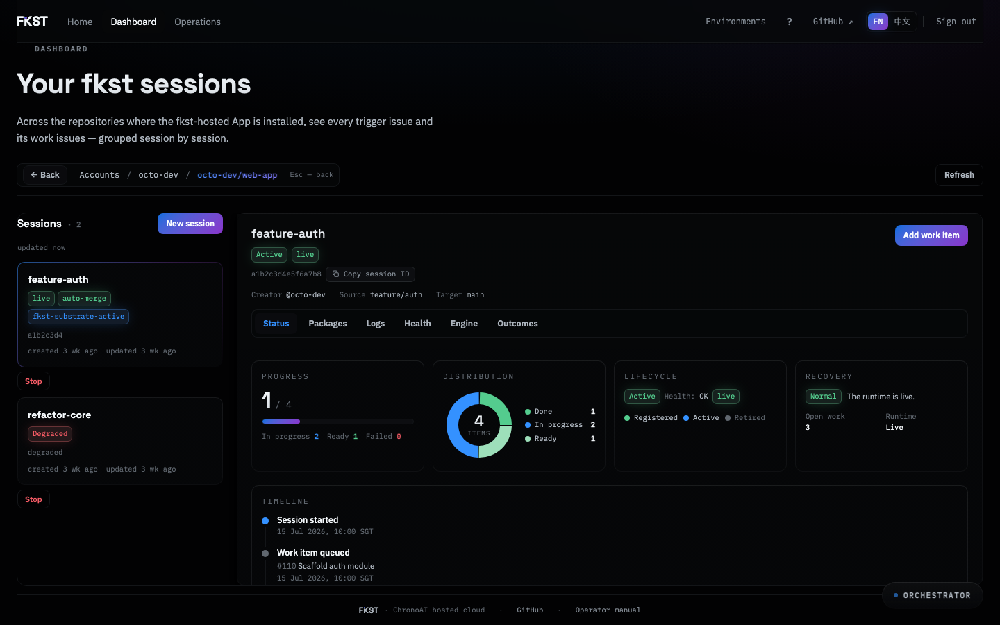
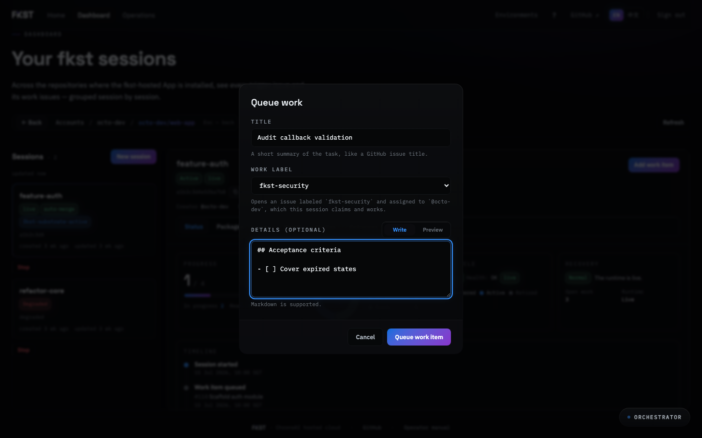
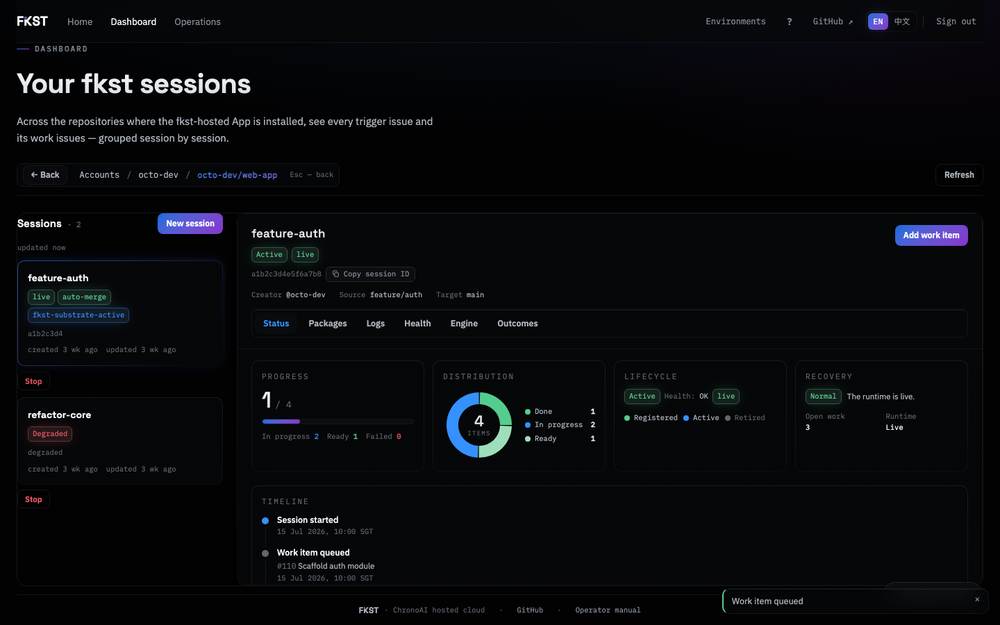

# Queue work for a running session

> **Generated artifact** (`docs.queue-work-item`). Evolution regenerates this page
> from the product model; edit the model or `intent/`, not this file.
>
> Capability `cap_9d41` · Journey `jny_2f7c` · Audience: session owner,
> repository maintainer · Status: **available**

A session works the issues you give it. This page covers the fastest way to give
it one: queueing a work item from the dashboard, without hand-writing a labelled
issue on GitHub.

## Before you start

You need all of the following. Each maps to a specific refusal, so if the button
is not there or the request fails, the list below tells you which one you are
missing.

| Requirement | If it is missing |
| --- | --- |
| You are the session's **effective creator**, a login frozen under its **Session Collaborators**, or a **deployment global administrator** | `403` — repository admin or maintain permission alone is *not* work authority |
| The session's **trigger issue is still open** | `409` |
| The session exposes **at least one applicable work label**, and you pick one of them | `422` |
| Your GitHub account can open issues on the repository | GitHub refuses the write; surfaced as `403` |

## Queue the work item

1. Open **Dashboard**. You see every account and repository where the fkst
   GitHub App is installed.

   

2. Drill into an account, then a repository. Its running sessions are listed,
   each backed by its trigger issue.

3. Select the session you want to work, then choose **Add work item**.

4. Fill in the composer.

   

   - **Title** — required. A blank title is rejected with `400`.
   - **Work label** — the list is that session's *complete effective set*,
     including labels discovered from its packages. Picking one is what makes
     the new issue routable to this session and no other.
   - **Details** — optional, and Markdown. Original whitespace is preserved,
     because indentation is meaningful. Omitting it opens a body-less issue.

5. Choose **Queue work item**.

## What happens next

The work issue is opened on GitHub **as you** — not as the App, and not as a
service account. It is stamped with the label you selected and assigned so that
the reconciler claims it for that session.

From then on the ordinary session lifecycle applies: the session picks the item
up, works it, and opens a pull request. You can follow that from the session's
detail drawer.

An open work-label issue keeps its session's pod alive until the issue is closed
or its pull request merges. Merge or close finished work to let a session idle
down.

## Why the dashboard is not a second control plane

Sessions are started, driven, and stopped through GitHub issues. This composer is
a convenience over that protocol, not an alternative to it: it opens exactly the
issue you would have written by hand, with the label and assignee already
correct. Anything you can do here you can do from GitHub, and the result is
identical.

That matters because GitHub is the only durable record. The control plane keeps
no database, so nothing you queue depends on this service staying available to be
reconstructed.

## Limits and caveats

- **Nothing here guarantees an outcome.** A session produces candidate pull
  requests for human review.
- The label selector shows the session's *effective* labels at the moment the
  session was read. If the session's packages changed since, reload before
  queueing.
- Work authority is enforced on every request, not just when the button renders.

## Evidence

This page's claims resolve to:

- `backend/src/routes/canvas/work_item.rs` — the handler and its documented
  `400` / `403` / `409` / `422` responses
- `GET /openapi.json` — the live operation schema
- `.fkst/evolution/journeys/queue-work-item.spec.ts` — the executable journey
  that produced every screenshot above
- `frontend/e2e/dashboard.spec.ts` — the product's own end-to-end coverage
