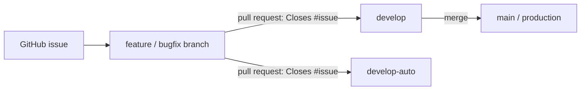
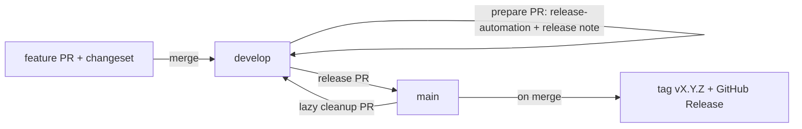

# CLAUDE.md

This file guides Claude Code (and any AI agent) when working in the **fkst-hosted** repository. These instructions are authoritative for this repo and must be followed exactly.

## Project Overview

**fkst-hosted** serves the **fkst** project's hosting-related concerns and is deployed as **ChronoAI's cloud services**.

- **Backend:** Rust-based backend service.
- **Frontend:** React.
- **Purpose:** User-facing and public interfaces for the fkst project, running as ChronoAI's hosted cloud offering.

## Scope & Boundaries

fkst-hosted has a deliberately narrow scope. Respect these boundaries on every change:

- ✅ **In scope:** Only user-facing and public interfaces that matter to the user.
- ❌ **Out of scope:** Anything related to the **kernel engine**. fkst-hosted does **not** change or include kernel-engine code.

> When a task seems to require touching engine internals, stop and reconsider — that work belongs upstream (see below), not in this repo.

## Upstream Source Repositories

These are **reference-only** dependencies. Do **not** modify them from within fkst-hosted; consult them to understand contracts and behavior.

| Component | Repository |
|-----------|------------|
| Engine    | https://github.com/ChronoAIProject/fkst-substrate |
| Packages  | https://github.com/ChronoAIProject/fkst-packages   |

## Integrations & Platform

fkst-hosted integrates with the following ChronoAI platform services. When doing related work, **always reference the latest `main` branch** of the corresponding repo for the current contracts and APIs.

| Integration | Area | Reference (latest `main`) |
|-------------|------|---------------------------|
| **NyxID** | IAM (identity & access management). fkst-hosted is deployed **under NyxID as one of its downstream services**. | https://github.com/ChronoAIProject/NyxID |
| **Ornn** | Agent-skill features. | https://github.com/ChronoAIProject/Ornn |

- For any **NyxID / IAM**-related work, reference NyxID's latest `main`.
- For any **Ornn / agent-skill**-related work, reference Ornn's latest `main`.

## Repository Layout

| Area      | Stack | Responsibility |
|-----------|-------|----------------|
| Backend   | Rust  | Hosted backend service, public APIs, user-facing endpoints |
| Frontend  | React | User-facing web interface |

## API Contract (OpenAPI)

The control plane (`backend/fkst-control-plane`) serves a **dynamically generated OpenAPI 3.1 document at `GET /openapi.json`**. It is assembled at runtime from the live Axum routes and Rust types via `utoipa` + `utoipa-axum` — there is **no static / checked-in spec file**, and the route registration *is* the documented path (`utoipa-axum`'s `OpenApiRouter` + `routes!`), so the spec never drifts from the code. The assembly + serving lives in `src/openapi.rs`; `src/router.rs::build_router` composes the routers and `split_for_parts()` yields `(Router, OpenApi)`.

When you add or change a **public** HTTP endpoint, the spec does **not** auto-reflect the handler signature — you must keep it in sync:

- **Annotate the handler** with `#[utoipa::path(method, path = "/x/{id}", tag, operation_id, params(...), request_body = ..., responses(...))]`. The `path` here is the single source of truth (`utoipa-axum` maps `{id}` → axum's `:id`). A handler without this annotation will NOT appear in the spec.
- **Register via `OpenApiRouter`**: every `routes::*::router()` returns `utoipa_axum::router::OpenApiRouter<AppState>` and adds routes with `.routes(routes!(handler, ...))` (group same-path handlers in one `routes!`). Do not introduce a bare `axum::Router` for a public route module.
- **Derive schemas**: `#[derive(ToSchema)]` on every request/response DTO; `#[derive(IntoParams)]` + `#[into_params(parameter_in = Query)]` on typed query structs. Error responses reference the public `error::ErrorEnvelope`.
- **Security**: protected `/api/v1/*` operations carry `security(("NyxIdIdentity" = []))`; the public surface (`/health`, `/metrics`, `/openapi.json`, the signature-verified GitHub App webhook) carries none.

Cross-crate and scope constraints:

- **Shared wire types** live in `fkst-shared` and derive `ToSchema` behind an **off-by-default `schema` feature** (`#[cfg_attr(feature = "schema", derive(utoipa::ToSchema))]`). The control plane enables `fkst-shared/schema`; the **worker must NOT** (so `utoipa` stays out of the worker binary). A new shared type used in a control-plane DTO needs that `cfg_attr`, or the build breaks.
- **Scope is the public surface only**: `/api/v1/*`, `/health`, `/metrics`, and the GitHub App webhook (only when a webhook secret is configured — the spec tracks live config). The fleet-only `/internal/v1/*` worker protocol is mounted **after** `build_router`, so it is intentionally excluded.
- **Component names** are derived from the Rust type identifier, so duplicate idents collide in the spec — give colliding types distinct names (e.g. `AdminSessionView`, `SetupRepoRef`) or consolidate them into one shared type.
- **Version pins**: `utoipa = "5"`, `utoipa-axum = "0.1"` (the axum-0.7 line; `utoipa-axum` 0.2+ targets axum 0.8 — do not bump it until axum itself is upgraded).
- **Keep `tests/openapi.rs` green**: it drives the real `build_router` and asserts the spec's paths/schemas/security and that no `/internal/*` path ever leaks.

## Git Workflow

### Commit Rules

- **Every commit must be small and self-contained.** No large commits are allowed.
- Each commit should represent one coherent, reviewable unit of change.

### Commit Authorship & Identity

- **Never include `Co-Authored-By`** — or any other AI / co-author trailer — in commit messages.
- **Always use the user's own GitHub identity** for every git operation (commits) and GitHub operation (issues, PRs, reviews, merges). Never commit or act as a bot, shared, or AI/Claude identity.
- Git is configured with the human maintainer's own name/email and the `gh` CLI is authenticated as that same person — keep the two consistent.

### Branch Model

| Branch         | Role |
|----------------|------|
| `main`         | **Production** branch. |
| `develop`      | **Active development** branch. |
| `develop-auto` | Branch actively developed and evolved by **unattended AI agent looping sessions**. |

### Branching & Merge Rules

- All features and bug fixes **must** land via a **pull request** into `develop` or `develop-auto`.
- **Only `develop` may be merged into `main`.** (`develop-auto` does not merge directly into `main`.)
- **No force push** is allowed on `main`, `develop`, or `develop-auto`.

### Issue & Pull Request Discipline

- **All work must be done via a proper pull request.** No direct commits to shared branches (`main`, `develop`, `develop-auto`); always branch, then open a PR.
- **Every pull request must have a corresponding GitHub issue.** Open the issue first, then reference it from the PR so it auto-closes on merge (e.g., `Closes #123`).
- A PR without a linked issue is not ready to merge.
- Standard flow: **open an issue → create a branch → implement → open a PR linking the issue → review → merge**.

### Auto-merge Policy (AI agents)

- **Unless the user explicitly says otherwise, auto-merge every PR you open into `develop` as soon as CI passes** (all required checks green). Use GitHub auto-merge: `gh pr merge --auto --merge`.
- **If any CI check fails, work on the resolution and auto-merge once CI passes.** Never leave a red PR open or hand it back unresolved.
- Applies to PRs targeting `develop` (the unattended `develop-auto` loop follows the same auto-merge-on-green behavior). PRs into `main` are **releases** and still follow the review-gated release flow (1 approval).

### Flow

## Issue & PR Templates

Every issue and pull request uses a standard template, stored under `.github/`:

| Template | Path | Use |
|----------|------|-----|
| Bug report | `.github/ISSUE_TEMPLATE/bug_report.md` | Report a defect in a user-facing/public interface. |
| Feature request | `.github/ISSUE_TEMPLATE/feature_request.md` | Propose a new user-facing feature or improvement. |
| Issue chooser config | `.github/ISSUE_TEMPLATE/config.yml` | Disables blank issues; routes engine/packages issues upstream. |
| Pull request | `.github/PULL_REQUEST_TEMPLATE.md` | Auto-applied to every PR; requires a linked issue. |

- GitHub auto-applies these templates when opening issues/PRs in the web UI.
- When creating issues/PRs via `gh` or the API (including unattended AI agent loops), fill the same template fields so structure and the required issue link are preserved.

## Versioning & Release

fkst-hosted uses **Changesets + SemVer**. Changesets drive **only the version number**; the human-readable release notes are authored separately and accumulated into `CHANGELOG.md`.

### Conventions

- **Unified version:** one product version (front + back) in the root `package.json` — the single source of truth. (It will be mirrored into `Cargo.toml` and the frontend `package.json` once those exist.)
- **Every PR into `develop` must include a changeset:** run `npx changeset` (or `npm run changeset`) and pick `patch` / `minor` / `major`. The `require-changeset` gate enforces this.
- **Release notes:** copy the persistent template `.github/release-note-template.md` (sections `## Fixed`, `## New Feature`, `## Changed`) to `release-notes/release-note-YYYYMMDD-HHMM.md` and fill it in. The template is **never deleted**; the dated copies are **ephemeral** (removed after release).
- **`CHANGELOG.md` (root)** is the persistent ledger — latest version on top, one `## vX.Y.Z` section per release (= that release's notes). It is updated as part of the `develop → main` release PR.
- The **`release-automation`** label makes automated/release PRs skip the `require-changeset` and `require-release-note` gates.

### Release flow

A release is **two PRs** (because `main` is protected and only `develop` may merge into it):

1. **Prepare** — open a PR into `develop` with the **`release-automation`** label and the filled `release-notes/release-note-*.md`. The `sync-release-pr` workflow computes the next SemVer version from the pending changesets, bumps `package.json`, and writes the pending `CHANGELOG.md` section. Review and merge into `develop`.
2. **Release** — open the `develop → main` PR (the `require-release-note` gate verifies the note). On merge, the `release` workflow tags `vX.Y.Z` and creates a GitHub Release whose body is the release note, then opens + merges a **lazy cleanup** PR back into `develop` (consume the changesets, delete the dated note, freeze the CHANGELOG entry). `main` is cleaned of those files on the next release.

### Workflows

| Workflow | Trigger | Purpose |
|----------|---------|---------|
| `require-changeset.yml` | PRs into `develop` | Fail unless a changeset is added (skips on `release-automation`). |
| `require-release-note.yml` | PRs `develop → main` | Fail unless a complete `release-note-*.md` is present (skips on `release-automation`). |
| `sync-release-pr.yml` | labeled release PRs into `develop` | Compute version, bump `package.json`, write the pending `CHANGELOG` section. |
| `release.yml` | push to `main` | Tag `vX.Y.Z`, create the GitHub Release, open the lazy cleanup PR into `develop`. |

## Quick Rules Summary

- Stay within the user-facing/public-interface scope; never touch the kernel engine.
- The control plane serves a dynamic OpenAPI 3 spec at `/openapi.json` (no static file). New/changed public endpoints MUST be annotated with `#[utoipa::path]` + `ToSchema`/`IntoParams` and registered via `OpenApiRouter`/`routes!`; `fkst-shared` wire types derive `ToSchema` behind its off-by-default `schema` feature (the worker stays utoipa-free); pin `utoipa-axum` to `0.1` (axum 0.7). See **API Contract (OpenAPI)**.
- The fkst deployables run exclusively on Kubernetes (per-deployable `k8s_sample/` dirs); `docker-compose` is not used in this repo.
- Treat the upstream engine and packages repos as read-only references.
- Keep commits small and self-contained.
- Never add `Co-Authored-By`; always act under the user's own GitHub identity (never a bot/AI identity).
- All work goes through a pull request — no direct commits to shared branches.
- For PRs into `develop`, auto-merge as soon as CI is green; if CI fails, fix it then auto-merge — unless told otherwise.
- Every PR must have a corresponding GitHub issue and link it (`Closes #N`).
- Use the issue/PR templates under `.github/`.
- Use pull requests into `develop` or `develop-auto`; only `develop` merges into `main`.
- Never force push `main`, `develop`, or `develop-auto`.
- For NyxID / IAM work, reference NyxID's latest `main`; for Ornn / agent-skill work, reference Ornn's latest `main`.
- Every PR into `develop` must include a changeset (`npx changeset`).
- Releases use release notes from `.github/release-note-template.md` → `release-notes/`; `CHANGELOG.md` is the ledger and the version lives in root `package.json`.
- A release = a `release-automation`-labelled prepare PR into `develop`, then a `develop → main` PR that tags `vX.Y.Z`.
