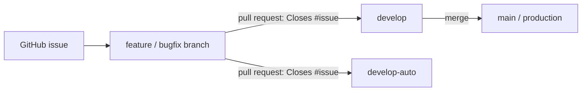

# CLAUDE.md

This file guides Claude Code (and any AI agent) when working in the **fkst-hosted** repository. These instructions are authoritative for this repo and must be followed exactly.

## Project Overview

**fkst-hosted** serves the **fkst** project's hosting-related concerns and is deployed as **ChronoAI's cloud services**.

- **Backend:** Rust-based backend service.
- **Frontend:** React.
- **Purpose:** User-facing and public interfaces for the fkst project, running as ChronoAI's hosted cloud offering.

## Scope & Boundaries

fkst-hosted has a deliberately narrow scope. Respect these boundaries on every change:

- ✅ **In scope:** Only user-facing and public interfaces that matter to the user.
- ❌ **Out of scope:** Anything related to the **kernel engine**. fkst-hosted does **not** change or include kernel-engine code.

> When a task seems to require touching engine internals, stop and reconsider — that work belongs upstream (see below), not in this repo.

## Upstream Source Repositories

These are **reference-only** dependencies. Do **not** modify them from within fkst-hosted; consult them to understand contracts and behavior.

| Component | Repository |
|-----------|------------|
| Engine    | https://github.com/ChronoAIProject/fkst-substrate |
| Packages  | https://github.com/ChronoAIProject/fkst-packages   |

## Repository Layout

| Area      | Stack | Responsibility |
|-----------|-------|----------------|
| Backend   | Rust  | Hosted backend service, public APIs, user-facing endpoints |
| Frontend  | React | User-facing web interface |

## Git Workflow

### Commit Rules

- **Every commit must be small and self-contained.** No large commits are allowed.
- Each commit should represent one coherent, reviewable unit of change.

### Branch Model

| Branch         | Role |
|----------------|------|
| `main`         | **Production** branch. |
| `develop`      | **Active development** branch. |
| `develop-auto` | Branch actively developed and evolved by **unattended AI agent looping sessions**. |

### Branching & Merge Rules

- All features and bug fixes **must** land via a **pull request** into `develop` or `develop-auto`.
- **Only `develop` may be merged into `main`.** (`develop-auto` does not merge directly into `main`.)
- **No force push** is allowed on `main`, `develop`, or `develop-auto`.

### Issue & Pull Request Discipline

- **All work must be done via a proper pull request.** No direct commits to shared branches (`main`, `develop`, `develop-auto`); always branch, then open a PR.
- **Every pull request must have a corresponding GitHub issue.** Open the issue first, then reference it from the PR so it auto-closes on merge (e.g., `Closes #123`).
- A PR without a linked issue is not ready to merge.
- Standard flow: **open an issue → create a branch → implement → open a PR linking the issue → review → merge**.

### Flow

## Issue & PR Templates

Every issue and pull request uses a standard template, stored under `.github/`:

| Template | Path | Use |
|----------|------|-----|
| Bug report | `.github/ISSUE_TEMPLATE/bug_report.md` | Report a defect in a user-facing/public interface. |
| Feature request | `.github/ISSUE_TEMPLATE/feature_request.md` | Propose a new user-facing feature or improvement. |
| Issue chooser config | `.github/ISSUE_TEMPLATE/config.yml` | Disables blank issues; routes engine/packages issues upstream. |
| Pull request | `.github/PULL_REQUEST_TEMPLATE.md` | Auto-applied to every PR; requires a linked issue. |

- GitHub auto-applies these templates when opening issues/PRs in the web UI.
- When creating issues/PRs via `gh` or the API (including unattended AI agent loops), fill the same template fields so structure and the required issue link are preserved.

## Quick Rules Summary

- Stay within the user-facing/public-interface scope; never touch the kernel engine.
- Treat the upstream engine and packages repos as read-only references.
- Keep commits small and self-contained.
- All work goes through a pull request — no direct commits to shared branches.
- Every PR must have a corresponding GitHub issue and link it (`Closes #N`).
- Use the issue/PR templates under `.github/`.
- Use pull requests into `develop` or `develop-auto`; only `develop` merges into `main`.
- Never force push `main`, `develop`, or `develop-auto`.
