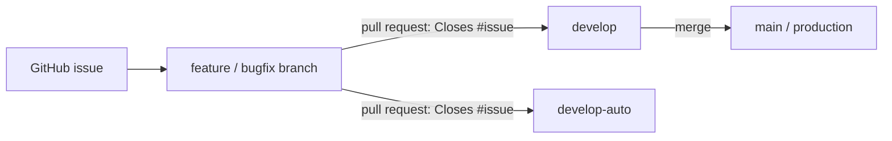

# CLAUDE.md

This file guides Claude Code (and any AI agent) when working in the **fkst-hosted** repository. These instructions are authoritative for this repo and must be followed exactly.

## Project Overview

**fkst-hosted** serves the **fkst** project's hosting-related concerns and is deployed as **ChronoAI's cloud services**.

- **Backend:** Rust-based backend service.
- **Frontend:** React.
- **Purpose:** User-facing and public interfaces for the fkst project, running as ChronoAI's hosted cloud offering.

## Scope & Boundaries

fkst-hosted has a deliberately narrow scope. Respect these boundaries on every change:

- ✅ **In scope:** Only user-facing and public interfaces that matter to the user.
- ❌ **Out of scope:** Anything related to the **kernel engine**. fkst-hosted does **not** change or include kernel-engine code.

> When a task seems to require touching engine internals, stop and reconsider — that work belongs upstream (see below), not in this repo.

## Upstream Source Repositories

These are **reference-only** dependencies. Do **not** modify them from within fkst-hosted; consult them to understand contracts and behavior.

| Component | Repository |
|-----------|------------|
| Engine    | https://github.com/ChronoAIProject/fkst-substrate |
| Packages  | https://github.com/ChronoAIProject/fkst-packages   |

> **fkst-hosted package home:** all fkst-hosted packages reside on the
> [`fkst-hosted` branch of `fkst-packages`](https://github.com/ChronoAIProject/fkst-packages/tree/fkst-hosted).
> When referencing a package for this deployment — a trigger issue's
> `### Packages` entries or `FKST_SEED_PACKAGES`, both in `owner/repo@ref:path`
> form — use `ChronoAIProject/fkst-packages@fkst-hosted:<path>`.

## Integrations & Platform

fkst-hosted integrates with the following ChronoAI platform services. When doing related work, **always reference the latest `main` branch** of the corresponding repo for the current contracts and APIs.

| Integration | Area | Reference (latest `main`) |
|-------------|------|---------------------------|
| **NyxID** | IAM (identity & access management). fkst-hosted is deployed **under NyxID as one of its downstream services**. | https://github.com/ChronoAIProject/NyxID |
| **Ornn** | Agent-skill features. | https://github.com/ChronoAIProject/Ornn |

- For any **NyxID / IAM**-related work, reference NyxID's latest `main`.
- For any **Ornn / agent-skill**-related work, reference Ornn's latest `main`.

## Repository Layout

| Area      | Stack | Responsibility |
|-----------|-------|----------------|
| Backend   | Rust  | Hosted backend service, public APIs, user-facing endpoints |
| Frontend  | React | User-facing web interface |

## FKST Local Deployment Guide

> The complete local deployment guide, embedded in full below. **This is the
> single source of truth** — there is no standalone copy (the former
> `opensandbox-developer-guide.md` was deleted; the READMEs and code comments
> link here). The guide must stay safe for public distribution: no
> internal/production identifiers (private repo URLs, real domains, registry
> paths, cluster/project names, real App/user IDs) — only `<placeholders>`,
> `127.0.0.1` addresses, and the `*.chronoai-fkst.local` hosts-file hostnames.
> The `chronoai-fkst` / `fkst-*` / `opensandbox-*` namespace and resource
> names are the stack's functional naming convention, deliberately kept.

This guide walks a new developer, step by step, through standing up a **complete
fkst stack on a local Kubernetes cluster** (on your laptop): the OpenSandbox
controller, the lifecycle API server, a caged tenant namespace, and the **fkst
services themselves** — the backend control plane and the frontend SPA, built
from this repository and deployed into the tenant namespace — everything needed
to develop and test the whole system end to end.

The guide is **self-contained**: every values file and manifest you need is
included inline. The only external inputs are public container images and Helm
charts from the upstream [OpenSandbox](https://github.com/opensandbox-group/OpenSandbox)
project (plus one vendored chart — see §3).

> **Time budget:** ~30–45 minutes on a fast connection. **Machine:** macOS or Linux,
> 8+ CPU cores and 12 GB+ RAM allocated to Docker. Apple Silicon works — every
> image used here (`server`, `controller`, `execd`) is published multi-arch
> (amd64 + arm64), including the digest-pinned server build (verify anytime with
> `docker manifest inspect
> opensandbox/server@sha256:4b386f107a4222320928b0b4dd38df8dc5154250ea4c90b4d36767a62f69ce7c`).

---

### 0. What you are building

The stack runs the **OpenSandbox controller** and the **OpenSandbox lifecycle
API server** in the `opensandbox-system` namespace, plus the **tenant
namespace** where the actual sandbox pods are stamped out:

```
                       opensandbox-system
  ┌────────────────────────────────────────────────────────────┐
  │  opensandbox-controller        (Helm: opensandbox, v0.2.0) │
  │      reconciles BatchSandbox/Pool/SandboxSnapshot CRs      │
  │                                                            │
  │  opensandbox-server            (vendored chart)            │
  │      lifecycle REST API; gVisor sandboxes                  │
  │      tenant: fkst                                          │
  └────────────────────────────────────────────────────────────┘
          │ creates BatchSandbox CRs → controller creates pods
          ▼
  ┌───────────────────────────────────────────────┐
  │ chronoai-fkst                                 │
  │ tenant: fkst                                  │
  │                                               │
  │  fkst-control-plane   (backend API, §14)      │
  │  fkst-frontend        (nginx + SPA, §15)      │
  │  sandbox pods         (gVisor, per session)   │
  └───────────────────────────────────────────────┘
```

How a sandbox is born, end to end:

1. A client (e.g. the fkst backend) calls the lifecycle API
   (`POST /v1/sandboxes`) with its **tenant API key** in the
   `OPEN-SANDBOX-API-KEY` header.
2. The server maps key → tenant → namespace via `tenants.toml` (keys in §9;
   the entrypoint override that renders the file lives in the §11 values).
   The API key is the **only** routing signal; there is no per-request
   namespace parameter.
3. The server stamps a `BatchSandbox` CR from a platform-enforced base template
   (a ConfigMap mounted into the server pod), merging in the request's values.
4. The controller reconciles the CR into a pod in the tenant namespace, running
   the requested image plus the injected `execd` exec daemon.
5. `[secure_runtime] type = "gvisor"` makes the server inject
   `runtimeClassName: gvisor` into every sandbox pod, which lands it on the
   gVisor node. Create requests carrying a `networkPolicy` are **rejected**
   with HTTP 400 (upstream #1070) — that field drives an egress-sidecar feature
   whose iptables/nftables programming cannot run under gVisor.
6. Tenant-namespace **guardrails** (zero-privilege `sandbox-runner`
   ServiceAccount, LimitRange, ResourceQuota, label-scoped lockdown
   NetworkPolicy) cage every sandbox pod regardless of what the server does.

### 1. Components and version pins

| Component | Image / version | Notes |
|---|---|---|
| Controller chart | `opensandbox-controller` **0.2.0** | upstream GitHub release asset (§10) |
| Controller image | `opensandbox/controller:v0.2.0` | Docker Hub build |
| Server chart | vendored **0.1.2** (0.1.0 upstream + 3 small patches) | see §3 for how to obtain it |
| Server image | `opensandbox/server@sha256:4b386f107a4222320928b0b4dd38df8dc5154250ea4c90b4d36767a62f69ce7c` | a **`main`-branch build pinned by digest**: tenant-based namespace routing is not in any released tag yet (v0.2.1 has no tenants module). The digest makes it reproducible; re-pin to a released tag once one ships with the tenants module |
| execd (exec daemon injected into sandboxes) | `opensandbox/execd:v1.0.20` | set in `configToml` |

### 2. Scope and caveats

Read this before trusting the environment for anything security-sensitive.

**What this guide gives you:**

- Real key-based tenant routing (key → tenant → namespace), enforced quotas and
  LimitRanges, a zero-privilege sandbox identity, and a lockdown NetworkPolicy
  enforced by Cilium.
- Real gVisor kernel isolation on the sandbox node (§6 Option A), or a clearly
  labeled no-isolation fallback (Option B) — **Option B is not a security
  boundary**; never use it to evaluate sandbox-escape behavior.
- The full fkst deployment: backend control plane (with its env-store RBAC,
  config, secrets, hardened pod spec) and frontend, both built from this
  repository's Dockerfiles and running in the tenant namespace (§14–§16).

**Included but NOT verified by this guide** (don't mistake "installed" for "proven"):

- **Pools and snapshots** (`pools`, `sandboxsnapshots` CRDs + the server's RBAC
  on them, pause/resume via `BatchSandbox.spec.pause`): present, but §13
  exercises neither. Snapshot/checkpoint behavior depends on the container
  runtime — do not expect it to work under Option B (runc alias).
- **Secure-access route signing** (`server.gateway.secureAccess`, OSEP-0011) and
  the chart's ingress-gateway: the gateway stays disabled (`[ingress] mode =
  "direct"`), so neither is ever rendered.

**Local simplifications** (each preserves the server's behavior):

- **One tenant provisioned.** The server's tenant mechanism
  (`[tenants] provider = "file"` + `tenants.toml`) supports any number of
  tenants; this guide provisions exactly one — **fkst** — which is all the fkst
  backend needs. §17 shows how to add another tenant later.
- **API keys as plain k8s Secrets.** The server entrypoint reads key **files**
  from `/var/secrets/` — a file contract that clusters with a secrets-store CSI
  can satisfy from a cloud secret manager without the keys ever existing as k8s
  Secrets. Locally, a plain Secret delivers the same file name at the same path
  (§9), so the entrypoint runs unchanged.
- **Static nodes.** The config's generous `sandbox_create_timeout_seconds = 300`
  leaves headroom for autoscaled clusters, where a sandbox node may have to
  cold-start; on kind's static nodes creates are simply faster and the timeout
  is never exercised.
- **Local-only exposure.** The opensandbox server stays a plain ClusterIP
  Service reached by port-forward (§12). The two fkst services get real local
  HTTPS origins — `https://app.chronoai-fkst.local` (frontend) and
  `https://api.chronoai-fkst.local` (backend) — via an in-cluster
  ingress-nginx, a mkcert-issued certificate, and `/etc/hosts` entries (§16);
  any cloud load-balancer/Gateway-API layer remains out of scope.
- **Locally built images.** The fkst backend and frontend images are built
  from this repository and side-loaded into kind (`kind load docker-image`) —
  no container registry involved.
- **You supply two external prerequisites** for the fkst backend: an
  OpenAI-compatible LLM endpoint + API key, and (for any GitHub-driven
  functionality) your own GitHub App registration, fronted by a free smee.io
  webhook relay channel so GitHub's deliveries can reach your laptop
  (§14.1–§14.3). Neither can be provided by a local cluster.
- The lockdown NetworkPolicy blocks cloud metadata endpoints
  (`169.254.169.254`) and RFC1918 ranges. The metadata rule is inert on kind
  (nothing answers that address) but is kept so the policy stays complete.

### 3. Prerequisites

Install (macOS: `brew install …`; Linux: distro packages or upstream releases):

| Tool | Version | Check |
|---|---|---|
| Docker Desktop / docker engine | recent; **8 CPU / 12 GB+** allocated | `docker info` |
| kind | ≥ 0.24 | `kind version` |
| kubectl | matching cluster minor | `kubectl version --client` |
| helm | ≥ 3.12 | `helm version` |
| cilium CLI | latest | `cilium version --client` |
| node + npx | ≥ 20.18 (smee-client 5.x requirement; runs the §14.2 webhook relay) | `node --version` |
| mkcert | latest (local CA + TLS cert for the §16 HTTPS hostnames; Firefox on Linux also needs `certutil` from nss/libnss3-tools) | `mkcert -version` |
| git, curl, openssl, python3 | any recent | — |

Create a workspace — every file this guide writes lives under it — and anchor
the repo checkout (this guide lives at the root of the `fkst-hosted` repo;
§14/§15 build the service images from it):

```bash
cd <your fkst-hosted checkout>     # the directory this guide file lives in
export FKST_REPO="$PWD"
export OSB_LOCAL="$HOME/opensandbox-local"
mkdir -p "$OSB_LOCAL"
```

> **If you open a new terminal** mid-guide (likely — the §12 port-forward and
> the §14.2 relay client run in the background and the backend image build
> takes a while), re-run both `export` lines first.

> **Kubernetes version:** any recent kind node image works (the opensandbox
> chart requires only ≥ 1.21, but the §16.1 ingress-nginx 4.15.1 pin is
> project-supported on k8s 1.31–1.35 — prefer a v1.31+ node image); pick a
> current one from the
> [kind releases page](https://github.com/kubernetes-sigs/kind/releases) and add
> `image: kindest/node:v1.3x.y@sha256:…` to every node in §4 if you want to pin.

#### Getting the lifecycle-server chart

Upstream publishes a release asset only for the *controller* chart; the
lifecycle-server chart must be **vendored**: copy
`kubernetes/charts/opensandbox-server` from the
[OpenSandbox repo](https://github.com/opensandbox-group/OpenSandbox) at commit
`f3e8d6d` to `$OSB_LOCAL/charts/opensandbox-server`, then apply three small
patches (this guide depends on all three):

1. `templates/server.yaml` — an optional `server.command` override on the main
   container (used by §11 to render `tenants.toml` before exec'ing the
   server). In the container spec, right before the `args:` block, add:

   ```yaml
             {{- with .Values.server.command }}
             command:
               {{- toYaml . | nindent 12 }}
             {{- end }}
   ```

2. `templates/server.yaml` — a `checksum/config` pod-template annotation so
   config changes roll the pods (the server only reads config at startup).
   Under `spec.template.metadata`, add:

   ```yaml
           annotations:
             checksum/config: {{ .Values.configToml | sha256sum }}
   ```

3. `templates/_helpers.tpl` — digest-pin support in the
   `opensandbox-server.serverImage` helper (required for the §1 digest pin):
   wrap the existing tag logic so that when `server.image.digest` is set, the
   helper renders `repository@digest` instead of `repository:tag`:

   ```yaml
   {{- if .Values.server.image.digest }}
   {{- printf "%s@%s" .Values.server.image.repository .Values.server.image.digest }}
   {{- else }}
   …(existing tag logic unchanged)…
   {{- end }}
   ```

Gate check — verify the chart is in place and patched **now**, not eight
sections from now when `helm install` first uses it:

```bash
helm show chart "$OSB_LOCAL/charts/opensandbox-server" | grep -E '^(name|version):'   # name: opensandbox-server
grep -c 'server.command'   "$OSB_LOCAL/charts/opensandbox-server/templates/server.yaml"    # ≥1 (patch 1)
grep -c 'checksum/config'  "$OSB_LOCAL/charts/opensandbox-server/templates/server.yaml"    # ≥1 (patch 2)
grep -c 'image.digest'     "$OSB_LOCAL/charts/opensandbox-server/templates/_helpers.tpl"   # ≥1 (patch 3)
```

### 4. Create the kind cluster

Workloads are separated onto dedicated nodes so every scheduling constraint in
the stack can actually be exercised: an untainted node for the
server/controller and a **gVisor sandbox node**. The gVisor node uses the
`sandbox.gke.io/runtime=gvisor` label/taint pair — that is the GKE Sandbox
naming *convention*, which the BatchSandbox template and RuntimeClass in this
guide standardize on (the names must simply match across node, template, and
RuntimeClass):

| kind node | Purpose | Label | Taint |
|---|---|---|---|
| control-plane | Kubernetes control plane + host 80/443 entry point for the §16 ingress | — | control-plane (kind default) |
| worker 1 | shared: server + controller land here | — | none |
| worker 2 | gVisor sandbox node | `sandbox.gke.io/runtime=gvisor` | `sandbox.gke.io/runtime=gvisor:NoSchedule` |

Write the cluster config:

```bash
cat > "$OSB_LOCAL/kind-cluster.yaml" <<'EOF'
kind: Cluster
apiVersion: kind.x-k8s.io/v1alpha4
name: opensandbox-local
networking:
  # The guardrail NetworkPolicy is enforced by Cilium (§5); disable kind's
  # default CNI so Cilium is the one and only dataplane.
  disableDefaultCNI: true
nodes:
  - role: control-plane
    # Host 80/443 → the §16 ingress-nginx NodePorts (30080/30443): gives the
    # fkst services their https://*.chronoai-fkst.local origins. Routed via
    # NodePort (not hostPort) so the mapping works regardless of the CNI's
    # hostPort support; NodePort answers on every node, the control-plane is
    # simply the stable place to pin the host mapping.
    extraPortMappings:
      - containerPort: 30080
        hostPort: 80
        protocol: TCP
      - containerPort: 30443
        hostPort: 443
        protocol: TCP
  - role: worker   # shared node: server + controller (the only untainted worker)
  - role: worker   # gVisor sandbox node
    labels:
      sandbox.gke.io/runtime: gvisor
    kubeadmConfigPatches:
      - |
        kind: JoinConfiguration
        nodeRegistration:
          taints:
            - key: sandbox.gke.io/runtime
              value: gvisor
              effect: NoSchedule
EOF

kind create cluster --config "$OSB_LOCAL/kind-cluster.yaml"
```

> Nodes will show `NotReady` until Cilium is installed (no CNI yet). That is
> expected — continue to §5.

> Host ports **80 and 443 must be free** on your machine (stop any local web
> server first), and `extraPortMappings` are **create-time only**: a cluster
> built from an older config without them must be deleted and recreated
> (Appendix B has a port-forward fallback if you cannot recreate).

### 5. Install Cilium (NetworkPolicy enforcement)

The tenant guardrails rely on Kubernetes NetworkPolicy; this stack standardizes
on **Cilium** as the enforcement engine:

```bash
cilium install --wait          # auto-detects kind; installs the default stable version
cilium status --wait           # everything green, nodes become Ready
```

(Equivalent Helm route if you prefer:
`helm repo add cilium https://helm.cilium.io && helm install cilium cilium/cilium -n kube-system --set ipam.mode=kubernetes`.)

Verify all three nodes are `Ready`, with the gVisor node labeled and tainted:

```bash
kubectl get nodes
kubectl get node -l sandbox.gke.io/runtime=gvisor \
  -o custom-columns='NAME:.metadata.name,TAINTS:.spec.taints[*].key'
```

### 6. gVisor runtime on the sandbox node

The server injects `runtimeClassName: gvisor` into every sandbox pod
(`[secure_runtime]` in the §11 values), and the BatchSandbox template
*additionally* pins `nodeSelector` + toleration as a second guarantee. For that
to work, the cluster needs (a) a **RuntimeClass named `gvisor`** whose
scheduling matches the sandbox node, and (b) a node that can actually run that
handler.

#### Option A (default) — real gVisor via runsc

gVisor's default **systrap** platform needs no KVM and runs inside kind's
privileged node containers, on both x86_64 and aarch64 (Apple Silicon).

Install `runsc` + the containerd shim into the gVisor node:

```bash
GVISOR_NODE=$(kubectl get nodes -l sandbox.gke.io/runtime=gvisor -o jsonpath='{.items[0].metadata.name}')
ARCH=$(docker exec "$GVISOR_NODE" uname -m)   # x86_64 or aarch64

cd "$OSB_LOCAL"
curl -fsSLO "https://storage.googleapis.com/gvisor/releases/release/latest/${ARCH}/runsc"
curl -fsSLO "https://storage.googleapis.com/gvisor/releases/release/latest/${ARCH}/runsc.sha512"
curl -fsSLO "https://storage.googleapis.com/gvisor/releases/release/latest/${ARCH}/containerd-shim-runsc-v1"
curl -fsSLO "https://storage.googleapis.com/gvisor/releases/release/latest/${ARCH}/containerd-shim-runsc-v1.sha512"
# macOS ships shasum; most Linux distros ship sha512sum — use whichever exists:
if command -v sha512sum >/dev/null; then
  sha512sum -c runsc.sha512 containerd-shim-runsc-v1.sha512
else
  shasum -a 512 -c runsc.sha512 containerd-shim-runsc-v1.sha512
fi

docker cp runsc                    "$GVISOR_NODE":/usr/local/bin/runsc
docker cp containerd-shim-runsc-v1 "$GVISOR_NODE":/usr/local/bin/containerd-shim-runsc-v1
docker exec "$GVISOR_NODE" chmod a+rx /usr/local/bin/runsc /usr/local/bin/containerd-shim-runsc-v1
cd - >/dev/null
```

Register a `gvisor` containerd runtime handler on that node. The CRI config
table name differs between containerd 1.x (config version 2) and 2.x (version 3),
so detect it:

```bash
docker exec "$GVISOR_NODE" bash -euc '
  ver=$(grep -m1 -E "^version *= *" /etc/containerd/config.toml | tr -dc "0-9")
  if [ "$ver" = "3" ]; then TABLE="io.containerd.cri.v1.runtime"; else TABLE="io.containerd.grpc.v1.cri"; fi
  cat >> /etc/containerd/config.toml <<EOF

# gVisor handler named "gvisor" (must match the RuntimeClass handler below)
[plugins."${TABLE}".containerd.runtimes.gvisor]
  runtime_type = "io.containerd.runsc.v1"
[plugins."${TABLE}".containerd.runtimes.gvisor.options]
  TypeUrl = "io.containerd.runsc.v1.options"
  ConfigPath = "/etc/containerd/runsc.toml"
EOF
  # kind uses the systemd cgroup driver; runsc must match it
  cat > /etc/containerd/runsc.toml <<EOF
[runsc_config]
  systemd-cgroup = "true"
EOF
  systemctl restart containerd
'
```

#### Option B (fallback) — alias RuntimeClass to runc

Only if Option A fails on your machine: point the `gvisor` RuntimeClass at the
node's stock `runc` handler. **Everything about scheduling and server behavior
stays identical, but there is NO kernel isolation** — fine for developing the
control plane, never a substitute when testing sandbox-escape/security behavior.
(In the RuntimeClass below, set `handler: runc` instead of `handler: gvisor`.)

#### Apply the RuntimeClass (both options)

The `scheduling` block lets pods that declare `runtimeClassName: gvisor`
tolerate and select the gVisor node (at admission, the `nodeSelector` is merged
into the pod and the toleration appended). This mirrors how GKE Sandbox
environments place `gvisor`-class pods, which is where the
`sandbox.gke.io/runtime` names come from:

```bash
cat > "$OSB_LOCAL/runtimeclass-gvisor.yaml" <<'EOF'
apiVersion: node.k8s.io/v1
kind: RuntimeClass
metadata:
  name: gvisor
handler: gvisor            # Option B fallback: change to "runc"
scheduling:
  nodeSelector:
    sandbox.gke.io/runtime: gvisor
  tolerations:
    - key: sandbox.gke.io/runtime
      operator: Equal
      value: gvisor
      effect: NoSchedule
EOF
kubectl apply -f "$OSB_LOCAL/runtimeclass-gvisor.yaml"
```

Smoke-test the runtime before moving on (Option A should print a gVisor kernel
banner; the pod must land on the gVisor node):

```bash
kubectl run gvisor-smoke --rm -it --restart=Never \
  --image=alpine --overrides='{"spec":{"runtimeClassName":"gvisor"}}' \
  -- sh -c 'dmesg | head -3; uname -a'
# Option A expected: "Starting gVisor..." lines
```

### 7. Namespaces

```bash
kubectl create namespace opensandbox-system
# chronoai-fkst is created BY its guardrails file (§8)
```

### 8. Platform manifests

Two manifests: the BatchSandbox base template the server stamps sandboxes from,
and the tenant-namespace guardrails. Write both, then apply.

**Guardrails are non-negotiable.** They are namespace-scoped and do NOT inherit;
a tenant namespace without them runs untrusted code with kube-API and network
reach.

#### 8.1 BatchSandbox base template

```bash
mkdir -p "$OSB_LOCAL/manifests"
cat > "$OSB_LOCAL/manifests/batchsandbox-template-configmap.yaml" <<'EOF'
# Base BatchSandbox CR every sandbox is stamped from (platform-enforced;
# SDK per-request values are merged in by the server). Mounted into the server
# pod at /etc/opensandbox/batchsandbox-template.yaml.
apiVersion: v1
kind: ConfigMap
metadata:
  name: opensandbox-batchsandbox-template
  namespace: opensandbox-system
data:
  batchsandbox-template.yaml: |
    metadata:
      labels:
        opensandbox.io/workload: sandbox
    spec:
      replicas: 1
      template:
        metadata:
          # POD label — the sandbox-lockdown NetworkPolicy selects on this.
          # Must be here (pod template), not on the CR metadata above.
          labels:
            opensandbox.io/workload: sandbox
        spec:
          restartPolicy: Never
          terminationGracePeriodSeconds: 30
          # unbound identity: no cloud IAM, no RBAC, no API token
          serviceAccountName: sandbox-runner
          automountServiceAccountToken: false
          # gVisor placement is injected by the server ([secure_runtime]) via
          # runtimeClassName, which carries the sandbox.gke.io/runtime
          # nodeSelector + toleration. These explicit copies are a SECOND
          # guarantee so a sandbox can only ever schedule on the gVisor node,
          # even if the runtime-class injection were ever misconfigured.
          nodeSelector:
            sandbox.gke.io/runtime: gvisor
          tolerations:
            - key: sandbox.gke.io/runtime
              operator: Equal
              value: gvisor
              effect: NoSchedule
          securityContext:
            seccompProfile:
              type: RuntimeDefault
EOF
```

#### 8.2 Guardrails — `chronoai-fkst`

```bash
cat > "$OSB_LOCAL/manifests/fkst-guardrails.yaml" <<'EOF'
# Tenant "fkst" namespace + guardrails. OpenSandbox routes requests bearing
# the fkst API key here (server tenants.toml). The lockdown NetworkPolicy is
# label-scoped so only sandbox pods are caged — anything else you deploy in
# this namespace (e.g. an in-cluster fkst backend) is unaffected.
apiVersion: v1
kind: Namespace
metadata:
  name: chronoai-fkst
  labels:
    opensandbox.io/role: sandbox-workloads
---
# Identity for SANDBOX pods (untrusted): bound to nothing — no IAM, no RBAC.
apiVersion: v1
kind: ServiceAccount
metadata:
  name: sandbox-runner
  namespace: chronoai-fkst
automountServiceAccountToken: false
---
# Identity for the fkst backend Deployment (§14, trusted caller): reads its
# own api key. automountServiceAccountToken is false HERE (SA-level default);
# the backend Deployment overrides it to true at the POD level because its
# env-store needs the k8s API (RBAC granted in §14.5).
apiVersion: v1
kind: ServiceAccount
metadata:
  name: fkst-ksa
  namespace: chronoai-fkst
automountServiceAccountToken: false
---
apiVersion: v1
kind: LimitRange
metadata:
  name: sandbox-limits
  namespace: chronoai-fkst
spec:
  limits:
    - type: Container
      defaultRequest:
        cpu: 100m
        memory: 256Mi
      default:
        cpu: "1"
        memory: 1Gi
      max:
        cpu: "4"
        memory: 8Gi
---
apiVersion: v1
kind: ResourceQuota
metadata:
  name: sandbox-quota
  namespace: chronoai-fkst
spec:
  hard:
    requests.cpu: "20"
    requests.memory: 40Gi
    limits.cpu: "40"
    limits.memory: 80Gi
    pods: "50"
---
# Network cage for SANDBOX PODS ONLY (label-scoped; any other pods in the
# namespace are unaffected).
apiVersion: networking.k8s.io/v1
kind: NetworkPolicy
metadata:
  name: sandbox-lockdown
  namespace: chronoai-fkst
spec:
  podSelector:
    matchLabels:
      opensandbox.io/workload: sandbox
  policyTypes: [Ingress, Egress]
  ingress:
    # opensandbox server/controller reach sandbox execd endpoints
    - from:
        - namespaceSelector:
            matchLabels:
              kubernetes.io/metadata.name: opensandbox-system
    # app pods in this namespace (e.g. an in-cluster fkst backend) can
    # connect to sandbox endpoints
    - from:
        - podSelector: {}
  egress:
    # DNS via kube-system only
    - to:
        - namespaceSelector:
            matchLabels:
              kubernetes.io/metadata.name: kube-system
      ports:
        - { protocol: UDP, port: 53 }
        - { protocol: TCP, port: 53 }
    # internet allowed, but NOT cloud metadata endpoints or internal ranges
    - to:
        - ipBlock:
            cidr: 0.0.0.0/0
            except:
              - 169.254.169.254/32
              - 10.0.0.0/8
              - 172.16.0.0/12
              - 192.168.0.0/16
EOF
```

#### 8.3 Apply both

```bash
kubectl apply -f "$OSB_LOCAL/manifests/batchsandbox-template-configmap.yaml"
kubectl apply -f "$OSB_LOCAL/manifests/fkst-guardrails.yaml"
```

### 9. Tenant API key

The server consumes the tenant key as a **file** under `/var/secrets/` — its
entrypoint `cat`s the file into `tenants.toml` at startup:

```
[[tenants]]
name = "fkst"
namespace = "chronoai-fkst"
api_keys = ["$(cat /var/secrets/opensandbox-fkst-api-key)"]
```

Generate the key and create the Secrets. The Secret **data key becomes the file
name**, so it must match the path the entrypoint reads exactly:

```bash
FKST_KEY=$(openssl rand -hex 32)

# Server side: the key file the entrypoint reads. The Secret is named
# opensandbox-api-key because the §11 volume references it by that name.
kubectl create secret generic opensandbox-api-key -n opensandbox-system \
  --from-literal=opensandbox-fkst-api-key="$FKST_KEY"

# consumer side: the fkst backend Deployment (§14) mounts this at
# /var/secrets to authenticate to the server — same key value, same file
# name, in its own namespace.
kubectl create secret generic opensandbox-fkst-api-key -n chronoai-fkst \
  --from-literal=opensandbox-fkst-api-key="$FKST_KEY"

# Keep the value around for testing this session (don't commit it anywhere)
echo "$FKST_KEY" > "$OSB_LOCAL/.fkst.key"
chmod 600 "$OSB_LOCAL/.fkst.key"
```

### 10. Install the OpenSandbox controller

The controller chart is a public upstream release asset:

```bash
cat > "$OSB_LOCAL/controller-values.yaml" <<'EOF'
# OpenSandbox controller values (chart opensandbox-controller 0.2.0). The
# chart's defaults already set runAsNonRoot, seccomp RuntimeDefault, and
# drop-ALL capabilities.
controller:
  image:
    # Docker Hub build (the chart defaults to an Alibaba CN registry)
    repository: opensandbox/controller
    tag: "v0.2.0"

  replicaCount: 1

  resources:
    limits:
      cpu: 500m
      memory: 128Mi
    requests:
      cpu: 10m
      memory: 64Mi

  logLevel: info

  # Full restricted profile, stated explicitly (chart defaults cover most of
  # this; readOnlyRootFilesystem is the addition).
  podSecurityContext:
    runAsNonRoot: true
    seccompProfile:
      type: RuntimeDefault

  containerSecurityContext:
    allowPrivilegeEscalation: false
    capabilities:
      drop: ["ALL"]
    readOnlyRootFilesystem: true

crds:
  install: true
  keep: true
EOF

helm install opensandbox \
  https://github.com/opensandbox-group/OpenSandbox/releases/download/helm/opensandbox-controller/0.2.0/opensandbox-controller-0.2.0.tgz \
  --namespace opensandbox-system \
  -f "$OSB_LOCAL/controller-values.yaml"

kubectl -n opensandbox-system rollout status deploy -l app.kubernetes.io/part-of=opensandbox --timeout=180s || \
kubectl -n opensandbox-system get pods
kubectl get crd | grep opensandbox.io   # batchsandboxes, pools, sandboxsnapshots
```

The controller must be installed **before** the server: its informers watch
the CRDs the controller installs.

### 11. Install the lifecycle server

```bash
cat > "$OSB_LOCAL/server-values.yaml" <<'EOF'
# OpenSandbox lifecycle server (gVisor). Tenant routing: the per-request API
# key is the ONLY routing signal (key -> tenant -> namespace via tenants.toml,
# rendered by the entrypoint below at startup).
fullnameOverride: "opensandbox-server"

server:
  image:
    # Pinned to a known-good `main` build by digest: tenant-based namespace
    # routing is not in any released tag yet (v0.2.1 has no tenants module).
    # Re-pin to a released tag (and drop `digest`) once one ships with the
    # tenants module.
    repository: opensandbox/server
    tag: "latest"
    digest: "sha256:4b386f107a4222320928b0b4dd38df8dc5154250ea4c90b4d36767a62f69ce7c"

  replicaCount: 1

  resources:
    limits:
      cpu: "1"
      memory: 2Gi
    requests:
      cpu: 250m
      memory: 512Mi

  # Renders tenants.toml from the tenant key FILE at startup (uses the
  # vendored chart's command-override patch). No OPENSANDBOX_SERVER_API_KEY:
  # tenant mode forbids server.api_key.
  command:
    - "/bin/sh"
    - "-c"
    - |
      cat > /tmp/tenants.toml <<EOF
      [[tenants]]
      name = "fkst"
      namespace = "chronoai-fkst"
      api_keys = ["$(cat /var/secrets/opensandbox-fkst-api-key)"]
      EOF
      export SANDBOX_TENANTS_CONFIG_PATH=/tmp/tenants.toml
      exec opensandbox-server --config /etc/opensandbox/config.toml

  volumeMounts:
    - name: api-key
      mountPath: /var/secrets
      readOnly: true
    - name: batchsandbox-template
      mountPath: /etc/opensandbox/batchsandbox-template.yaml
      subPath: batchsandbox-template.yaml
      readOnly: true

  # Key delivery: a plain k8s Secret (§9). Clusters with a secrets-store CSI
  # can deliver the same file name from a cloud secret manager instead — the
  # entrypoint above only cares about the file path.
  volumes:
    - name: api-key
      secret:
        secretName: opensandbox-api-key
    - name: batchsandbox-template
      configMap:
        name: opensandbox-batchsandbox-template

configToml: |
  [server]
  host = "0.0.0.0"
  port = 80
  # NO api_key — tenant mode ([tenants]) forbids server.api_key; auth is via
  # the per-tenant keys in tenants.toml (rendered by the entrypoint).
  # hard ceiling on sandbox TTL requested by clients
  max_sandbox_timeout_seconds = 3600

  [log]
  level = "INFO"

  [runtime]
  type = "kubernetes"
  execd_image = "opensandbox/execd:v1.0.20"

  # Tenant routing: api key -> tenant -> namespace (tenants.toml, rendered by
  # the entrypoint). Every tenant namespace needs a "sandbox-runner" SA +
  # label-scoped guardrails (see the platform manifests).
  [tenants]
  provider = "file"

  [kubernetes]
  # fallback namespace only (real routing is per-tenant); points at the sole
  # tenant namespace
  namespace = "chronoai-fkst"
  service_account = "sandbox-runner"
  workload_provider = "batchsandbox"
  batchsandbox_template_file = "/etc/opensandbox/batchsandbox-template.yaml"
  # headroom for slow node cold-starts / image pulls on autoscaled clusters;
  # harmless on a static local cluster
  sandbox_create_timeout_seconds = 300
  informer_enabled = true
  informer_resync_seconds = 300
  informer_watch_timeout_seconds = 60

  # gVisor: injects runtimeClassName into every sandbox pod (the RuntimeClass
  # carries the gVisor-node selector + toleration)
  [secure_runtime]
  type = "gvisor"
  k8s_runtime_class = "gvisor"
EOF

helm install opensandbox-server "$OSB_LOCAL/charts/opensandbox-server" \
  --namespace opensandbox-system \
  -f "$OSB_LOCAL/server-values.yaml"

kubectl -n opensandbox-system rollout status deploy/opensandbox-server --timeout=300s
```

> The release **name** matters: the chart's `app.kubernetes.io/instance`
> selector label is the release name. Keep `opensandbox-server` exactly.

### 12. Reaching the server

The server is a plain ClusterIP service in `opensandbox-system` —
port-forward it:

```bash
kubectl -n opensandbox-system port-forward svc/opensandbox-server 18080:80 >/dev/null 2>&1 &

# the forward takes a moment to start listening
until curl -sf http://127.0.0.1:18080/health >/dev/null; do sleep 1; done
curl -s http://127.0.0.1:18080/health; echo    # {"status":"healthy"}
```

Interactive API docs (Swagger UI) are served at `http://127.0.0.1:18080/docs`.

**Endpoint semantics — read this before wiring a client.** The server runs
`[ingress] mode = "direct"` (gateway disabled): when you ask for a sandbox
endpoint, the server hands back an **in-cluster address** (pod IP), which your
laptop cannot reach. The supported path for out-of-cluster callers is the
**server proxy**: `GET /v1/sandboxes/{id}/endpoints/{port}?use_server_proxy=true`
returns an endpoint routed *through the server itself*, which works through your
port-forward. The fkst backend hard-requires the proxy transport
(`FKST_OSB_USE_SERVER_PROXY=false` is rejected at startup —
`backend/src/osb_config.rs`).

### 13. Verification checklist

Run all of these in order (they share shell variables). Each maps to a designed
behavior of the stack.

**1. Deployments healthy, correct images:**

```bash
kubectl -n opensandbox-system get deploy,pods -o wide
kubectl -n opensandbox-system get deploy opensandbox-server \
  -o jsonpath='{.spec.template.spec.containers[0].image}'; echo
# expect: opensandbox/server@sha256:4b386f107a4222320928b0b4dd38df8dc5154250ea4c90b4d36767a62f69ce7c
```

**2. Rendered config:** spot check that the gateway is off (`[ingress] mode =
"direct"` is appended to the ConfigMap by the chart):

```bash
kubectl -n opensandbox-system get cm opensandbox-server-config -o jsonpath='{.data.config\.toml}' | tail -3
```

**3. Key → namespace routing** (the core invariant). A valid fkst key creates a
sandbox in `chronoai-fkst`; a wrong or missing key is rejected:

```bash
FKST_KEY=$(cat "$OSB_LOCAL/.fkst.key")
# timeout at the server's ceiling: later checks reuse this sandbox
BODY='{"image":{"uri":"python:3.11-slim"},"entrypoint":["python","-m","http.server","8000"],"timeout":3600}'

FKST_SBX=$(curl -s -X POST http://127.0.0.1:18080/v1/sandboxes \
  -H "OPEN-SANDBOX-API-KEY: $FKST_KEY" -H "Content-Type: application/json" \
  -d "$BODY" | python3 -c 'import sys,json; print(json.load(sys.stdin)["id"])')
echo "sandbox: $FKST_SBX"

kubectl -n chronoai-fkst get pods -l opensandbox.io/workload=sandbox
kubectl get batchsandboxes -A

# negative test: an unknown key must be rejected (401/403), never routed
curl -s -o /dev/null -w '%{http_code}\n' -X POST http://127.0.0.1:18080/v1/sandboxes \
  -H "OPEN-SANDBOX-API-KEY: not-a-real-key" -H "Content-Type: application/json" -d "$BODY"
```

> The sandbox above is reaped when its TTL (1 h) expires. If a later check's
> pod lookup comes back empty, re-run the create and continue.

**4. gVisor injection + placement:** the sandbox pod must carry
`runtimeClassName: gvisor`, sit on the gVisor node, and (Option A) boot the gVisor kernel:

```bash
FKST_POD=$(kubectl -n chronoai-fkst get pods -l opensandbox.io/workload=sandbox -o jsonpath='{.items[0].metadata.name}')
kubectl -n chronoai-fkst get pod "$FKST_POD" -o jsonpath='{.spec.runtimeClassName} {.spec.nodeName}'; echo
kubectl -n chronoai-fkst exec "$FKST_POD" -- dmesg | head -3   # Option A: "Starting gVisor..."
```

> Sandbox pods can carry more than one container (the requested image plus
> injected components). If an `exec` in this checklist lands in the wrong
> container, list them with `kubectl -n chronoai-fkst get pod "$FKST_POD" -o
> jsonpath='{.spec.containers[*].name}'` and add `-c <workload-container>`.

**5. `networkPolicy` requests are rejected:** the server runs sandboxes under
gVisor, which is incompatible with the egress-sidecar feature that the
`networkPolicy` create-field drives (upstream #1070) — the server must reject
such requests with HTTP 400 rather than silently ignoring the field:

```bash
curl -s -o /dev/null -w '%{http_code}\n' -X POST http://127.0.0.1:18080/v1/sandboxes \
  -H "OPEN-SANDBOX-API-KEY: $FKST_KEY" -H "Content-Type: application/json" \
  -d '{"image":{"uri":"python:3.11-slim"},"entrypoint":["sleep","60"],"timeout":300,"networkPolicy":{"defaultAction":"deny"}}'
# expect: 400
```

**6. Zero-privilege sandbox identity:** `serviceAccountName: sandbox-runner`,
`automountServiceAccountToken: false` — the pod has no API token:

```bash
kubectl -n chronoai-fkst get pod "$FKST_POD" -o jsonpath='{.spec.serviceAccountName} {.spec.automountServiceAccountToken}'
kubectl -n chronoai-fkst exec "$FKST_POD" -- ls /var/run/secrets/kubernetes.io 2>&1  # should fail
```

**7. Network lockdown enforced** (needs Cilium). The probe below tests raw TCP
reachability and distinguishes *filtered* (timeout ⇒ policy dropped it) from
*reachable* (connect or refused ⇒ the packet got through). The kube-API check is
the discriminator: without an enforced NetworkPolicy it **connects**.

```bash
kubectl -n chronoai-fkst exec -i "$FKST_POD" -- python3 - <<'PY'
import os, socket
socket.setdefaulttimeout(4)
def blocked(host, port):
    try:
        socket.create_connection((host, port)).close(); return False
    except TimeoutError: return True          # filtered: policy dropped it
    except OSError: return False              # refused/reset: packet got through
api = os.environ.get("KUBERNETES_SERVICE_HOST", "10.96.0.1")
for name, b, want in [
    (f"kube API {api}:443 (RFC1918)", blocked(api, 443), True),
    ("public internet 1.1.1.1:443",   blocked("1.1.1.1", 443), False),
]:
    print(f"{name}: {'BLOCKED' if b else 'REACHABLE'}",
          "OK" if b == want else "<-- UNEXPECTED: check Cilium / policy")
try:
    socket.getaddrinfo("example.com", 443); print("DNS via kube-system: OK")
except OSError as e:
    print(f"DNS via kube-system: FAILED ({e})")
PY
```

> The policy also blocks cloud metadata endpoints (`169.254.169.254/32`); that
> rule is applied verbatim here, but it can't be *demonstrated* in kind —
> nothing answers on that address locally, so a probe would time out with or
> without the policy.

**8. Quotas and limits present in the tenant namespace:**

```bash
kubectl -n chronoai-fkst get sa,limitrange,resourcequota,networkpolicy
```

**9. Server-proxy endpoint access** (the transport out-of-cluster clients
use — §12): fetch the sandbox's endpoint through the server proxy:

```bash
curl -s "http://127.0.0.1:18080/v1/sandboxes/$FKST_SBX/endpoints/8000?use_server_proxy=true" \
  -H "OPEN-SANDBOX-API-KEY: $FKST_KEY" | python3 -m json.tool
# expect a proxied endpoint (routed via the server); without use_server_proxy
# you'd get an in-cluster pod address your laptop cannot reach
```

**10. Config-change rollout (vendored patch #2):** the `checksum/config`
annotation rolls pods whenever `configToml` changes:

```bash
printf '  # roll-test\n' >> "$OSB_LOCAL/server-values.yaml"   # configToml is the file's last block
helm upgrade opensandbox-server "$OSB_LOCAL/charts/opensandbox-server" \
  -n opensandbox-system -f "$OSB_LOCAL/server-values.yaml"
kubectl -n opensandbox-system rollout status deploy/opensandbox-server   # pods roll
# revert: delete the "# roll-test" line again and re-run the same helm upgrade
```

Note the checksum covers only `.Values.configToml` — the helper-generated
`[ingress]`/`[ingress.secure_access]` lines are outside it, so a
gateway/secureAccess values change would update the ConfigMap *without* rolling
pods (irrelevant while the gateway stays disabled).

**11. TTL ceiling and reaping:** the server enforces
`max_sandbox_timeout_seconds = 3600`. Send `"timeout": 999999`: a pass is
**either** an HTTP 4xx rejection **or** a success whose `expiresAt` is clamped
to ≈ now + 3600 s. A response honoring 999999 is a failure. Then watch a
short-TTL sandbox get reaped:

```bash
curl -s -X POST http://127.0.0.1:18080/v1/sandboxes \
  -H "OPEN-SANDBOX-API-KEY: $FKST_KEY" -H "Content-Type: application/json" \
  -d '{"image":{"uri":"python:3.11-slim"},"entrypoint":["sleep","300"],"timeout":60}' | python3 -m json.tool
# expiresAt ≈ now+60 s; the pod disappears shortly after
```

Clean up test sandboxes with `DELETE /v1/sandboxes/{id}` (same auth header), e.g.
`curl -X DELETE -H "OPEN-SANDBOX-API-KEY: $FKST_KEY" http://127.0.0.1:18080/v1/sandboxes/$FKST_SBX`.

### 14. Deploy the fkst backend (control plane)

The backend (`fkst-control-plane`) is a single binary that is **both** the API
server and, inside a session sandbox, the substrate entrypoint — which is why
`FKST_POD_IMAGE` and `FKST_OSB_ENTRYPOINT` below point back at the same image
and binary. It runs in `chronoai-fkst` as the `fkst-ksa` ServiceAccount and
reaches the opensandbox server in-cluster via service DNS.

#### 14.1 External prerequisites

Two things no local cluster can provide:

1. **An OpenAI-compatible LLM endpoint + API key** — sessions drive the codex
   CLI against it (`FKST_LLM_BASE_URL` / `FKST_LLM_MODEL` /
   `FKST_LLM_WIRE_API` + `FKST_LLM_API_KEY`). The endpoint must be **publicly
   reachable**: sandbox egress blocks RFC1918/loopback/cluster-internal
   destinations, and the backend fails closed at startup on such a URL — a
   local Ollama/vLLM on `127.0.0.1` will not work without a public tunnel.
2. **Your own GitHub App** — required for anything GitHub-driven (login,
   installs, sessions working repos). The backend boots without one
   (`FKST_GITHUB_APP_ID` unset = App features disabled), so you can defer this,
   but a real end-to-end test needs it. Setting it up locally is a two-step
   affair, **in this order**: create the webhook relay channel first (§14.2 —
   the App registration form asks for a webhook URL GitHub can reach, which
   `127.0.0.1` is not), then register the App with that URL (§14.3).

#### 14.2 GitHub webhook relay (smee)

GitHub delivers webhooks by POSTing **from GitHub's servers** to the App's
webhook URL — it can never reach `127.0.0.1` or your kind cluster directly. A
relay bridges the gap: [smee.io](https://smee.io) gives you a public channel
URL GitHub can POST to, plus a local client that replays every delivery to
the backend's local HTTPS origin (§16).

Without the relay the stack still functions — the reconciler is level-based
and re-enumerates the App's installations on a periodic poll — but every
reaction is poll-bound: a work issue for an already-registered session waits
for the reconcile sweep (default 30 s), a brand-new trigger issue on a
not-yet-registered repo waits for the next full resync (default 600 s,
`FKST_POD_FULL_RESYNC_INTERVAL_SECS`), and install-time seeding
(`FKST_SEED_TRIGGER_ISSUE_ON_INSTALL`) never fires at all, because it acts on
the live `installation` / `installation_repositories` webhook events. With
the relay, deliveries (`issues`, `installation`,
`installation_repositories`) nudge the reconciler the moment something
happens.

```bash
# 1. Create a channel: open https://smee.io/new in a browser — it redirects
#    to your channel URL. Save it: the §14.3 App form wants it as the
#    webhook URL.
export SMEE_CHANNEL="https://smee.io/<your-channel-id>"

# 2. Relay deliveries to the backend's webhook endpoint (through the §16
#    ingress). DEFER THIS COMMAND until §16 is complete — it needs the api
#    hostname resolving AND the §16.2 mkcert CA on disk, and Node loads
#    NODE_EXTRA_CA_CERTS only at launch (a client started early keeps
#    rejecting the local TLS cert until restarted). Then run it in a spare
#    terminal and KEEP IT RUNNING — like the §12 port-forward, it is a
#    long-lived process, and its per-delivery log lines are your first stop
#    when debugging webhook problems.
#    NODE_EXTRA_CA_CERTS: Node ignores the OS trust store, so hand it the
#    §16.2 mkcert root CA or the client rejects the local TLS cert.
NODE_EXTRA_CA_CERTS="$(mkcert -CAROOT)/rootCA.pem" \
npx smee-client --url "$SMEE_CHANNEL" \
  --target https://api.chronoai-fkst.local/api/v1/github/app/webhook
```

Notes:

- **The channel URL is public but unguessable.** Anyone holding it can read
  the relayed payloads and POST forgeries — the backend is protected by the
  HMAC signature check (`X-Hub-Signature-256` verified against
  `FKST_GITHUB_APP_WEBHOOK_SECRET`, §14.7), so forged posts get `401`; but
  payloads expose repo/issue content, so treat the URL like a dev credential
  and don't reuse it beyond local dev.
- **Ordering:** only the *channel* must exist before §14.3 (the form wants
  the URL); run the *client* once §16 is in place — it needs the backend
  reachable at its hostname AND the §16.2 mkcert CA on disk. Deliveries
  relayed while the target is down are dropped by the client — that's fine:
  the reconciler's startup + periodic resync re-derives state, and any
  delivery can be replayed from the App's **Advanced → Recent Deliveries**
  page (Redeliver).
- smee is for **webhooks only**. The OAuth callback URLs (§14.3) point at the
  same `https://api.chronoai-fkst.local` origin — a callback is a browser
  redirect, which happens on your machine and needs no relay.

#### 14.3 Register your GitHub App

The fkst control plane authenticates to GitHub as a **GitHub App** (session
work on repos, installs, and OAuth login for the dashboard). Every deployment
— including each developer's local environment — needs its **own** App
registration. Register at *GitHub → Settings → Developer settings → GitHub
Apps → New GitHub App* (for an org:
`https://github.com/organizations/<org>/settings/apps/new`).

**Registration form:**

| Section | Setting | Value |
|---|---|---|
| Basic | App name | your choice — GitHub derives the **slug** from it, and the bot identity becomes `<slug>[bot]` |
| Basic | Homepage URL | anything reachable (the repo URL is fine) |
| Webhook | Active | **ON** |
| Webhook | Webhook URL | your §14.2 smee channel URL. (A production deployment, whose control plane has a public HTTPS endpoint, uses `<public-base-url>/api/v1/github/app/webhook` directly — no relay.) |
| Webhook | Content type | `application/json` — the endpoint parses JSON; a form-encoded payload is ACKed (`202`, to stop GitHub redelivery hammering) but never acted on |
| Webhook | Webhook secret | generate one (e.g. `openssl rand -hex 24`) and save it: the SAME string becomes `FKST_GITHUB_APP_WEBHOOK_SECRET` in §14.7 |
| Repository permissions | Contents | **Read & write** — clone / commit / push, git refs, ensure issue templates, read `fkst.toml` |
| | Issues | **Read & write** — trigger issues, status comments, labels |
| | Pull requests | **Read & write** — open and merge the session's PRs |
| | Workflows | **Read & write** — GitHub blocks pushes touching `.github/workflows/` without it |
| | Metadata | Read-only (mandatory, auto-selected) |
| Subscribe to events | | **Issues** only — the only *subscribed* event acted on (`installation` / `installation_repositories` are always delivered to Apps, no subscription needed) |
| Where can this App be installed? | | "Only on this account" keeps it private to your org/user |

> The permission set above is exactly what the backend's GitHub API calls
> need — **no organization permissions, no Administration**; grant nothing
> more.

**OAuth (dashboard / browser login).** The web dashboard and browser log
downloads use this same App as the OAuth provider. Under **"Identifying and
authorizing users"**:

- Add **both** callback URLs (the base must equal `FKST_PUBLIC_BASE_URL` —
  locally the §16 backend hostname):
  - `https://api.chronoai-fkst.local/api/v1/auth/github/callback`
  - `https://api.chronoai-fkst.local/api/v1/logs/oauth/callback`
- Leave **"Expire user authorization tokens" ON** (the default) — the SPA
  refreshes via `POST /api/v1/auth/github/refresh`, which needs refresh tokens.

**Collect the outputs.** Each maps to a §14.6 ConfigMap or §14.7 Secret key:

| From the App page / action | Goes to |
|---|---|
| **App ID** (numeric, top of the settings page) | `FKST_GITHUB_APP_ID` (Secret, §14.7) |
| **slug** (in the settings URL `…/apps/<slug>`) | `FKST_GITHUB_APP_SLUG` (Secret, §14.7), and derives `FKST_GITHUB_BOT_LOGIN: <slug>[bot]` (ConfigMap, §14.6) |
| **Generate a private key** → downloads a `.pem` | `FKST_GITHUB_APP_PRIVATE_KEY_PEM` (Secret, §14.7; `kubectl create secret … --from-file=`) |
| **Client ID** (shown on the page, `Iv…`, public) | `FKST_GITHUB_OAUTH_CLIENT_ID` (ConfigMap, §14.6) |
| **Generate a new client secret** (shown once) | `FKST_GITHUB_OAUTH_CLIENT_SECRET` (Secret, §14.7) |
| the webhook secret you entered in the form | `FKST_GITHUB_APP_WEBHOOK_SECRET` (Secret, §14.7) |

**Rules & gotchas:**

- **Install the App** on every repo sessions should work on (App page →
  *Install App*) — registration alone does nothing until it is installed. If
  you rely on `FKST_SEED_TRIGGER_ISSUE_ON_INSTALL`, install *after* the
  backend and relay are up (§16): seeding acts on the live `installation` /
  `installation_repositories` webhook events, so an install delivered while
  the backend is down seeds nothing (the reconciler still discovers the
  installation on its next resync — only the auto-seeded trigger issue is
  skipped).
- App creds are enablement-gated: `FKST_GITHUB_APP_ID` unset = App features
  disabled, the backend still boots. But **never set
  `FKST_GITHUB_OAUTH_CLIENT_ID` without `FKST_GITHUB_OAUTH_CLIENT_SECRET`** —
  the pair is validated fail-closed and the pod crash-loops.
- The webhook endpoint is mounted **only when
  `FKST_GITHUB_APP_WEBHOOK_SECRET` is set** (§14.7): with it missing, every
  relayed delivery 404s; with a value that differs from the form's, every
  delivery 401s.
- Production bootstrap: a deployment whose public HTTPS endpoint isn't live
  yet can register the App with Webhook **Active = off** (or a placeholder
  URL) and edit it later — every App setting stays editable after creation.
  (Locally this never applies: the §14.2 channel exists before the form.)
- Never commit any secret output (private key PEM, client secret, webhook
  secret) — deliver them as k8s Secrets (§14.7).

#### 14.3.1 Optional — broader repo/org visibility (a separate **classic OAuth App**)

By default the dashboard lists only the repos/orgs where the fkst App is
**installed**: the login token is a GitHub **App** user-to-server token, and
GitHub scopes those to the App's installations. To let a signed-in user see
**every** repo/org they can access — including ones the App is *not* installed
on yet (e.g. to find a repo to install it on) — the control plane supports a
**second, broader-scoped credential**: a **classic OAuth App** carrying `repo` +
`read:org`, used ONLY to enumerate the caller's repos/orgs. The App token still
drives installations, the reconciler, and the bot.

This is **entirely optional and additive**: leave `FKST_GITHUB_BROADER_OAUTH_*`
unset and the dashboard behaves exactly as today (installed repos only, no
connect action). When configured, the SPA shows a **"See all your repositories ·
Connect"** action; each user authorizes the OAuth App once and their full
repo/org list appears.

> ⚠️ A GitHub **App** *cannot* do this — its user tokens are installation-scoped
> and ignore classic OAuth scopes. You must register a **classic OAuth App**,
> which is a **different entity** from your GitHub App: *GitHub → Settings →
> Developer settings → **OAuth Apps*** (NOT *GitHub Apps*).

> ⚠️ **One OAuth App per environment.** A classic OAuth App accepts only a
> **single** authorization callback URL (unlike a GitHub App, which allows up to
> 10), and the callback must be the deployment's own origin — so production and
> local (different origins) each need their **own** OAuth App, exactly as the
> GitHub App does (§14.3). Separate registrations also isolate the client secrets
> (a leaked local dev secret can't touch prod).

**Register the classic OAuth App** (*Settings → Developer settings → OAuth Apps →
New OAuth App*; for an org:
`https://github.com/organizations/<org>/settings/applications/new`):

| Setting | Value |
|---|---|
| Application name | your choice (e.g. `fkst broader visibility`) |
| Homepage URL | anything reachable (the repo URL is fine) |
| Authorization callback URL | **`<FKST_PUBLIC_BASE_URL>/api/v1/auth/github/broader/callback`** — locally `https://api.chronoai-fkst.local:8443/api/v1/auth/github/broader/callback`. It MUST equal `FKST_PUBLIC_BASE_URL` (§14.6) + that exact path, or the OAuth return 400s. |

Then **Register application**, copy the **Client ID**, and **Generate a new
client secret** (shown once — save it). Classic OAuth Apps declare no scopes at
registration; the control plane requests `repo` + `read:org` per authorization,
and each user grants them on the consent screen. (Every OAuth-App setting,
including the callback URL, stays editable after creation.)

**Wire the credentials — all-or-nothing** (set BOTH or neither; a lone half is a
fail-closed startup error, mirroring the App OAuth pair):

| Output | Goes to |
|---|---|
| **Client ID** | `FKST_GITHUB_BROADER_OAUTH_CLIENT_ID` — the §14.6 ConfigMap (public) |
| **Client secret** | `FKST_GITHUB_BROADER_OAUTH_CLIENT_SECRET` — the §14.7 Secret (never committed) |

**Post-registration** — nothing else server-side: the `/api/v1/auth/github/broader`
+ `/api/v1/auth/github/broader/callback` endpoints mount automatically once the
pair is set; restart the control plane to pick up the new env (§17). Then in the
dashboard, click **"See all your repositories · Connect"** → authorize the OAuth
App (`repo` + `read:org`) → non-installed repos/orgs appear.

- The broader token is a **classic** token (no expiry, no refresh — each user
  authorizes once), delivered to the SPA in the URL **fragment**
  (`#broader_token=`), **same-user-verified** server-side before use, and NEVER
  logged. A wrong/foreign token is ignored (falls back to installed-only) — never
  an error.
- **Security note:** a `repo`+`read:org` token can read all of that user's
  private repos; it lives in the browser and is sent only on the `/overview`
  call. Keep the callback origin HTTPS and treat the client secret like any App
  secret.

#### 14.4 Build the image and load it into kind

The build context is the repo checkout (`$FKST_REPO`, from §3); the engine
toolchain compile makes the first build slow — tens of minutes:

```bash
docker build -f "$FKST_REPO/backend/Dockerfile" -t fkst-control-plane:local "$FKST_REPO"
kind load docker-image fkst-control-plane:local --name opensandbox-local
```

`kind load` copies the image to **every** node — required, because the same
image runs as the backend (shared node) and as the session sandbox (gVisor
node).

#### 14.5 Env-store RBAC

The backend persists each user's named environments as paired
`fkst-env-<id>-<name>` ConfigMap + Secret in its own namespace
(`backend/src/k8s/env_store.rs`), and **validates** every profile by running its
install commands in a throwaway, hard-isolated **validation Pod** the backend
creates directly (`backend/src/k8s/env_validator.rs` →
`backend/src/session_backend/k8s/validation.rs`) — this is independent of
`FKST_POD_MODE`, so it happens even in opensandbox mode. So `fkst-ksa` needs this
Role — least-privilege verbs on secrets + configmaps (the store) **plus `pods` +
`pods/log`** (validation-pod create/status/logs/delete + the crash-recovery GC
sweep). Session pods remain the opensandbox server's job — the backend never
creates *those* — but the env-validation pod is the one exception where the
control plane touches Pods directly. **Without the pod rules, the first
`PUT /environment-profiles` (i.e. any "New environment" from the UI) fails with
`pods is forbidden`:**

```bash
cat > "$OSB_LOCAL/manifests/fkst-envstore-rbac.yaml" <<'EOF'
apiVersion: rbac.authorization.k8s.io/v1
kind: Role
metadata:
  name: fkst-control-plane-envstore
  namespace: chronoai-fkst
  labels:
    app.kubernetes.io/part-of: fkst-hosted
rules:
  # Named-environment store — secret values (`fkst-env-<id>-<name>` Secrets).
  - apiGroups: [""]
    resources: ["secrets"]
    verbs: ["create", "get", "list", "update", "delete"]
  # Named-environment store — install commands + non-secret variables
  # (`fkst-env-<id>-<name>` ConfigMaps) + each validation Pod's spec ConfigMap.
  - apiGroups: [""]
    resources: ["configmaps"]
    verbs: ["create", "get", "list", "update", "delete"]
  # Environment-profile validation Pods (throwaway, owner-referenced for GC):
  # create the pod, poll its status, read its install output, delete it, and
  # list+reap orphans a crashed control plane left behind.
  - apiGroups: [""]
    resources: ["pods"]
    verbs: ["create", "get", "list", "delete"]
  # Read the validation pod's logs to surface the failed install command's stderr.
  - apiGroups: [""]
    resources: ["pods/log"]
    verbs: ["get"]
---
apiVersion: rbac.authorization.k8s.io/v1
kind: RoleBinding
metadata:
  name: fkst-control-plane-envstore
  namespace: chronoai-fkst
  labels:
    app.kubernetes.io/part-of: fkst-hosted
roleRef:
  apiGroup: rbac.authorization.k8s.io
  kind: Role
  name: fkst-control-plane-envstore
subjects:
  - kind: ServiceAccount
    name: fkst-ksa
    namespace: chronoai-fkst
EOF
kubectl apply -f "$OSB_LOCAL/manifests/fkst-envstore-rbac.yaml"
```

#### 14.6 ConfigMap

Fill in the four `<…>` placeholders (LLM endpoint/model and your GitHub App's
slug + Client ID). Optional features stay commented out:

```bash
cat > "$OSB_LOCAL/manifests/fkst-control-plane-config.yaml" <<'EOF'
apiVersion: v1
kind: ConfigMap
metadata:
  name: fkst-control-plane-config
  namespace: chronoai-fkst
  labels:
    app.kubernetes.io/name: fkst-control-plane
    app.kubernetes.io/part-of: fkst-hosted
data:
  # ---- core ----
  FKST_HOSTED_LOG_LEVEL: info,fkst_control_plane=debug,tower_http=info
  FKST_HOSTED_REQUEST_TIMEOUT_SECS: "30"

  # ---- session dispatch (opensandbox mode) ----
  FKST_POD_DISPATCH: "true"
  FKST_POD_MODE: opensandbox
  # sessions run THIS same image inside a sandbox
  FKST_POD_IMAGE: fkst-control-plane:local
  # in-cluster DNS of the §11 lifecycle server
  FKST_OSB_BASE_URL: http://opensandbox-server.opensandbox-system.svc.cluster.local
  # file delivered by the opensandbox-fkst-api-key Secret volume (§9)
  FKST_OSB_API_KEY_FILE: /var/secrets/opensandbox-fkst-api-key
  FKST_OSB_ENTRYPOINT: /usr/local/bin/fkst-control-plane
  FKST_OSB_SESSION_CPU: "2"
  FKST_OSB_SESSION_MEMORY: 4Gi

  # ---- LLM (external prerequisite, §14.1) ----
  FKST_LLM_BASE_URL: <your OpenAI-compatible endpoint, e.g. https://api.openai.com/v1>
  FKST_LLM_MODEL: <model id served by your LLM endpoint>
  FKST_LLM_WIRE_API: responses

  # ---- GitHub App (yours, §14.3) ----
  # Deferring the App? Keep BOT_LOGIN set (any placeholder string works — it
  # is required while FKST_POD_DISPATCH=true) but COMMENT OUT the client id:
  # a client id without FKST_GITHUB_OAUTH_CLIENT_SECRET is a fail-closed pair.
  FKST_GITHUB_BOT_LOGIN: <your-app-slug>[bot]
  FKST_GITHUB_OAUTH_CLIENT_ID: <your App's Client ID>

  # ---- URLs handed to browsers (the §16 ingress origins) ----
  FKST_PUBLIC_BASE_URL: https://api.chronoai-fkst.local
  FKST_FRONTEND_URL: https://app.chronoai-fkst.local

  # ---- optional ----
  # Auth model: "all" = any GitHub user; "allowlist" = only
  # FKST_ACCESS_ALLOWED_USERS plus FKST_GLOBAL_ADMINS (empty ordinary list =>
  # deny everyone except global admins). Unset = today's behavior (allowlist if
  # the ordinary list is set, else open). A bad value fails closed at startup.
  # FKST_AUTH_MODEL: allowlist
  # Comma-separated GitHub logins (case-insensitive; optional leading @). Numeric
  # user IDs remain supported as a rename-safe alternative; they are not required.
  # FKST_ACCESS_ALLOWED_USERS: "<your-github-login>"
  # Deployment-wide administrators. They always pass the service gate and the
  # dashboard spans every account/repository where this GitHub App is installed,
  # with cross-installation session, outcome, log, and observe read access.
  # Cross-account GitHub mutations still use the caller's user token and remain
  # subject to GitHub's own permissions.
  # FKST_GLOBAL_ADMINS: "<your-github-login>"
  # Work-issue authority gate (default OFF = legacy permissive). "true" => only a
  # session's trigger author, its ### Session Collaborators, and the repo's admins /
  # org owners may raise work issues; anyone else's work-label issue is rejected
  # (fkst-unauthorized) and not picked up. Fails safe on a lookup error.
  # FKST_ENFORCE_WORK_ISSUE_AUTHZ: "true"
  # Broader repo/org visibility (§14.3.1): the classic OAuth App's Client ID (its
  # secret goes in the §14.7 Secret). Unset = installed repos only.
  # FKST_GITHUB_BROADER_OAUTH_CLIENT_ID: <your OAuth App's Client ID>
  # Default fkst-manifest the install-seeder references (see the auto-seed line
  # below). Default: ChronoAIProject/fkst-packages@fkst-hosted:manifests/default-workflows.json
  # Set blank to disable the manifest-driven seed body (falls back to FKST_SEED_PACKAGES).
  # FKST_DEFAULT_MANIFEST: <owner>/<repo>@<ref>:manifests/<name>.json
  # Auto-seed a trigger on a NEW App install. DEFAULT IS NOW "true": a successful
  # install auto-creates one ### Manifest trigger (FKST_DEFAULT_MANIFEST, driven by
  # the packages' auto-detected work labels). Set "false" to disable.
  # FKST_SEED_TRIGGER_ISSUE_ON_INSTALL: "false"
  # Legacy seed packages (used only when FKST_DEFAULT_MANIFEST is blank);
  # whitespace-separated owner/repo@ref:path.
  # FKST_SEED_PACKAGES: "<owner>/<repo>@<ref>:<path>"
  # Log streaming to an object store (off when unset; needs
  # FKST_NYXID_CLIENT_SECRET in the Secret below when enabled):
  # FKST_STORAGE_BASE_URL: <storage proxy base url>
  # FKST_STORAGE_BUCKET: <bucket>
  # FKST_NYXID_CLIENT_ID: <service-account client id>
  # FKST_NYXID_TOKEN_URL: <oauth token url>
  # Environment-profile knobs (all optional; sane defaults shown). Validation
  # runs each profile's install commands in a pod (needs the §14.5 pod RBAC):
  # FKST_ENV_MAX_PER_USER: "20"                   # named profiles per user
  # FKST_ENV_VALIDATE_DEADLINE_SECS: "300"        # per-profile validation timeout
  # FKST_ENV_VALIDATE_MAX_CONCURRENT: "..."       # concurrent validation pods cap
  # FKST_ENV_VALIDATE_POLL_INTERVAL_SECS: "..."   # validation status poll interval
  # FKST_ENV_INSTALL_MAX_COMMANDS: "..."          # max install commands per profile
  # FKST_ENV_INSTALL_MAX_COMMAND_BYTES: "..."     # max bytes per install command
  # FKST_ENV_INSTALL_STDERR_TAIL_BYTES: "..."     # stderr tail kept on failure
EOF

# gate check: unreplaced <placeholders> apply cleanly but fail later in
# confusing ways — stop until no ACTIVE (uncommented) key carries one
grep -En '^  [A-Z_]+: .*<' "$OSB_LOCAL/manifests/fkst-control-plane-config.yaml" \
  && echo 'STOP: replace the placeholders above first' \
  || kubectl apply -f "$OSB_LOCAL/manifests/fkst-control-plane-config.yaml"
```

(`FKST_POD_NAMESPACE` is deliberately absent — the Deployment injects it via
the downward API.)

#### 14.7 Secret

```bash
kubectl -n chronoai-fkst create secret generic fkst-control-plane-secret \
  --from-literal=FKST_LLM_API_KEY='<your LLM api key>' \
  --from-literal=FKST_OSB_EXECD_TOKEN_SEED="$(openssl rand -hex 32)" \
  --from-literal=FKST_GITHUB_APP_ID='<numeric App ID>' \
  --from-file=FKST_GITHUB_APP_PRIVATE_KEY_PEM='<path/to/downloaded.private-key.pem>' \
  --from-literal=FKST_GITHUB_APP_SLUG='<your-app-slug>' \
  --from-literal=FKST_GITHUB_APP_WEBHOOK_SECRET='<the webhook secret from the §14.3 App form>' \
  --from-literal=FKST_GITHUB_OAUTH_CLIENT_SECRET='<your App client secret>'
```

> **Optional — broader visibility (§14.3.1):** if you registered the classic
> OAuth App, add
> `--from-literal=FKST_GITHUB_BROADER_OAUTH_CLIENT_SECRET='<your OAuth App client secret>'`
> to the command above (paired with `FKST_GITHUB_BROADER_OAUTH_CLIENT_ID` in the
> §14.6 ConfigMap). Omit both to keep broader visibility off.

The webhook secret must be the **exact string you entered in the §14.3
registration form** — the endpoint verifies every delivery's HMAC against it,
so a mismatch 401s everything the §14.2 relay forwards.

If you deferred the GitHub App (§14.1): create the Secret with only the first
two literals **and comment out `FKST_GITHUB_OAUTH_CLIENT_ID` in the §14.6
ConfigMap** (a client id without its client secret is a fail-closed pair),
keeping `FKST_GITHUB_BOT_LOGIN` set to any placeholder (required while
`FKST_POD_DISPATCH=true`). The backend then boots with App features disabled
(the webhook endpoint is not mounted while the webhook secret is unset).

#### 14.8 Deployment + Service

Notable hardening baked into the spec: `strategy: Recreate` (the control plane
is single-writer — a rollout must never run two instances),
`readOnlyRootFilesystem` with dedicated `emptyDir`s for `/tmp` and the runtime
root, a non-root 10001 uid/gid, and the same `/var/secrets` key-file contract
the opensandbox server uses:

```bash
cat > "$OSB_LOCAL/manifests/fkst-control-plane.yaml" <<'EOF'
apiVersion: apps/v1
kind: Deployment
metadata:
  name: fkst-control-plane
  namespace: chronoai-fkst
  labels:
    app.kubernetes.io/component: control-plane
    app.kubernetes.io/name: fkst-control-plane
    app.kubernetes.io/part-of: fkst-hosted
spec:
  replicas: 1
  selector:
    matchLabels:
      app.kubernetes.io/name: fkst-control-plane
  # single-writer control plane: never two instances alive during a rollout
  strategy:
    type: Recreate
  template:
    metadata:
      labels:
        app.kubernetes.io/component: control-plane
        app.kubernetes.io/name: fkst-control-plane
        app.kubernetes.io/part-of: fkst-hosted
    spec:
      # the env-store needs the k8s API (§14.5) — overrides the SA-level default
      automountServiceAccountToken: true
      serviceAccountName: fkst-ksa
      enableServiceLinks: false
      terminationGracePeriodSeconds: 30
      securityContext:
        fsGroup: 10001
        runAsGroup: 10001
        runAsNonRoot: true
        runAsUser: 10001
        seccompProfile:
          type: RuntimeDefault
      containers:
        - name: fkst-control-plane
          image: fkst-control-plane:local
          imagePullPolicy: IfNotPresent
          env:
            - name: FKST_POD_NAMESPACE
              valueFrom:
                fieldRef:
                  fieldPath: metadata.namespace
          envFrom:
            - configMapRef:
                name: fkst-control-plane-config
            - secretRef:
                name: fkst-control-plane-secret
          ports:
            - containerPort: 8080
              name: http
          lifecycle:
            preStop:
              exec:
                command: ["/bin/sh", "-c", "sleep 2"]
          startupProbe:
            httpGet:
              path: /health
              port: http
            periodSeconds: 2
            failureThreshold: 30
            timeoutSeconds: 7
          readinessProbe:
            httpGet:
              path: /health
              port: http
            periodSeconds: 10
            failureThreshold: 3
            timeoutSeconds: 7
          livenessProbe:
            tcpSocket:
              port: http
            periodSeconds: 10
            failureThreshold: 3
            timeoutSeconds: 3
          resources:
            requests:
              cpu: 100m
              memory: 128Mi
            limits:
              cpu: "1"
              memory: 512Mi
          securityContext:
            allowPrivilegeEscalation: false
            capabilities:
              drop: ["ALL"]
            readOnlyRootFilesystem: true
          volumeMounts:
            - mountPath: /var/lib/fkst/runtime
              name: runtime
            - mountPath: /tmp
              name: tmp
            - mountPath: /var/secrets
              name: opensandbox-fkst-api-key
              readOnly: true
      volumes:
        - name: runtime
          emptyDir: {}
        - name: tmp
          emptyDir: {}
        # plain-Secret delivery of the tenant API key (§9). Clusters with a
        # secrets-store CSI can mount the same file via CSI instead.
        - name: opensandbox-fkst-api-key
          secret:
            secretName: opensandbox-fkst-api-key
---
apiVersion: v1
kind: Service
metadata:
  name: fkst-control-plane
  namespace: chronoai-fkst
  labels:
    app.kubernetes.io/component: control-plane
    app.kubernetes.io/name: fkst-control-plane
    app.kubernetes.io/part-of: fkst-hosted
spec:
  type: ClusterIP
  ports:
    - name: http
      port: 80
      targetPort: http
  selector:
    app.kubernetes.io/name: fkst-control-plane
EOF
kubectl apply -f "$OSB_LOCAL/manifests/fkst-control-plane.yaml"
kubectl -n chronoai-fkst rollout status deploy/fkst-control-plane --timeout=180s
```

#### 14.9 Alternative: run the backend on your laptop instead

For a faster edit-compile loop you can skip §14.6–§14.8 and run the backend
natively against the port-forwarded server (`FKST_OSB_BASE_URL=http://127.0.0.1:18080`,
`FKST_OSB_API_KEY_FILE` → `$OSB_LOCAL/.fkst.key`, plus the same
`FKST_POD_*`/`FKST_LLM_*`/GitHub vars as env exports). Know what you trade
away: the §16 ingress routes `https://api.chronoai-fkst.local` to the
in-cluster Service, so a native backend cannot sit behind the canonical
origin — pick a local port (e.g. `FKST_HOSTED_PORT=18081`) and re-point
everything that carries the backend origin at `http://127.0.0.1:18081`:
`FKST_PUBLIC_BASE_URL`, the §14.3 App callback URLs, the §14.2 smee
`--target`, and the frontend's baked `VITE_FKST_API_BASE` (a §15 rebuild).
Also skip the `api.chronoai-fkst.local` checks in §16.3/§16.4 — with no
in-cluster backend Service behind it, the api Ingress rule answers 503 and
the §16.3 health wait-loop would spin forever; verify the native backend
directly at `http://127.0.0.1:18081/health` instead. The full variable
reference is `backend/src/osb_config.rs` + `backend/src/config.rs`. Notes that
apply either way: `*_FILE` variants win over inline values;
`FKST_OSB_USE_SERVER_PROXY` defaults to `true` and `false` is rejected (the
server proxy is the only supported execd transport — §12/§13.9);
`FKST_OSB_INSPECT_HEALTH` is the only truly optional `FKST_OSB_*` knob;
`FKST_POD_SERVICE_ACCOUNT`, `FKST_POD_DNS_NAMESERVERS`,
`FKST_POD_RUNTIME_CLASS` and `FKST_POD_TERMINATION_GRACE_SECS` are ignored in
opensandbox mode (the BatchSandbox template owns them).

### 15. Deploy the fkst frontend

The frontend is a static SPA served by nginx. `VITE_` vars bake into the
bundle at build time, so the backend origin must be set **at build**: our local
topology is cross-origin (two §16 hostnames, `app.` and
`api.chronoai-fkst.local`), which the backend's permissive dev CORS allows.

```bash
docker build -f "$FKST_REPO/frontend/Dockerfile" \
  --build-arg VITE_FKST_API_BASE=https://api.chronoai-fkst.local \
  -t fkst-frontend:local "$FKST_REPO/frontend"
kind load docker-image fkst-frontend:local --name opensandbox-local

cat > "$OSB_LOCAL/manifests/fkst-frontend.yaml" <<'EOF'
apiVersion: apps/v1
kind: Deployment
metadata:
  name: fkst-frontend
  namespace: chronoai-fkst
  labels:
    app.kubernetes.io/component: frontend
    app.kubernetes.io/name: fkst-frontend
    app.kubernetes.io/part-of: fkst-hosted
spec:
  replicas: 1
  selector:
    matchLabels:
      app.kubernetes.io/name: fkst-frontend
  template:
    metadata:
      labels:
        app.kubernetes.io/component: frontend
        app.kubernetes.io/name: fkst-frontend
        app.kubernetes.io/part-of: fkst-hosted
    spec:
      automountServiceAccountToken: false
      enableServiceLinks: false
      containers:
        - name: frontend
          image: fkst-frontend:local
          imagePullPolicy: IfNotPresent
          ports:
            - containerPort: 80
              name: http
          livenessProbe:
            httpGet:
              path: /
              port: http
            initialDelaySeconds: 5
            periodSeconds: 10
          readinessProbe:
            httpGet:
              path: /
              port: http
            initialDelaySeconds: 2
            periodSeconds: 5
          resources:
            requests:
              cpu: 10m
              memory: 32Mi
            limits:
              memory: 128Mi
          securityContext:
            allowPrivilegeEscalation: false
            capabilities:
              drop: ["ALL"]
              # nginx master: bind :80, drop to worker uid, chown temp dirs
              add: ["CHOWN", "SETGID", "SETUID", "NET_BIND_SERVICE"]
---
apiVersion: v1
kind: Service
metadata:
  name: fkst-frontend
  namespace: chronoai-fkst
  labels:
    app.kubernetes.io/component: frontend
    app.kubernetes.io/name: fkst-frontend
    app.kubernetes.io/part-of: fkst-hosted
spec:
  type: ClusterIP
  ports:
    - name: http
      port: 80
      targetPort: http
  selector:
    app.kubernetes.io/name: fkst-frontend
EOF
kubectl apply -f "$OSB_LOCAL/manifests/fkst-frontend.yaml"
kubectl -n chronoai-fkst rollout status deploy/fkst-frontend --timeout=120s
```

### 16. Expose and verify the fkst services (local HTTPS)

The two fkst services are served at real local HTTPS origins:

| Service | Origin |
|---|---|
| frontend (SPA) | `https://app.chronoai-fkst.local` |
| backend (API) | `https://api.chronoai-fkst.local` |

Three local pieces make that work: an **ingress-nginx** controller reached
through the §4 host-port mappings, a **mkcert** certificate your OS already
trusts, and an **/etc/hosts** entry (one line, both hostnames). These origins
are baked into §14.3
(App callback URLs), §14.6 (`FKST_PUBLIC_BASE_URL` / `FKST_FRONTEND_URL`),
§15 (`VITE_FKST_API_BASE`), and the §14.2 relay `--target` — change any of
them together or logins/XHRs/webhooks break.

#### 16.1 Install the ingress controller

The pinned NodePorts must match the §4 `extraPortMappings` (host 80/443 →
30080/30443); a NodePort answers on every node, so the control-plane mapping
reaches the controller pod wherever it schedules (the untainted shared
worker):

```bash
helm upgrade --install ingress-nginx ingress-nginx \
  --repo https://kubernetes.github.io/ingress-nginx --version 4.15.1 \
  --namespace ingress-nginx --create-namespace \
  --set controller.service.type=NodePort \
  --set controller.service.nodePorts.http=30080 \
  --set controller.service.nodePorts.https=30443
kubectl -n ingress-nginx rollout status deploy/ingress-nginx-controller --timeout=180s
```

#### 16.2 Hostnames + trusted TLS

> Heads-up: both steps below change state on your machine, not the cluster —
> `mkcert -install` adds a local CA to your OS/browser trust stores, and the
> hosts-file append needs sudo. Each is one line to undo (`mkcert
> -uninstall`; delete the hosts line).

```bash
# Local CA (once per machine; restart browsers afterwards). Firefox on Linux
# needs certutil (nss/libnss3-tools) for its own store — see §3.
mkcert -install

# One cert covering both hostnames + the TLS Secret the Ingress references.
mkcert -cert-file "$OSB_LOCAL/fkst-local.pem" \
       -key-file  "$OSB_LOCAL/fkst-local-key.pem" \
       app.chronoai-fkst.local api.chronoai-fkst.local
kubectl -n chronoai-fkst create secret tls fkst-local-tls \
  --cert="$OSB_LOCAL/fkst-local.pem" --key="$OSB_LOCAL/fkst-local-key.pem"

# Name resolution: hosts-file entries win over mDNS for .local names on both
# OSes — macOS's libinfo checks /etc/hosts first, and on Linux either
# nsswitch's `files` entry or systemd-resolved's built-in /etc/hosts support
# answers before mDNS.
echo '127.0.0.1 app.chronoai-fkst.local api.chronoai-fkst.local' | sudo tee -a /etc/hosts
```

#### 16.3 Route the hostnames

```bash
cat > "$OSB_LOCAL/manifests/fkst-ingress.yaml" <<'EOF'
apiVersion: networking.k8s.io/v1
kind: Ingress
metadata:
  name: fkst
  namespace: chronoai-fkst
  labels:
    app.kubernetes.io/part-of: fkst-hosted
spec:
  ingressClassName: nginx
  tls:
    - hosts:
        - app.chronoai-fkst.local
        - api.chronoai-fkst.local
      secretName: fkst-local-tls
  rules:
    - host: api.chronoai-fkst.local
      http:
        paths:
          - path: /
            pathType: Prefix
            backend:
              service:
                name: fkst-control-plane
                port:
                  name: http
    - host: app.chronoai-fkst.local
      http:
        paths:
          - path: /
            pathType: Prefix
            backend:
              service:
                name: fkst-frontend
                port:
                  name: http
EOF
kubectl apply -f "$OSB_LOCAL/manifests/fkst-ingress.yaml"

# admission + nginx config reload take a moment
until curl -sf https://api.chronoai-fkst.local/health >/dev/null; do sleep 1; done
until curl -sf https://app.chronoai-fkst.local/ >/dev/null; do sleep 1; done
```

(Plain `http://` on either hostname 308-redirects to HTTPS — ingress-nginx's
default once a rule carries TLS.)

With the origins live, **start the deferred §14.2 smee relay client now** —
and if one was already running, restart it: Node loads `NODE_EXTRA_CA_CERTS`
only at launch, so a client started before the §16.2 CA existed keeps
rejecting the certificate.

#### 16.4 Verify

**1. Backend healthy and configured:**

```bash
curl -s https://api.chronoai-fkst.local/health; echo
kubectl -n chronoai-fkst logs deploy/fkst-control-plane --tail=30   # startup lines, no fail-closed config errors;
                                                                    # with the §14.7 webhook secret set, includes
                                                                    # "github app webhook endpoint mounted"
```

**2. Frontend serves the SPA:**

```bash
curl -s https://app.chronoai-fkst.local/ | grep -o '<title>[^<]*</title>'
```

then open `https://app.chronoai-fkst.local` in a browser (no certificate
warning — that's the §16.2 mkcert CA at work). With the GitHub App configured
(§14.3), *Sign in with GitHub* completes the OAuth round-trip through
`https://api.chronoai-fkst.local`.

**3. Env-store RBAC actually grants what the backend needs:**

```bash
kubectl auth can-i create secrets --as=system:serviceaccount:chronoai-fkst:fkst-ksa -n chronoai-fkst   # yes
kubectl auth can-i create pods    --as=system:serviceaccount:chronoai-fkst:fkst-ksa -n chronoai-fkst   # no (by design)
```

**4. Full end-to-end smoke (needs the App installed on a test repo):** open an
issue on that repo with the session work label. The webhook delivery — watch
the §14.2 smee client log the forwarded POST — nudges the reconciler
immediately (with the relay down, the ~30 s sweep still catches a work issue
on a registered session; only a brand-new trigger issue on an unregistered
repo waits for the ~10 min full resync), a sandbox is created via the
opensandbox server, and a session pod appears:

```bash
kubectl -n chronoai-fkst get pods -l opensandbox.io/workload=sandbox -w
```

The sandbox pod runs `fkst-control-plane:local` under `runtimeClassName:
gvisor` on the sandbox node — the complete end-to-end path: backend →
lifecycle API → BatchSandbox → controller → caged gVisor pod.

> Sizing note: each session sandbox requests `FKST_OSB_SESSION_CPU`/`MEMORY`
> (2 CPU / 4 Gi as configured in §14.6) on the gVisor node. If your Docker VM
> is small, lower those two values — they are a per-session knob, not a
> platform invariant.

### 17. Day-2: common maintenance operations

| Operation | How |
|---|---|
| **Rebuild the backend after code changes** | `docker build -f "$FKST_REPO/backend/Dockerfile" -t fkst-control-plane:local "$FKST_REPO" && kind load docker-image fkst-control-plane:local --name opensandbox-local && kubectl -n chronoai-fkst rollout restart deploy/fkst-control-plane` (`kind load` replaces the image on the nodes; the restart picks it up) |
| **Rebuild the frontend** | same pattern with the §15 build command (`$FKST_REPO/frontend` + the `VITE_FKST_API_BASE` build-arg) and `deploy/fkst-frontend` |
| **Recover a session runtime created before the exact work-label fix (#626)** | Deploy the corrected control-plane image and `fkst-packages@fkst-hosted` package revision first. Then delete only the affected runtime through its backend's supported delete operation: OpenSandbox `DELETE /v1/sandboxes/<sandbox-id>` with the tenant API key, or Kubernetes `kubectl --context kind-opensandbox-local -n chronoai-fkst delete pod fkst-sess-<session-id>`. Do **not** edit the trigger/work issue or add claim labels manually. Level-triggered reconciliation recreates the same deterministic session and redrives pending durable work. Confirm the trigger and dashboard issues remain unclaimed and the open issue carrying an exact effective work label resumes. |
| Change backend config | edit + `kubectl apply -f "$OSB_LOCAL/manifests/fkst-control-plane-config.yaml"`, then `kubectl -n chronoai-fkst rollout restart deploy/fkst-control-plane` (env is read at startup) |
| Restart the webhook relay | re-run the §14.2 `npx smee-client …` command (it is a long-lived process, like the §12 port-forward); deliveries missed while it was down can be replayed from the App's **Advanced → Recent Deliveries** page |
| Renew the local TLS cert (mkcert leaf certs expire after ~2 years) | re-run the §16.2 `mkcert` cert command, then `kubectl -n chronoai-fkst create secret tls fkst-local-tls --cert=… --key=… --dry-run=client -o yaml \| kubectl apply -f -` — ingress-nginx reloads on Secret change, no restart needed |
| Change server values (image pin bump, `configToml` edit) | edit `$OSB_LOCAL/server-values.yaml`, then `helm upgrade opensandbox-server "$OSB_LOCAL/charts/opensandbox-server" -n opensandbox-system -f "$OSB_LOCAL/server-values.yaml"` |
| Update the vendored server chart | refresh your copy at `$OSB_LOCAL/charts/opensandbox-server` (re-run the §3 gate check), same `helm upgrade` |
| Bump the controller chart | `helm upgrade opensandbox` with the new `.tgz` URL and values |
| Change the template / guardrails | edit the file under `$OSB_LOCAL/manifests/` and `kubectl apply -f` it |
| Add a tenant | add its key file to the §9 Secret, add a `[[tenants]]` block to the values `command`, apply guardrails for its namespace (copy §8.2 as a starting point), `helm upgrade` the server |
| Rotate the tenant key | update the k8s Secret data key (`kubectl create secret generic … --dry-run=client -o yaml \| kubectl apply -f -`), then `kubectl -n opensandbox-system rollout restart deploy/opensandbox-server` — `tenants.toml` renders only at pod startup. Update the consumer-side copy too (the `chronoai-fkst` secret, §9) and restart the backend |
| Watch upstream | the server digest pin — replace it with a released tag once upstream ships the tenants module in a release |

### 18. Teardown

```bash
kind delete cluster --name opensandbox-local
rm -rf "$OSB_LOCAL"           # contains the generated API key — shred if you prefer
docker rmi fkst-control-plane:local fkst-frontend:local   # optional
```

### Appendix A — file inventory

Everything this guide creates lives under `$OSB_LOCAL`:

```
opensandbox-local/
├── kind-cluster.yaml                         # §4  — node topology (labels/taints) + host 80/443
│                                             #       mappings for the §16 ingress (create-time only)
├── runtimeclass-gvisor.yaml                  # §6  — gvisor RuntimeClass + scheduling
├── charts/opensandbox-server/                # §3  — vendored lifecycle-server chart
├── manifests/
│   ├── batchsandbox-template-configmap.yaml  # §8.1
│   ├── fkst-guardrails.yaml                  # §8.2
│   ├── fkst-envstore-rbac.yaml               # §14.5
│   ├── fkst-control-plane-config.yaml        # §14.6
│   ├── fkst-control-plane.yaml               # §14.8 — Deployment + Service
│   ├── fkst-frontend.yaml                    # §15  — Deployment + Service
│   └── fkst-ingress.yaml                     # §16.3 — HTTPS hostname routing
├── controller-values.yaml                    # §10
├── server-values.yaml                        # §11
├── .fkst.key                                 # §9  — generated API key (never commit)
├── fkst-local.pem, fkst-local-key.pem        # §16.2 — mkcert TLS cert + key (never commit)
└── runsc*, containerd-shim-runsc-v1*         # §6  — gVisor downloads (+ .sha512 files);
                                              #       safe to delete after the docker cp
```

(Plus two locally built images, `fkst-control-plane:local` and
`fkst-frontend:local`, and the `fkst-control-plane-secret` created imperatively
in §14.7. The §14.2 smee channel URL lives only in your shell/App form —
nothing on disk. Also created imperatively: the `fkst-local-tls` TLS Secret
(§16.2). Outside `$OSB_LOCAL` on your machine: the mkcert root CA
(`mkcert -CAROOT`) and the §16.2 `/etc/hosts` line — one line carrying both
hostnames.)

### Appendix B — Troubleshooting

| Symptom | Cause / fix |
|---|---|
| Nodes `NotReady` after cluster create | Expected until Cilium is installed (default CNI disabled). `cilium status --wait`. |
| Server pod `CrashLoopBackOff`, log mentions `/var/secrets/...: No such file` | §9 Secret missing or the data key misnamed — the file name must be exactly `opensandbox-fkst-api-key`. |
| Server pod stuck `ContainerCreating`, event `configmap "opensandbox-batchsandbox-template" not found` | §8 manifests not applied before the Helm install. |
| Server starts, create returns 5xx, log mentions batchsandboxes CRD | Controller (§10) not installed first. Install it, restart the server pod. |
| Sandbox pod `Pending`, event `Untolerated taint` / no matching node | gVisor node label/taint missing (check §4/§5 verification) or RuntimeClass absent. |
| Sandbox pod `CreateContainerError: no runtime for "gvisor"` | containerd handler not registered on the gVisor node, or containerd not restarted — redo §6 Option A on that node (`GVISOR_NODE=$(kubectl get nodes -l sandbox.gke.io/runtime=gvisor -o jsonpath='{.items[0].metadata.name}'); docker exec "$GVISOR_NODE" systemctl restart containerd`), or fall back to Option B. |
| Sandbox pod OOM/evicted instantly | LimitRange defaults from guardrails apply (request 100m/256Mi) — your Docker VM may be undersized; give Docker more memory. |
| `dmesg` in sandbox does not show gVisor | You're on Option B (runc alias), or the pod scheduled before the handler existed — recreate the sandbox. |
| §13.7 probe shows kube API REACHABLE | NetworkPolicy not enforced — Cilium unhealthy or not installed (`cilium status`), or the guardrails file wasn't applied. |
| Sandbox create with a private-registry image → `ImagePullBackOff` | kind nodes have no registry credentials. `docker pull` it with your own credentials, then `kind load docker-image <image> --name opensandbox-local`, or add `imagePullSecrets` to the tenant namespace. |
| Docker Hub pull rate-limit errors on sandbox creation | Pre-pull on the host and `kind load docker-image <image> --name opensandbox-local`, or add authenticated pull secrets. |
| Create call hangs / can't reach server | Port-forward died (it's a background job) — re-run the §12 command. |
| `fkst-control-plane` / `fkst-frontend` pod `ErrImagePull` on `:local` image | The image wasn't side-loaded (or was rebuilt without re-loading) — re-run the §14.4 / §15 `kind load docker-image` command. |
| Backend pod `CreateContainerConfigError` | `fkst-control-plane-config` ConfigMap or `fkst-control-plane-secret` Secret missing — `envFrom` requires both to exist (§14.6/§14.7). |
| Backend pod crash-loops with a `FKST_… must be set` / `must be a valid URL` error | The startup validation is fail-closed and names the exact variable — set it (or replace the leftover `<placeholder>`) in the ConfigMap/Secret and restart. Pair rules count too: `FKST_GITHUB_OAUTH_CLIENT_ID` set without `FKST_GITHUB_OAUTH_CLIENT_SECRET` crash-loops (§14.7 deferral note). |
| Browser login bounces or XHRs fail with connection errors | The three URL sets must agree: `FKST_PUBLIC_BASE_URL`/`FKST_FRONTEND_URL` (§14.6), the frontend's baked `VITE_FKST_API_BASE` (§15), and the hostnames the §16 ingress actually serves. Rebuild/redeploy after changing any of them. |
| `*.chronoai-fkst.local` does not resolve | The §16.2 `/etc/hosts` line is missing (or was removed by a hosts-file manager). `ping api.chronoai-fkst.local` must answer from `127.0.0.1`. |
| Browser or curl distrusts the certificate | `mkcert -install` was never run, the browser predates it (restart it), or Firefox on Linux lacks `certutil` (§3). A curl built against its own CA bundle (e.g. Homebrew curl) can also distrust it — use the system curl or add `$(mkcert -CAROOT)/rootCA.pem` to that bundle. |
| Connection refused on `https://…local` (port 443) | The cluster was created without the §4 `extraPortMappings` — they are create-time only, so recreate the cluster. Fallback without recreating: `kubectl -n ingress-nginx port-forward svc/ingress-nginx-controller 443:443` (needs sudo/CAP_NET_BIND_SERVICE on Linux). |
| `kind create cluster` fails with `port is already allocated` | Another local server owns host port 80/443 at create time — stop it first (§4 note). If something grabs 443 *after* the cluster exists you'll instead see its wrong certificate/content on the hostnames. |
| Ingress answers `404 Not Found` from nginx | The request lacked a routed `Host` header (e.g. curl by IP), or the §16.3 Ingress isn't applied — `kubectl -n chronoai-fkst get ingress fkst` should list both hosts. |
| smee client exits with a TLS verification error | `NODE_EXTRA_CA_CERTS` not set on the §14.2 command, or it was set while the CA file didn't exist yet (Node reads it only at launch) — point it at `$(mkcert -CAROOT)/rootCA.pem` and restart the client after §16.2's `mkcert -install`. |
| Webhook deliveries respond `404` (App page → **Advanced → Recent Deliveries**, or the smee client output) | `FKST_GITHUB_APP_WEBHOOK_SECRET` unset — the endpoint is only mounted when the secret is configured (§14.7). |
| Webhook deliveries respond `401` | Secret mismatch: the §14.3 form value and `FKST_GITHUB_APP_WEBHOOK_SECRET` (§14.7) must be the same string. A delivery whose bytes were altered in transit fails the same way — the HMAC is verified over the exact signed bytes (this is why the §14.3 content type must be `application/json`: the smee client re-serializes the JSON body, which round-trips, while a form-encoded body does not). |
| Webhook deliveries respond `202` but nothing ever happens | The backend ACKed a payload it could not parse (deliberate — a `4xx`/`5xx` would make GitHub hammer redeliveries): usually the App's webhook content type is not `application/json` (§14.3). The parse failure is in the backend logs. |
| Trigger issue ignored for minutes (session does start eventually) | The webhook path is down — smee client not running, the §16 ingress unreachable, or the App's webhook inactive / pointing at the wrong channel (§14.2/§14.3). The reconciler's full resync (default 600 s) is the fallback that eventually catches up; check the smee client output and the App's Recent Deliveries. |
| Session sandbox pod stuck `Pending` (untainted nodes full) | Each session requests 2 CPU / 4 Gi (`FKST_OSB_SESSION_CPU`/`MEMORY`) on the gVisor node — enlarge the Docker VM or lower those values (§16 sizing note). |
| Named-environment API calls fail with `Forbidden` | The env-store RBAC (§14.5) wasn't applied — the backend needs the `fkst-control-plane-envstore` Role bound to `fkst-ksa`. |

---

*References: upstream [OpenSandbox](https://github.com/opensandbox-group/OpenSandbox)
(lifecycle API, charts, images); `backend/src/osb_config.rs` +
`backend/src/config.rs` in this repository for the backend wiring.*

## API Contract (OpenAPI)

The control plane (`backend/`, a single Rust crate) serves a **dynamically generated OpenAPI 3.1 document at `GET /openapi.json`**. It is assembled at runtime from the live Axum routes and Rust types via `utoipa` + `utoipa-axum` — there is **no static / checked-in spec file**, and the route registration *is* the documented path (`utoipa-axum`'s `OpenApiRouter` + `routes!`), so the spec never drifts from the code. The assembly + serving lives in `src/openapi.rs`; `src/router.rs::build_router` composes the routers and `split_for_parts()` yields `(Router, OpenApi)`.

When you add or change a **public** HTTP endpoint, the spec does **not** auto-reflect the handler signature — you must keep it in sync:

- **Annotate the handler** with `#[utoipa::path(method, path = "/x/{id}", tag, operation_id, params(...), request_body = ..., responses(...))]`. The `path` here is the single source of truth (`utoipa-axum` maps `{id}` → axum's `:id`). A handler without this annotation will NOT appear in the spec.
- **Register via `OpenApiRouter`**: every `routes::*::router()` returns `utoipa_axum::router::OpenApiRouter<AppState>` and adds routes with `.routes(routes!(handler, ...))` (group same-path handlers in one `routes!`). Do not introduce a bare `axum::Router` for a public route module.
- **Derive schemas**: `#[derive(ToSchema)]` on every request/response DTO; `#[derive(IntoParams)]` + `#[into_params(parameter_in = Query)]` on typed query structs. Error responses reference the public `error::ErrorEnvelope`.
- **Security**: protected `/api/v1/*` operations carry `security(("NyxIdIdentity" = []))`; the public surface (`/health`, `/metrics`, `/openapi.json`, the signature-verified GitHub App webhook) carries none.

Scope and constraints:

- **Wire types** are plain modules in the crate and derive `ToSchema` directly (the backend is one crate — there is no separate shared/worker crate, so no off-by-default `schema` feature to gate). A new request/response DTO needs `#[derive(ToSchema)]`, or it won't appear in the spec.
- **Scope is the public surface only**: `/api/v1/*`, `/health`, `/metrics`, and the GitHub App webhook (only when a webhook secret is configured — the spec tracks live config).
- **Component names** are derived from the Rust type identifier, so duplicate idents collide in the spec — give colliding types distinct names or consolidate them into one type.
- **Version pins**: `utoipa = "5"`, `utoipa-axum = "0.1"` (the axum-0.7 line; `utoipa-axum` 0.2+ targets axum 0.8 — do not bump it until axum itself is upgraded).
- **Keep `tests/openapi.rs` green**: it drives the real `build_router` and asserts the spec's paths/schemas/security.

## Git Workflow

### Commit Rules

- **Every commit must be small and self-contained.** No large commits are allowed.
- Each commit should represent one coherent, reviewable unit of change.

### Commit Authorship & Identity

- **Never include `Co-Authored-By`** — or any other AI / co-author trailer — in commit messages.
- **Always use the user's own GitHub identity** for every git operation (commits) and GitHub operation (issues, PRs, reviews, merges). Never commit or act as a bot, shared, or AI/Claude identity.
- Git is configured with the human maintainer's own name/email and the `gh` CLI is authenticated as that same person — keep the two consistent.

### Branch Model

| Branch         | Role |
|----------------|------|
| `main`         | **Production** branch. |
| `develop`      | **Active development** branch. |
| `develop-auto` | Branch actively developed and evolved by **unattended AI agent looping sessions**. |

### Branching & Merge Rules

- All features and bug fixes **must** land via a **pull request** into `develop` or `develop-auto`.
- **Only `develop` may be merged into `main`.** (`develop-auto` does not merge directly into `main`.)
- **No force push** is allowed on `main`, `develop`, or `develop-auto`.

### Issue & Pull Request Discipline

- **All work must be done via a proper pull request.** No direct commits to shared branches (`main`, `develop`, `develop-auto`); always branch, then open a PR.
- **Every pull request must have a corresponding GitHub issue.** Open the issue first, then reference it from the PR so it auto-closes on merge (e.g., `Closes #123`).
- A PR without a linked issue is not ready to merge.
- Standard flow: **open an issue → create a branch → implement → open a PR linking the issue → review → merge**.

### Auto-merge Policy (AI agents)

- **Unless the user explicitly says otherwise, auto-merge every PR you open into `develop` as soon as CI passes** (all required checks green). Use GitHub auto-merge: `gh pr merge --auto --merge`.
- **If any CI check fails, work on the resolution and auto-merge once CI passes.** Never leave a red PR open or hand it back unresolved.
- Applies to PRs targeting `develop` (the unattended `develop-auto` loop follows the same auto-merge-on-green behavior). PRs into `main` still require review (1 approval); a release is cut manually as a git tag on `main`.

### Flow


```mermaid
graph LR
    I[GitHub issue] --> F[feature / bugfix branch]
    F -->|pull request: Closes #issue| D[develop]
    F -->|pull request: Closes #issue| DA[develop-auto]
    D -->|merge| M[main / production]
```

## Issue & PR Templates

Every issue and pull request uses a standard template, stored under `.github/`:

| Template | Path | Use |
|----------|------|-----|
| Bug report | `.github/ISSUE_TEMPLATE/bug_report.md` | Report a defect in a user-facing/public interface. |
| Feature request | `.github/ISSUE_TEMPLATE/feature_request.md` | Propose a new user-facing feature or improvement. |
| Issue chooser config | `.github/ISSUE_TEMPLATE/config.yml` | Disables blank issues; routes engine/packages issues upstream. |
| Pull request | `.github/PULL_REQUEST_TEMPLATE.md` | Auto-applied to every PR; requires a linked issue. |

- GitHub auto-applies these templates when opening issues/PRs in the web UI.
- When creating issues/PRs via `gh` or the API (including unattended AI agent loops), fill the same template fields so structure and the required issue link are preserved.

## Versioning

The product version lives in the root `package.json` (`version`) and is read by
the Docker build. There is **no automated release pipeline** (the Changesets +
release-note + tag workflows were removed): PRs into `develop` do **not** need a
changeset, and a release — if ever cut — is a plain git tag on `main`.

## CI (pull requests into `develop`)

PRs into `develop` run exactly five checks, all under `.github/workflows/`:

| Check | Workflow | What it does |
|-------|----------|--------------|
| `rust lint` | `rust-ci.yml` | `cargo fmt --check` + `cargo clippy --all-targets -D warnings` |
| `rust build` | `rust-ci.yml` | `cargo build --workspace --locked` |
| `rust test` | `rust-ci.yml` | `cargo test --workspace --locked` |
| `docker build` | `docker-build.yml` | builds `backend/Dockerfile` `--target server-builder` |
| `gitleaks` | `gitleaks.yml` | scans the working tree for committed secrets |

Keep this set minimal — do not add new PR gates without good reason.

## Authoring work issues for a substrate session

A running session's devloop works the repo's open work-label issues **in parallel, each as an independent PR branched off `main`** — so an issue that depends on shared scaffolding another issue produces is coded against a `main` that does **not** yet contain it. Shape the backlog accordingly:

- **Wave the backlog by dependency.** Land the foundational issues first (shared config, base modules, scaffolding), **merge them**, and only then file the issues that build on them. Do **not** file a large set of interdependent issues at once: a dependent issue worked before its foundation is merged can yield an empty diff (codex returns `no-changes`) or reference files not yet on `main`. In live testing, content clarity was never the failure mode — **dependency ordering** was.
- **One feature/page per issue**, named in the title, with exact files + real content + checkable acceptance criteria. Each issue is coded in isolation (codex sees that one issue + the repo, not the sibling backlog), so cross-referencing every other issue in each body does not help — correct per-issue scoping does.
- **An open work issue keeps its session's pod alive until it is closed or its PR merges.** A created-but-unmerged PR does NOT idle the session — the reconciler's pending gate counts open work-label issues, not un-PR'd ones. Merge/close finished work to let a session idle down.
- **Never give two open trigger issues in one repo the same work label** — each spawns a competing pod over the same work queue (double-claim / duplicate PRs). One session = one distinct work label.

## Quick Rules Summary

- Stay within the user-facing/public-interface scope; never touch the kernel engine.
- The control plane serves a dynamic OpenAPI 3 spec at `/openapi.json` (no static file). New/changed public endpoints MUST be annotated with `#[utoipa::path]` + `ToSchema`/`IntoParams` and registered via `OpenApiRouter`/`routes!`; pin `utoipa-axum` to `0.1` (axum 0.7). See **API Contract (OpenAPI)**.
- The fkst deployables run exclusively on Kubernetes — the full local setup is embedded above in **FKST Local Deployment Guide** (the single source of truth; there is no standalone copy); `docker-compose` is not used in this repo.
- Each deployment needs its own GitHub App registration — permissions, OAuth callbacks, and env-var mapping are in the deployment guide's **§14.3 Register your GitHub App** (local webhook delivery needs the **§14.2 smee relay** — GitHub cannot POST to `127.0.0.1`); never set `FKST_GITHUB_OAUTH_CLIENT_ID` without its client secret, never commit App secrets.
- Treat the upstream engine and packages repos as read-only references; all fkst-hosted packages reside on the `fkst-hosted` branch of `fkst-packages` (reference form `ChronoAIProject/fkst-packages@fkst-hosted:<path>`).
- When filing work issues for a substrate session, **wave the backlog by dependency** (merge foundation before dependent issues), one feature per issue; an open work issue keeps the session's pod alive until closed/merged; never share a work label between two trigger issues in one repo. See **Authoring work issues for a substrate session**.
- Keep commits small and self-contained.
- Never add `Co-Authored-By`; always act under the user's own GitHub identity (never a bot/AI identity).
- All work goes through a pull request — no direct commits to shared branches.
- For PRs into `develop`, auto-merge as soon as CI is green; if CI fails, fix it then auto-merge — unless told otherwise.
- Every PR must have a corresponding GitHub issue and link it (`Closes #N`).
- Use the issue/PR templates under `.github/`.
- Use pull requests into `develop` or `develop-auto`; only `develop` merges into `main`.
- Never force push `main`, `develop`, or `develop-auto`.
- For NyxID / IAM work, reference NyxID's latest `main`; for Ornn / agent-skill work, reference Ornn's latest `main`.
- PRs into `develop` run exactly five checks (rust lint/build/test, docker build, gitleaks); there is no changeset or release-note requirement.
- The product version lives in root `package.json`; there is no automated release pipeline — releases are manual git tags on `main`.
