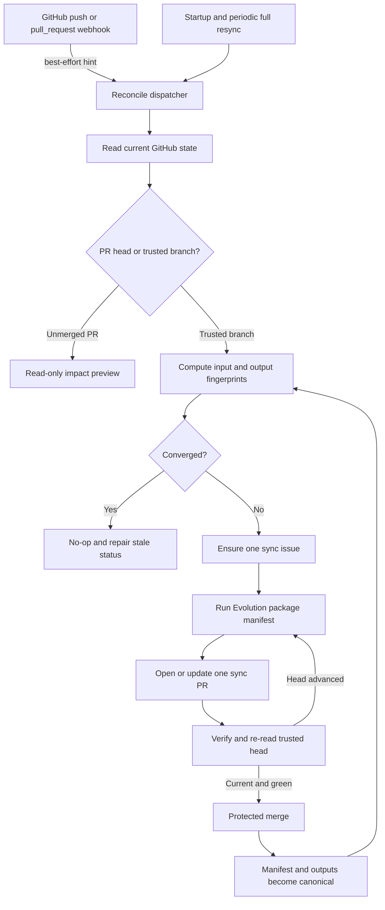

# FKST Evolution: GitHub-Native Continuous Product Evolution

Status: Draft for discussion

Date: 2026-07-24

Intended audience: FKST maintainers, package authors, hosted-control-plane
maintainers, repository owners, product owners, and security reviewers

This document is a temporary design specification. It defines a proposed
system and does not describe functionality that is already implemented unless
an existing FKST behavior is explicitly identified as such.

## Document map

- Sections 1-9 define the problem, purpose, constraints, principles, and terms.
- Sections 10-14 define component boundaries, placement, configuration, and the
  product model.
- Sections 15-17 define change records, the manifest, fingerprints, and
  convergence.
- Sections 18-22 define events, PR preview, singleton reconciliation, branches,
  merging, and loop prevention.
- Sections 23-24 define artifacts and GitHub Release storage.
- Sections 25-27 define security, recovery, and autonomy policy.
- Sections 28-34 define component work, UI projection, operations,
  compatibility, and adoption.
- Sections 35-42 define tests, acceptance criteria, rollout, examples,
  alternatives, open questions, and final invariants.
- Appendices provide draft machine markers, a freshness example, a minimal
  proof, and current implementation touchpoints.

## 1. Executive summary

FKST Evolution is a proposed repository-level capability that continuously
keeps a project's product-facing materials aligned with the latest trusted
state of the project. It observes pull requests and the repository's current
default branch, maintains a compact machine-readable product model, and
produces or updates:

- user-facing documentation;
- product-operation agent skills;
- executable product journeys;
- demo screenshots;
- demo videos;
- release notes and product change records; and
- editable and rendered slide decks.

Evolution is not a database-backed service. GitHub is the only durable system
of record. The source repository, or an explicitly configured companion GitHub
repository, stores all durable configuration, model data, generated source,
coordination state, history, and artifacts. The control plane may keep
short-lived queues, caches, leases, and running sandboxes, but a complete loss
of that process-local state MUST NOT lose work or change the final outcome.

The system is level-triggered rather than event-sourced. A GitHub webhook is a
best-effort wake-up hint. On every reconciliation, Evolution reads current
GitHub state and determines whether the repository is converged. Startup and
periodic full resynchronization repair missed, duplicated, delayed, or
out-of-order webhook deliveries.

Evolution MUST serialize canonical artifact production per repository. A burst
of commits may be analyzed in one run, but every reachable change since the
last converged source revision remains covered. At most one canonical Evolution
work issue and one canonical Evolution pull request may be open for a source
repository at a time.

Pull request heads are untrusted. Pre-merge processing is read-only and
secretless. Canonical documentation, skills, demos, media, and decks are
generated from a commit that has reached the trusted default branch. This
separation permits useful PR impact feedback without executing contributor code
under a repository write token or demo credentials.

The central implementation concept is a repository-native materialized view:

```text
authoritative product source + owner intent + generator version
                              |
                              v
                 structured product observation
                              |
          +-------------------+-------------------+
          |         |         |         |         |
        docs      skills   screenshots  video   slides
                              |
                              v
         versioned Git files + GitHub Release assets
```

The system checks the complete managed product surface after each relevant
change, but only rewrites affected artifacts. A release event or explicit full
rebuild request may force regeneration of every configured artifact.

## 2. Normative language

The key words MUST, MUST NOT, REQUIRED, SHALL, SHALL NOT, SHOULD, SHOULD NOT,
RECOMMENDED, MAY, and OPTIONAL in this document are to be interpreted as
normative requirements when written in uppercase.

Examples and proposed schemas are normative only where the surrounding text
says they are required. Field names marked as provisional may change before
implementation.

## 3. Background

### 3.1 Current FKST operating model

FKST runs package-driven coding sessions against GitHub repositories. A trigger
issue declares the session's package set and routing configuration. Open issues
with matching work labels form the session's work queue. A session performs
work in a sandbox, reports through GitHub, and normally produces a pull request.

The hosted control plane is intentionally durable-datastore-free. GitHub issues,
comments, labels, branches, pull requests, and repository files express durable
desired state and durable acknowledgements. Running Kubernetes pods or
OpenSandbox sandboxes express live runtime state. In-memory queues accelerate
reconciliation but do not establish correctness.

Current sessions are optimized for independent work items. Multiple open work
issues can be handled in parallel, with each issue producing an independent
pull request. That behavior is valuable for unrelated development tasks but is
not safe for Evolution artifacts, which share product models, documentation
indexes, screenshots, and release narratives. Evolution therefore requires a
single coalescing lane per repository.

FKST already reserves `.fkst/packages/` in a target repository as a repo-local
workflow catalog. Evolution extends the `.fkst/` namespace with
`.fkst/evolution/`; it does not replace or reinterpret `.fkst/packages/`.

### 3.2 Product continuity problem

Product-facing artifacts usually evolve at different speeds:

- application behavior changes in code;
- tests describe only selected behavior;
- documentation becomes stale;
- agent instructions retain obsolete paths or API fields;
- screenshots show previous layouts;
- demo videos stop matching current flows;
- release notes omit product implications; and
- decks reuse old claims and imagery.

The problem is not simply that artifact generation is manual. The deeper
problem is that each artifact often reconstructs its own understanding of the
product. Five independently generated outputs can disagree even when generated
on the same day.

Evolution addresses this by maintaining one structured, evidence-backed product
observation and deriving multiple artifact types from it. Owner-authored intent
is kept separate from agent-observed behavior so that the system cannot silently
turn an inference into product strategy.

### 3.3 Why a conventional documentation bot is insufficient

A documentation bot normally reacts to a diff and edits prose. Evolution has a
broader responsibility:

- determine whether a change is product-facing;
- identify affected capabilities and user journeys;
- preserve a semantic product-change history;
- verify current behavior against code, tests, schemas, and a running product;
- update several mutually dependent artifact formats;
- determine which artifacts are stale even when no source file names match;
- execute safe demo journeys against trusted code;
- retain provenance tying every output to an exact source state; and
- recover after missed events without a private event database.

These requirements make Evolution a reconciliation workflow rather than a text
generation task.

## 4. Purpose

Evolution exists to give repository and product owners an automatically
maintained, inspectable answer to four questions:

1. What can users do with the product now?
2. What product-visible behavior changed, when, and why?
3. Which public artifacts represent the current product accurately?
4. What evidence supports each claim, instruction, screenshot, video, or slide?

The system SHOULD reduce ongoing artifact maintenance to exception handling and
editorial review. After bootstrap, an enabled repository SHOULD converge
automatically after default-branch changes without requiring a person to open a
new Evolution issue for each commit.

## 5. Goals

Evolution has the following goals:

1. Detect every relevant pull request update and every change that reaches the
   repository's current default branch.
2. Remain correct when webhook events are lost, duplicated, reordered, or
   delivered after a restart.
3. Store all durable Evolution data in a GitHub repository.
4. Maintain a structured product model with stable capability and journey
   identifiers.
5. Produce mutually consistent documentation, skills, screenshots, videos,
   release narratives, and slide decks.
6. Track artifact freshness and provenance without a central registry.
7. Serialize canonical updates so competing runs cannot produce conflicting
   product projections.
8. Support autonomous operation with branch-protection-respecting merge policy.
9. Keep untrusted pull request execution separated from privileged post-merge
   production.
10. Permit a complete Evolution deployment restart without data migration or
    replay from a private event log.
11. Let owners retain product intent, terminology, publication policy, and
    artifact ownership boundaries under version control.
12. Keep artifact source editable and portable outside FKST.
13. Work with an application repository directly or with an owner-selected
    companion GitHub repository.
14. Make uncertainty and failed verification explicit rather than converting
    them into confident product claims.

## 6. Non-goals

Evolution is not intended to:

- replace Git, GitHub issues, pull requests, branch protection, or release
  management;
- create a private durable queue, project database, vector database, or hosted
  artifact registry;
- preserve every webhook payload;
- guarantee exactly one agent invocation per commit;
- publish unreviewed marketing claims inferred only from code;
- execute untrusted pull request code with repository write credentials,
  production data, or demo secrets;
- continuously rewrite arbitrary product source code as part of artifact
  synchronization;
- replace ordinary unit, integration, accessibility, or end-to-end tests;
- guarantee byte-identical LLM output for the same input;
- store credentials, tokens, raw prompts, or private runtime logs in the source
  repository;
- use GitHub Actions artifacts as durable storage; or
- require repository owners to use one documentation framework, skill format,
  presentation tool, or frontend test framework.

Evolution MAY discover source defects or missing automation. Those findings
SHOULD become separate FKST development work items and MUST NOT silently expand
the Evolution pull request beyond its configured ownership boundary.

## 7. Hard constraints

### 7.1 Durable-store constraint

GitHub repository resources are the only permitted durable store for Evolution.
For this specification, repository resources include:

- Git commits, trees, blobs, branches, and tags;
- repository files on ordinary branches;
- issues, issue comments, assignees, and labels;
- pull requests, pull request comments, and reviews;
- commit statuses or check results when permission is granted;
- GitHub Releases and Release assets; and
- resources in a configured companion GitHub repository.

No SQL, document, key-value, graph, vector, or event database is permitted.
Evolution artifacts MUST NOT depend on external object storage or Git LFS.

Short-lived runtime state is permitted when correctness does not depend on it.
Examples include:

- bounded in-memory reconcile queues;
- token and contents caches;
- debounce timers;
- a leader-election lease;
- a running sandbox filesystem;
- temporary media-rendering files; and
- retry counters held by a current process.

After all such state is destroyed, the next full reconciliation MUST be able to
derive the required action from GitHub and live sandbox discovery alone.

### 7.2 Default branch as canonical trust boundary

The current default branch is the canonical product source unless configuration
explicitly chooses another protected source branch. Pull request heads are
untrusted until merged. Canonical executable verification and publication MUST
use an exact commit reachable from the trusted source branch.

### 7.3 GitHub-native auditability

Every durable decision MUST be inspectable in normal GitHub resources. A
repository owner MUST be able to determine:

- which source commit was observed;
- which generator packages and tool versions were resolved;
- which capabilities and journeys were affected;
- which artifacts were updated;
- which verification steps passed or failed;
- why a run did not merge; and
- whether a later run superseded it.

### 7.4 Idempotent convergence

The same repository state may be reconciled any number of times. Reconciliation
MUST become a no-op once authoritative input, configured generator versions,
and managed output match the committed Evolution manifest.

### 7.5 Owner-controlled boundaries

The owner MUST declare which paths Evolution owns. Evolution MUST NOT modify a
path outside those boundaries. Human-authored product intent MUST have a
separate ownership class and MUST NOT be rewritten automatically.

## 8. Design principles

### 8.1 Desired state, observed state, and action

Evolution follows a controller model:

```text
desired state = current GitHub source + owner policy + generator revision
observed state = committed manifest + managed files + GitHub work resources
action         = the smallest safe operation that makes observed match desired
```

### 8.2 Events are hints, state is truth

Webhook delivery reduces latency. It is never the sole record that a change
occurred. Reconciliation always queries current branch or pull request state and
never trusts an event's stale head SHA without confirmation.

### 8.3 Detect each change, batch execution

Evolution distinguishes detection from execution. Each reachable change since
the last converged source revision MUST be considered. Several changes MAY be
processed in one session and one pull request.

### 8.4 Inspect all, rewrite affected outputs

After a relevant source change, Evolution SHOULD check the entire managed
product surface for consistency. It SHOULD only rewrite artifacts whose inputs,
dependencies, verification evidence, or generated bytes changed. A configured
full rebuild may deliberately regenerate every artifact.

### 8.5 One product model, multiple renderers

Artifact producers MUST consume a shared capability, journey, change, and
evidence model. A documentation renderer and a slide renderer MUST NOT derive
independent product facts from the repository without recording their findings
in the shared model.

### 8.6 Evidence before assertion

A factual product claim SHOULD reference one or more evidence sources, such as:

- a passing unit, integration, contract, or end-to-end test;
- an API or command schema;
- an application route or user-visible control;
- a successful executable journey;
- a migration or compatibility declaration;
- a merged pull request; or
- an owner-authored statement.

Unsupported inferences MUST be marked unverified or raised for owner review.

### 8.7 Safe autonomy

Autonomy means that the system detects drift, produces updates, verifies them,
and advances them according to repository policy without routine human
coordination. It does not mean direct pushes, permission bypass, or execution of
untrusted code with privileged credentials.

## 9. Terminology

| Term                  | Meaning                                                                                            |
| --------------------- | -------------------------------------------------------------------------------------------------- |
| Source repository     | The GitHub repository whose product is being observed                                              |
| Artifact repository   | The GitHub repository receiving Evolution state and artifacts; normally the source repository      |
| Companion repository  | An optional separate artifact repository selected by the owner                                     |
| Trusted source branch | Normally the source repository's current default branch                                            |
| Authoritative input   | Owner-controlled or product-source content from which artifacts are derived                        |
| Managed output        | A file or artifact that Evolution is authorized to rewrite                                         |
| Product intent        | Human-owned audience, terminology, positioning, promises, and constraints                          |
| Product observation   | Agent-maintained structured description of current capabilities and journeys                       |
| Capability            | A stable, user-relevant product function with evidence and lifecycle state                         |
| Journey               | A user goal expressed as ordered, verifiable product interactions                                  |
| Change record         | A semantic description of product-visible changes associated with a source commit                  |
| Artifact              | A generated document, skill, image, video, presentation, or release narrative                      |
| Artifact source       | Editable, diffable files from which an artifact may be rendered                                    |
| Rendered artifact     | A generated binary such as MP4, PDF, or PPTX                                                       |
| Input fingerprint     | Hash representing all authoritative inputs and generator revisions                                 |
| Output fingerprint    | Hash representing all managed repository outputs                                                   |
| Converged             | Input and output fingerprints match the committed manifest and no required verification is pending |
| Evolution cycle       | One serialized attempt to move a repository from observed state to desired state                   |
| Sync issue            | The single open GitHub work issue representing a canonical Evolution cycle                         |
| Sync PR               | The single open pull request carrying canonical Evolution updates                                  |
| PR preview            | Read-only impact analysis for an unmerged pull request                                             |

## 10. System context and responsibility boundaries

### 10.1 Hosted control plane

The hosted control plane SHOULD own only generic orchestration concerns:

- signature verification and classification of GitHub webhook events;
- repository reconciliation wake-up;
- startup and periodic full resynchronization;
- discovery of Evolution enrollment and current GitHub state;
- enforcement of one canonical Evolution lane per repository;
- creation or reopening of a coalesced sync issue;
- dynamic resolution of the current default branch;
- least-privilege credential minting;
- safe merge-policy enforcement;
- projection of GitHub-native Evolution state to a user-facing dashboard; and
- cleanup of runtime resources.

The hosted control plane MUST NOT understand how to write a user guide, operate
Playwright, compose a product skill, edit video, or render slides.

### 10.2 FKST packages

Evolution packages SHOULD own domain behavior:

- repository change analysis;
- capability and journey extraction;
- evidence collection;
- documentation maintenance;
- skill generation and conformance testing;
- deterministic demo environment preparation;
- screenshot and video capture;
- slide source generation and rendering;
- cross-artifact consistency checks; and
- Evolution manifest construction.

Packages SHOULD be composable through an FKST manifest so owners can enable
only the artifact types they need.

### 10.3 Source repository

The source repository owns:

- product source and tests;
- Evolution enrollment and configuration;
- human-authored product intent;
- current machine-readable product observation when no companion is used;
- generated artifact source when no companion is used;
- durable change and provenance records;
- the sync issue and sync PR; and
- repository policy governing required checks and merge behavior.

### 10.4 Companion repository

A companion repository MAY own product observation, artifact source, and
rendered artifacts for owners that do not want generated content in the source
repository. The source repository MUST retain enough configuration to identify
the companion repository, and every companion artifact MUST record the exact
source repository and source commit it represents.

The GitHub App MUST have authority on both repositories. Cross-repository
updates are not atomic; the manifest in the artifact repository is canonical
for artifact convergence, while source-repository configuration is canonical
for enrollment and destination selection.

### 10.5 GitHub

GitHub provides the durable substrate:

- Git history stores source, structured state, and editable outputs;
- issues and labels store work coordination and durable status;
- pull requests store proposed canonical transitions and reviews;
- comments store bounded human-readable diagnostics and machine markers;
- branch protection and merge queues enforce repository policy; and
- Releases store large rendered artifacts.

## 11. High-level architecture



The control plane can lose `B` entirely. `C` will reconstruct pending work from
GitHub and live runtime state.

## 12. Durable data placement

### 12.1 Default placement

The RECOMMENDED default is to store structured Evolution state and editable
artifact source in the source repository's default branch. Large rendered
artifacts are stored as Release assets in that same repository.

```text
.fkst/
  packages/                         existing FKST workflow catalog
  evolution/
    config.yaml                     owner-controlled policy
    intent/
      product.md                    owner-controlled narrative intent
      overrides.yaml                owner-controlled protected facts
    observed/
      capabilities.yaml             agent-maintained product observation
      journeys.yaml                 journey metadata and evidence references
    changes/
      <source-commit-sha>.yaml       semantic product change record
    manifest.json                   convergence and artifact provenance

docs/product/                       generated user-facing documentation
.agents/skills/                     generated product-operation skills
demo/journeys/                      executable demo specifications
demo/screenshots/                   small current screenshots
slides/                             editable presentation source
```

Rendered MP4, PDF, PPTX, and other large binaries SHOULD be stored in GitHub
Releases and referenced by `manifest.json`.

### 12.2 What MUST NOT be stored under `.fkst/evolution/`

The directory MUST NOT contain:

- repository, GitHub App, LLM, or demo-environment credentials;
- raw private user or production data;
- raw LLM prompts or transcripts;
- unredacted runtime logs;
- browser profiles, cookies, or authenticated storage state;
- package-manager, compiler, or browser caches;
- temporary media frames;
- large videos, PDFs, or presentation binaries; or
- a private copy of webhook payloads.

### 12.3 Data ownership classes

Every configured path belongs to exactly one ownership class:

| Class                | Owner                       | Evolution behavior                                          |
| -------------------- | --------------------------- | ----------------------------------------------------------- |
| Authoritative source | Product developers          | Read, never rewrite as part of Evolution                    |
| Human intent         | Repository or product owner | Read, preserve, request review for conflicts                |
| Observed model       | Evolution                   | Update through sync PRs                                     |
| Managed output       | Evolution                   | Regenerate or repair through sync PRs                       |
| Shared/manual        | Humans                      | Read only unless explicitly migrated into managed ownership |

A path MUST NOT be both human-owned and Evolution-managed. Mixed ownership
inside one file SHOULD be avoided. When unavoidable, generated blocks MUST use
stable machine markers and the implementation MUST preserve all content outside
those blocks.

### 12.4 Companion repository placement

When `artifactRepository` names a companion repository, the source repository
retains only enrollment and destination configuration. The companion repository
uses the same `.fkst/evolution/` schema and stores all generated source and
Release assets.

The companion manifest MUST include:

- source repository full name;
- source default branch resolved for the run;
- exact source commit SHA;
- source input fingerprint;
- companion output fingerprint; and
- generator fingerprint.

The Git commit containing the manifest is derived from GitHub when the manifest
is read. It is deliberately not embedded in the manifest itself, which would
create a self-referential commit identity.

## 13. Enrollment and configuration

### 13.1 Enrollment

A repository is enrolled when both of the following exist:

1. an open FKST trigger issue whose packages or manifest include the Evolution
   workflow; and
2. `.fkst/evolution/config.yaml` on the trusted source branch.

An installation-time bootstrap MAY create a draft trigger issue and a baseline
configuration PR. It MUST NOT silently enable autonomous merging without an
owner-selected policy.

### 13.2 Draft configuration schema

The following schema is illustrative and intentionally explicit:

```yaml
schemaVersion: 1
enabled: true

source:
  branch: "@default"
  include:
    - "**"
  exclude:
    - ".git/**"
    - ".fkst/evolution/observed/**"
    - ".fkst/evolution/changes/**"
    - ".fkst/evolution/manifest.json"
    - "docs/product/**"
    - ".agents/skills/**"
    - "demo/screenshots/**"
    - "slides/generated/**"

artifactRepository: "."

intent:
  product: ".fkst/evolution/intent/product.md"
  overrides: ".fkst/evolution/intent/overrides.yaml"

managedOutputs:
  documentation:
    enabled: true
    paths:
      - "docs/product/**"
  skills:
    enabled: true
    paths:
      - ".agents/skills/**"
  journeys:
    enabled: true
    paths:
      - "demo/journeys/**"
  screenshots:
    enabled: true
    paths:
      - "demo/screenshots/**"
  video:
    enabled: true
    storage: "github-release"
  slides:
    enabled: true
    sourcePaths:
      - "slides/**"
    renderedStorage: "github-release"

locales:
  - "en"

triggers:
  pullRequestPreview: true
  defaultBranchPush: true
  releaseFullRebuild: true
  debounceSeconds: 60

publication:
  mode: "automerge-managed"
  requireCurrentSource: true
  requireChecks: true
  allowDirectPush: false

retention:
  renderedSnapshots: 10
  preserveProductReleases: true

security:
  runPullRequestCode: false
  allowProductionData: false
  allowProductionCredentials: false
```

### 13.3 Configuration validation

Configuration validation MUST fail closed when:

- `schemaVersion` is unsupported;
- the configured source branch cannot be resolved;
- the artifact repository is malformed or inaccessible;
- managed output patterns overlap human-intent paths;
- source include/exclude rules omit the configuration itself from the input
  fingerprint;
- two artifact classes claim the same path incompatibly;
- direct push is requested;
- a requested storage mode is not GitHub-native;
- a requested merge policy cannot honor required checks; or
- security policy requests privileged execution of an untrusted PR head.

Unknown fields SHOULD be rejected until the schema defines an extension
mechanism. Silent acceptance would let misspelled safety policy appear active.

### 13.4 Configuration changes

A configuration change is authoritative input and MUST trigger reconciliation.
Reducing a managed path set MUST NOT automatically delete previously managed
files. Evolution SHOULD report them as released from management and require an
explicit cleanup policy or separate reviewed deletion.

Changing `artifactRepository` requires an explicit migration. The old manifest
remains historical evidence and MUST NOT be silently deleted.

## 14. Product model

### 14.1 Model purpose

The product model is a compact, structured observation that gives all artifact
renderers a common understanding. It is not intended to duplicate the complete
source tree or function as an application architecture database.

### 14.2 Capability schema

Each capability MUST have a stable identifier. Renaming a title MUST NOT create
a new identity. A draft entry is:

```yaml
schemaVersion: 1
capabilities:
  - id: "data.csv-import"
    title: "CSV import"
    status: "available"
    summary: "Import structured records from a CSV file."
    audiences:
      - "workspace-admin"
    interfaces:
      - kind: "ui"
        entrypoint: "/imports/new"
      - kind: "api"
        entrypoint: "POST /api/v1/imports"
    limitations:
      - "Maximum upload size is 25 MiB."
    journeys:
      - "journey.csv-import-and-validate"
    evidence:
      - kind: "test"
        ref: "frontend/e2e/import.spec.ts"
      - kind: "schema"
        ref: "GET /openapi.json#/paths/~1api~1v1~1imports"
    introducedBy: "<commit-sha>"
    lastChangedBy: "<commit-sha>"
    verification: "passed"
```

Allowed lifecycle states SHOULD include:

- `planned`, only when explicitly owner-authored;
- `experimental`;
- `available`;
- `deprecated`;
- `removed`; and
- `unknown` for incomplete bootstrap analysis.

Evolution MUST NOT infer `planned` product commitments from branches, TODOs, or
unmerged pull requests.

### 14.3 Journey schema

Journey metadata links product meaning to executable verification. Executable
code remains in the configured journey source directory.

```yaml
schemaVersion: 1
journeys:
  - id: "journey.csv-import-and-validate"
    title: "Import and validate customer records"
    audience: "workspace-admin"
    capabilities:
      - "data.csv-import"
    executable:
      framework: "playwright"
      ref: "demo/journeys/csv-import.spec.ts"
    prerequisites:
      - "A synthetic workspace with import permission"
    captures:
      - id: "csv-mapping"
        kind: "screenshot"
      - id: "csv-import-demo"
        kind: "video"
    evidence:
      lastVerifiedSource: "<commit-sha>"
      result: "passed"
```

### 14.4 Product intent

Product intent is human-owned. It SHOULD cover:

- intended audiences;
- product purpose and value proposition;
- canonical terminology;
- prohibited or regulated claims;
- known non-goals;
- brand and accessibility requirements;
- expected documentation voice;
- demo-data constraints; and
- presentation audiences and confidentiality classes.

Evolution MAY propose changes to intent in a separately reviewable suggestion,
but MUST NOT merge those changes through autonomous managed-output policy.

### 14.5 Overrides

Overrides protect facts that cannot be reliably inferred. Example:

```yaml
schemaVersion: 1
protectedFacts:
  - id: "upload-limit"
    statement: "CSV uploads are limited to 25 MiB."
    evidence: "docs/architecture/import-limits.md"
    owner: "product"

terminology:
  forbidden:
    - "account owner"
  preferred:
    "account owner": "workspace administrator"

artifactRules:
  - match: "slides/investor/**"
    requiresHumanReview: true
```

An observed contradiction with a protected fact MUST block publication of the
affected artifact and produce a clear review request.

## 15. Product change records

### 15.1 Purpose

Git history records implementation changes but does not reliably express their
product meaning. Evolution change records provide an append-only semantic layer
without creating a separate database.

### 15.2 Identity and file naming

The canonical path is:

```text
.fkst/evolution/changes/<trusted-source-commit-sha>.yaml
```

The source commit SHA is the identity. Reprocessing the same commit MUST update
the same proposed file rather than creating another record. Once merged, a
record SHOULD remain immutable except for schema migration or correction of a
demonstrable factual error.

For a squash-merged pull request, the default-branch squash commit is the source
identity and the record includes the pull request number and last observed PR
head. Individual commits that never become reachable from the trusted branch do
not receive canonical change records.

### 15.3 Draft schema

```yaml
schemaVersion: 1
sourceCommit: "<full-commit-sha>"
sourceParents:
  - "<parent-sha>"
pullRequest:
  number: 412
  url: "https://github.com/owner/project/pull/412"
  headCommit: "<last-pr-head-sha>"

classification: "product-change"
summary: "Workspace administrators can import and validate CSV records."

capabilities:
  added:
    - "data.csv-import"
  changed: []
  deprecated: []
  removed: []

journeys:
  added:
    - "journey.csv-import-and-validate"
  changed: []
  removed: []

artifactImpact:
  documentation:
    - "docs.csv-import"
  skills:
    - "skill.csv-import"
  screenshots:
    - "screenshot.csv-mapping"
  videos:
    - "video.csv-import"
  slides:
    - "deck.release-update"

migrations: []
limitations:
  - "Maximum upload size is 25 MiB."

evidence:
  - kind: "pull-request"
    ref: "#412"
  - kind: "test"
    ref: "frontend/e2e/import.spec.ts"

verification: "passed"
```

### 15.4 Classification

Allowed classifications SHOULD include:

- `product-change`;
- `product-fix`;
- `deprecation`;
- `removal`;
- `migration`;
- `internal-only`;
- `documentation-only`;
- `generated-only`; and
- `uncertain`.

An `internal-only` or `generated-only` commit MAY have a small record when it is
needed to prove coverage, but implementations MAY instead track coverage only
through the manifest when no product semantics changed.

### 15.5 Coverage across batched commits

A single Evolution cycle may process a range of commits. It MUST walk every
reachable commit from the previous covered source revision, exclusive, through
the currently observed source revision, inclusive. Merge topology and pull
request metadata SHOULD be used to avoid presenting implementation merge commits
as independent user-facing releases.

If the previous revision is not an ancestor of the current revision, Evolution
MUST perform a full product comparison and record that history was rewritten.
It MUST NOT guess a linear range from timestamps.

## 16. Evolution manifest

### 16.1 Purpose

`.fkst/evolution/manifest.json` is the canonical compact convergence record. It
replaces the need for a database cursor or hosted artifact registry. It answers:

- which trusted source state was used;
- which generator revision produced the outputs;
- which source and output fingerprints were calculated;
- which commit range was covered;
- which artifacts exist and where;
- which capabilities and journeys each artifact represents; and
- whether verification passed.

### 16.2 Draft schema

```json
{
  "schemaVersion": 1,
  "source": {
    "repository": "owner/project",
    "branch": "main",
    "observedHead": "abc123fullsha",
    "previousCoveredHead": "def456fullsha",
    "historyRelation": "fast-forward",
    "sourceTreeFingerprint": "sha256:...",
    "inputFingerprint": "sha256:..."
  },
  "artifactRepository": {
    "repository": "owner/project",
    "branch": "main"
  },
  "generator": {
    "manifestRef": "owner/fkst-packages@resolved-sha:manifests/product-evolution.json",
    "packages": [
      "owner/fkst-packages@resolved-sha:packages/evolution-observer",
      "owner/fkst-packages@resolved-sha:packages/evolution-docs"
    ],
    "engineVersion": "<version>",
    "model": "<provider-and-model-id>",
    "toolchain": {
      "playwright": "<version>",
      "ffmpeg": "<version>",
      "slideRenderer": "<name-and-version>"
    },
    "fingerprint": "sha256:..."
  },
  "outputFingerprint": "sha256:...",
  "verification": {
    "status": "passed",
    "verifiedAt": "2026-07-24T12:00:00Z",
    "checks": [
      {
        "id": "journey.csv-import-and-validate",
        "status": "passed",
        "evidence": "demo/journeys/csv-import.spec.ts"
      }
    ]
  },
  "artifacts": [
    {
      "id": "docs.csv-import",
      "kind": "documentation",
      "locale": "en",
      "audience": "workspace-admin",
      "capabilities": ["data.csv-import"],
      "journeys": ["journey.csv-import-and-validate"],
      "sourceCommit": "abc123fullsha",
      "repositoryPath": "docs/product/csv-import.md",
      "contentHash": "sha256:...",
      "status": "current",
      "verification": "passed"
    },
    {
      "id": "video.csv-import",
      "kind": "video",
      "locale": "en",
      "audience": "workspace-admin",
      "capabilities": ["data.csv-import"],
      "journeys": ["journey.csv-import-and-validate"],
      "sourceCommit": "abc123fullsha",
      "release": {
        "repository": "owner/project",
        "tag": "fkst-evolution/0123456789abcdef",
        "asset": "csv-import.sha256-abcd1234.mp4",
        "assetUrl": "https://github.com/owner/project/releases/download/..."
      },
      "contentHash": "sha256:...",
      "status": "current",
      "verification": "passed"
    }
  ]
}
```

### 16.3 Artifact status

Artifact status values SHOULD include:

- `current`: generated from the manifest input and verified;
- `current-unverified`: generated from the manifest input but not fully tested;
- `stale`: known not to represent current input;
- `blocked`: generation cannot proceed until a declared condition is resolved;
- `failed`: an attempted generation or verification failed;
- `deprecated`: retained for compatibility but no longer preferred; and
- `removed`: represented as a tombstone when historical continuity is needed.

A manifest merged under autonomous policy MUST NOT claim `current` when a
required verification failed.

### 16.4 Manifest lifecycle

The manifest advances only when its corresponding sync PR merges. An issue
comment, open PR, successful local generation, uploaded draft Release asset, or
passing sandbox test is not canonical completion.

The manifest MUST NOT contain the SHA of the final Git commit that contains the
manifest. Consumers obtain that commit from the GitHub ref or contents response.
Embedding it would require changing the file, which would create a different
commit SHA indefinitely.

When the artifact repository differs from the source repository, the companion
manifest advances through a PR in the companion repository. The source commit
remains immutable provenance even if the source branch advances before that PR
merges.

### 16.5 Corruption handling

An absent manifest means the repository requires baseline generation. A
malformed or unsupported manifest MUST NOT be silently replaced under
autonomous merge policy. Evolution SHOULD open or update the sync issue with a
bounded diagnostic and propose a repair PR that preserves the invalid file for
review or history.

## 17. Fingerprints and convergence

### 17.1 Why commit SHA comparison is insufficient

Every merged Evolution PR creates a new trusted-branch commit. If convergence
were defined as `manifest.source.observedHead == currentBranchHead`, Evolution
would trigger itself indefinitely. A commit SHA also fails to detect a mutable
generator reference moving while source code remains unchanged.

Evolution therefore uses separate source, generator, input, and output
fingerprints.

### 17.2 Canonical file hashing

For every fingerprinted repository file, implementations MUST:

1. use the Git tree at the exact revision rather than filesystem modification
   time;
2. normalize paths to slash-separated repository-relative UTF-8 names;
3. preserve Git file mode in the hash input;
4. hash raw blob bytes without line-ending conversion;
5. sort entries by path byte order; and
6. hash a length-delimited representation so path and content boundaries cannot
   collide.

A conceptual leaf is:

```text
leaf = SHA256(path_length || path || mode || content_length || content_bytes)
```

The tree fingerprint is SHA-256 over the ordered length-delimited leaves.

### 17.3 Source tree fingerprint

The source tree fingerprint covers files selected by `source.include` minus
`source.exclude`, with these rules:

- `config.yaml` and human-intent files are always included;
- observed model, change records, manifest, and managed outputs are excluded;
- generated workflow files MAY be included only when they are authoritative
  inputs rather than outputs of this same Evolution cycle;
- submodule identity is the recorded submodule commit, not an implicit clone of
  mutable remote content; and
- symlinks are hashed as Git symlink blobs and MUST NOT be followed outside the
  checkout.

### 17.4 Generator fingerprint

The generator fingerprint covers all inputs that may change output without a
source-tree change:

- every FKST manifest and package reference resolved to an immutable commit;
- package configuration and prompts;
- engine version;
- declared model provider and model identifier;
- renderer and media tool versions;
- template and theme files not already included in the source fingerprint; and
- schema versions for capabilities, journeys, changes, and manifest.

Secrets and secret values MUST NOT enter a fingerprint. Non-secret settings
that affect visible output SHOULD enter it.

### 17.5 Input fingerprint

The input fingerprint is a versioned composition:

```text
inputFingerprint = SHA256(
  "fkst-evolution-input-v1" ||
  sourceTreeFingerprint ||
  generatorFingerprint ||
  normalizedRelevantConfiguration
)
```

The exact canonical serialization MUST be documented and covered by test
vectors before implementation.

### 17.6 Output fingerprint

The output fingerprint covers:

- every file in configured managed-output paths;
- `.fkst/evolution/observed/**`;
- `.fkst/evolution/changes/**`;
- all referenced Release asset content hashes; and
- declared artifact metadata other than self-referential manifest fields.

`manifest.json` itself is excluded from repository file hashing to avoid a
circular hash. A canonical projection of its `artifacts` and `verification`
sections MAY be included in the output fingerprint.

### 17.7 Convergence decision

The repository is converged only when:

1. the current input fingerprint equals the committed manifest input
   fingerprint;
2. the current output fingerprint equals the committed manifest output
   fingerprint;
3. all REQUIRED artifacts are present;
4. all REQUIRED verification entries have an acceptable status;
5. no newer authoritative-input change remains uncovered; and
6. no open canonical sync PR represents a different current input.

### 17.8 Managed-output drift

If input is unchanged but output differs, a human or tool changed a managed
output outside Evolution. Policy MAY choose:

- `repair`: regenerate and propose restoration;
- `adopt`: analyze the manual edit and update the model and manifest through a
  normal sync PR; or
- `block`: request ownership resolution.

The default SHOULD be `block` during bootstrap and `repair` only after owners
have explicitly accepted managed ownership.

## 18. Event and discovery contract

### 18.1 GitHub App subscriptions

Evolution requires these webhook subscriptions in addition to existing FKST
issue handling:

- `push`;
- `pull_request`;
- `repository` for default-branch changes when available; and
- `release` only when release-triggered full rebuild is enabled. Namespaced
  Evolution Releases MUST be excluded.

Installation and installation-repository events remain useful for discovery and
access recovery.

### 18.2 Webhook processing

The webhook route MUST:

1. verify `X-Hub-Signature-256` over the exact raw request bytes;
2. parse only fields needed to derive the affected repository and event class;
3. reject an invalid signature;
4. enqueue a best-effort repository hint;
5. return promptly without waiting for generation; and
6. avoid persisting the payload outside GitHub.

A verified but malformed or unsupported event SHOULD be acknowledged without
creating an unbounded redelivery storm. Correctness comes from subsequent full
resynchronization.

### 18.3 Event actions

| Event                           | Condition                                               | Action                                |
| ------------------------------- | ------------------------------------------------------- | ------------------------------------- |
| `pull_request.opened`           | Base is current default                                 | Reconcile PR preview                  |
| `pull_request.reopened`         | Base is current default                                 | Reconcile PR preview                  |
| `pull_request.synchronize`      | Base is current default                                 | Reconcile new PR head                 |
| `pull_request.ready_for_review` | Base is current default                                 | Reconcile PR preview                  |
| `pull_request.edited`           | Base or relevant metadata changed                       | Re-evaluate eligibility               |
| `pull_request.closed`           | Not merged                                              | Clear active preview status if needed |
| `pull_request.closed`           | Merged                                                  | Nudge canonical reconciliation        |
| `push`                          | Ref is current default                                  | Nudge canonical reconciliation        |
| `push`                          | Other ref                                               | Ignore unless configured              |
| `repository.edited`             | Default branch changed                                  | Re-resolve branch and reconcile       |
| `release.published`             | Full rebuild enabled and release is not Evolution-owned | Reconcile with force-full flag        |
| installation access changed     | Repository affected                                     | Re-discover enrollment and access     |

The merge of a pull request normally produces both a `pull_request.closed`
event and a `push` event. Both MUST converge on the same repository hint and
MUST NOT create two work items.

### 18.4 Startup and periodic full resynchronization

On leader acquisition or process startup, the controller MUST enumerate
accessible installations and repositories, discover enrolled repositories, and
reconcile each one. A periodic full resynchronization MUST repeat this process.

An open Evolution trigger issue SHOULD make an enrolled repository discoverable
through existing FKST registration scanning. The control plane MAY also check
for `config.yaml`, but SHOULD avoid an unbounded per-repository contents scan
when issue registration already proves enrollment.

### 18.5 Sweep cadence

Enrolled repositories with an open trigger, live Evolution sandbox, open sync
issue, or open sync PR SHOULD be swept more frequently than inactive
repositories. All intervals are latency controls, not correctness state.

### 18.6 Debounce and coalescing

A webhook burst MAY be debounced in memory. A restart may lose the timer and
run earlier; this is acceptable. A debounce MUST NOT suppress periodic recovery
or cause a trusted source revision to remain uncovered.

The sync issue creation time or latest bot marker MAY provide a GitHub-native
minimum-age signal when a durable quiet period is required.

## 19. Pull request preview

### 19.1 Purpose

PR preview provides early product-impact feedback without changing canonical
Evolution state. It SHOULD report:

- likely affected capabilities and journeys;
- likely additions, changes, deprecations, or removals;
- artifacts expected to become stale after merge;
- missing migration or user-facing information;
- uncertainty that requires author or owner input; and
- whether the PR attempts to modify an Evolution-managed output directly.

### 19.2 Security boundary

PR preview MUST NOT:

- execute code from the PR under a write-capable repository token;
- receive demo, production, publishing, or LLM-provider secrets beyond the
  minimum separately controlled inference credential;
- load PR-authored browser configuration with privileged credentials;
- publish canonical artifacts;
- mutate the PR head branch; or
- update `.fkst/evolution/manifest.json`.

The preferred design is for the control plane to fetch the PR metadata and diff
with a read-only installation token, provide bounded content to a restricted
analysis sandbox, and post the resulting summary through a separate
controller-owned write operation. The untrusted sandbox never receives the
write token.

### 19.3 Durable preview marker

Evolution SHOULD maintain exactly one bot-owned preview comment per pull
request. The comment includes a visible summary and an HTML comment marker:

```html
<!-- fkst-evolution-preview:v1
{"head":"<sha>","base":"<sha>","generator":"sha256:...","status":"current"}
-->
```

On a `synchronize` event, Evolution queries the current PR head. If the marker
already represents that head and generator fingerprint, preview is a no-op.

### 19.4 Preview results are advisory

An unmerged PR is not product truth. Preview findings MUST NOT add planned or
available capabilities to the canonical model. After merge, canonical
reconciliation independently verifies the trusted result.

## 20. Canonical reconciliation

### 20.1 Singleton requirement

For each `(source repository, artifact repository, trusted source branch)`
tuple, there MUST be at most:

- one open canonical sync issue;
- one live canonical Evolution execution;
- one open canonical sync PR; and
- one pending canonical Release-asset set for the same input fingerprint.

The generic FKST behavior of processing independent issues in parallel MUST NOT
be used to create one Evolution issue per commit.

### 20.2 Reconciliation algorithm

Each canonical reconciliation performs these steps:

1. Resolve the source repository's current default branch when configuration
   uses `@default`.
2. Resolve the current trusted branch head.
3. Read and validate Evolution configuration and enrollment.
4. Read the committed manifest, observed model, managed output tree, open sync
   issues, open sync PRs, and relevant Release assets.
5. Resolve all Evolution manifest and package references to immutable commits.
6. Compute source, generator, input, and output fingerprints.
7. If converged, repair stale labels or comments, close an empty stale sync
   issue when safe, and stop.
8. Otherwise, ensure exactly one coalesced sync issue exists.
9. Ensure no second live execution or incompatible sync PR exists.
10. Launch or continue the Evolution package workflow for the exact observed
    source head.
11. Analyze all covered changes and update the product model.
12. Regenerate affected artifacts and perform configured full-surface checks.
13. Create or update one sync PR and any draft Release assets.
14. Re-read the trusted source branch head before declaring readiness.
15. If authoritative input changed, incorporate the new source head and repeat
    generation in the same canonical lane.
16. When current and verified, request policy-compliant merge.
17. After merge, publish eligible draft Release assets, close the sync issue,
    and let the resulting push perform a final no-op convergence check.

### 20.3 Sync issue protocol

The proposed title is:

```text
[evolution] synchronize <source-repository>@<branch>
```

The issue MUST carry the session's Evolution work label and the correct FKST
creator assignee required by session routing. An App-authored issue MUST follow
existing FKST work-authority rules.

Its body SHOULD contain human-readable scope plus a machine marker:

```html
<!-- fkst-evolution-sync:v1
{"source":"owner/project","branch":"main","desiredHead":"<sha>","generation":7}
-->
```

New source events update the desired marker or leave it for the running worker
to discover by re-reading GitHub. They MUST NOT create another open issue.

### 20.4 Issue lifecycle and race closure

The issue remains open while generation, review, required checks, merge, or
post-merge publication is pending. It MAY close automatically after the sync PR
and required assets are canonical.

Consider this race:

1. the worker reads source head A and decides it is current;
2. source head B is pushed;
3. the webhook sees the still-open issue and creates nothing;
4. the worker closes the issue.

Periodic reconciliation compares the committed manifest with head B and creates
or reopens the next sync issue. Therefore correctness does not depend on atomic
issue closure and branch observation.

### 20.5 State machine

```text
DISABLED
   |
   v
BASELINE_REQUIRED -> PENDING -> RUNNING -> PR_OPEN -> VERIFYING
                         ^          |          |           |
                         |          |          |           v
                         +----------+----------+------- BLOCKED
                                                    |
                                                    v
                              CONVERGED <- MERGING <- READY
```

Every durable state is projected from GitHub. The state name itself need not be
stored in a database.

### 20.6 Labels

Implementations MAY use labels such as:

- `fkst-evolution-pending`;
- `fkst-evolution-running`;
- `fkst-evolution-blocked`;
- `fkst-evolution-stale`; and
- `fkst-evolution-complete`.

Labels are projections and durable deduplication latches. Reconciliation MUST
repair them when they disagree with authoritative GitHub state.

## 21. Branch and pull request protocol

### 21.1 Dynamic default branch

Evolution requires a target semantic meaning "the repository's current default
branch." The proposed trigger value is:

```markdown
### Source Branch

@default

### Target Branch

@default
```

Because `@` is not currently accepted as a normal branch name, this is a new
sentinel rather than an ordinary branch. It MUST be resolved at reconciliation
and session-launch time. A repository default-branch rename MUST not require a
new Evolution trigger issue.

### 21.2 Sync branch naming

A canonical cycle SHOULD use an owned branch such as:

```text
fkst/evolution/issue-<issue-number>/<input-short-hash>
```

The branch is temporary and MAY be deleted after merge. Evolution MUST NOT
force-push shared branches. If the trusted source advances while the sync PR is
open, Evolution SHOULD merge or otherwise safely incorporate the new trusted
head into its owned branch, regenerate outputs, and push a normal follow-up
commit.

### 21.3 Pull request identity

The PR title SHOULD be:

```text
docs(evolution): synchronize product artifacts through <source-short-sha>
```

The body MUST link the sync issue and contain a machine marker with:

- input fingerprint;
- observed source head;
- generator fingerprint;
- managed path set;
- verification status; and
- Release asset set, when applicable.

Reconciliation MUST identify the canonical PR by marker and App identity, not by
title alone.

### 21.4 Source-head advancement

Before readiness and again immediately before merge, the system MUST compare the
current source input fingerprint with the PR marker. If it changed, the PR is
stale and MUST NOT merge under autonomous policy until regenerated.

It is acceptable for a very busy repository to merge a verified Evolution PR
for source state A after source state B has landed only when policy explicitly
allows eventual follow-up. The default `requireCurrentSource: true` forbids
this behavior.

### 21.5 Safe automatic merge

Existing mergeability-only FKST auto-merge is not sufficient for Evolution.
Evolution autonomous merge MUST be scoped to its canonical PR and MUST require:

- the PR is authored by the configured FKST App identity;
- every changed path is currently managed or is an allowed Evolution state
  path;
- the PR marker matches the current input fingerprint;
- required checks and journey verification passed;
- branch protection and required reviews are honored;
- no protected product-intent file changed;
- no unapproved deletion escaped the managed-path policy; and
- required Release assets exist with matching hashes.

The RECOMMENDED implementation is GitHub native auto-merge or a merge queue,
not an immediate REST merge based only on GitHub's `mergeable` field.

### 21.6 Direct push

Evolution MUST NOT push directly to the trusted source branch. All canonical
changes use a pull request even in the most autonomous mode.

## 22. Self-trigger prevention

### 22.1 Fingerprint-based suppression

Evolution MUST NOT rely only on bot author, commit message, or changed-path
filters to suppress recursion. Those are useful optimizations but can be stale
or spoofed. The authoritative test is fingerprint convergence.

After an Evolution PR merges:

- managed output changed;
- the manifest changed;
- trusted branch head changed;
- authoritative source input did not change; and
- current output matches the manifest.

The next push-triggered reconciliation therefore becomes a no-op.

### 22.2 Generator modifying generator inputs

Evolution configuration, human intent, templates classified as authoritative,
and package references are inputs. Autonomous Evolution MUST NOT modify them in
the same managed-output cycle. A proposed change to these inputs requires a
separate reviewed PR, after which a new cycle regenerates outputs.

### 22.3 Generated workflow code

When Evolution generates product-operation skills or workflow code that later
acts as input, configuration MUST declare whether it is:

- a managed output excluded from the current input fingerprint; or
- an authoritative workflow source included in the next cycle.

The same file cannot occupy both roles in one cycle. A two-stage workflow MAY
first merge generated workflow source, then reconcile dependent artifacts in a
new cycle.

### 22.4 Evolution Release events

Publishing a namespaced `fkst-evolution/*` Release is an output of Evolution and
MUST NOT trigger a release-driven full rebuild. Release event classification
MUST distinguish owner product releases from Evolution artifact Releases by
validated tag namespace and App identity. Fingerprint convergence remains the
backstop if an event is misclassified.

## 23. Artifact model

### 23.1 Common artifact fields

Every artifact record MUST include:

- stable artifact ID;
- kind;
- source repository and commit;
- input fingerprint;
- generator fingerprint;
- locale and audience when applicable;
- capability and journey dependencies;
- repository path or GitHub Release asset identity;
- content hash;
- freshness status;
- verification status; and
- creation or last-update time.

### 23.2 Dependency graph

Artifacts SHOULD declare capability, journey, template, and source dependencies.
The dependency graph supports selective regeneration, but a full-surface
consistency check still verifies that supposedly unaffected artifacts do not
contain removed capability references, broken links, or invalid terminology.

### 23.3 Documentation

Documentation artifacts MAY include:

- onboarding and quick-start guides;
- task-oriented user guides;
- conceptual documentation;
- UI and CLI reference pages;
- API examples derived from committed schemas;
- troubleshooting;
- migration guides;
- accessibility guidance; and
- release notes.

Generated documentation MUST distinguish current behavior, experimental
behavior, deprecation, and planned behavior. It MUST NOT expose internal secrets
or private implementation notes.

### 23.4 Product-operation agent skills

An agent skill is not merely reformatted documentation. Each generated skill
SHOULD include:

- supported product versions or source fingerprint;
- purpose and bounded scope;
- required permissions and prerequisites;
- inputs and expected outputs;
- side effects;
- deterministic success verification;
- known failure modes;
- referenced scripts and resources; and
- conformance tests against a trusted product build.

Skill format adapters MAY target Ornn or other supported agent-skill formats.
The canonical product facts and journey semantics remain format-independent.

### 23.5 Executable journeys

An executable journey is both product evidence and capture source. For browser
products, Playwright is RECOMMENDED. Other products MAY use CLI, API contract,
mobile, or desktop automation frameworks.

Journeys MUST use stable synthetic fixtures and SHOULD avoid timing,
localization, or viewport assumptions that make capture nondeterministic.

### 23.6 Screenshots

Screenshots used by documentation or decks SHOULD be captured from the same
passing journey revision used to verify the capability. Each capture SHOULD
record:

- journey and checkpoint ID;
- source commit;
- viewport and device scale factor;
- locale and theme;
- fixture revision;
- browser name and version; and
- content hash.

Small current screenshots MAY be committed. Very large image sets SHOULD use
GitHub Releases or a companion repository according to policy.

### 23.7 Demo video

Demo videos SHOULD be produced from passing executable journeys, not from an
independent manual script. A video pipeline MAY add:

- deterministic cursor movement;
- title and end frames;
- captions;
- callouts;
- audio narration;
- chapter markers; and
- locale-specific tracks.

The raw journey must pass before presentation post-processing. Captions are
REQUIRED when narration or meaningful audio is present. Demo data MUST be
synthetic and safe for public inspection at the artifact's confidentiality
level.

### 23.8 Slide decks

Editable slide source SHOULD be committed in a portable format such as Markdown,
Slidev, Marp, or a source format supported by a configured renderer. Rendered
PDF or PPTX MAY be uploaded as Release assets.

Each deck MUST declare audience and purpose, for example:

- product release update;
- customer onboarding;
- sales demonstration;
- internal roadmap review; or
- investor update.

Evolution MUST NOT reuse a claim or image solely because it appears in an older
deck. Every included element must resolve through the current product model and
artifact manifest.

### 23.9 Localization

Each localized artifact is a distinct artifact revision. Translation MUST occur
after canonical source-language facts are current. Locale-specific screenshots
and videos SHOULD execute the localized product journey rather than replacing
text on a source-language image.

## 24. GitHub Release asset protocol

### 24.1 Scope

GitHub Releases store rendered artifacts that are unsuitable for ordinary Git
history, including MP4, WebM, PDF, and PPTX files. GitHub Actions artifacts are
temporary execution outputs and MUST NOT be referenced as durable artifacts.

### 24.2 Release identity

An Evolution asset set SHOULD use a namespaced immutable tag:

```text
fkst-evolution/<first-16-hex-of-input-fingerprint>
```

The tag targets the trusted source commit represented by the artifacts. A full
fingerprint remains in the Release body and manifest, so the shortened tag is
not the sole identity.

### 24.3 Asset identity

Asset names SHOULD embed a bounded content-hash prefix:

```text
csv-import.sha256-abcd1234.mp4
release-update.sha256-1234abcd.pdf
```

An existing asset name MUST NOT be replaced with different bytes. A changed
artifact receives a new content-addressed name.

### 24.4 Two-phase publication

Large artifacts may need durable GitHub storage before the sync PR merges. The
proposed protocol is:

1. Create a draft namespaced Evolution Release targeting the observed trusted
   source commit.
2. Upload content-addressed assets.
3. Verify GitHub-reported size and locally calculated SHA-256.
4. Reference the draft Release and hashes in the sync PR manifest.
5. Merge the sync PR only after required assets are complete.
6. Publish the Release after the manifest becomes canonical, unless policy
   keeps it private or draft.

An abandoned draft Release is harmless orphaned GitHub state. Periodic
reconciliation MAY identify it for retention cleanup but MUST NOT confuse it
with a canonical manifest reference.

### 24.5 Retention

Retention policy is repository configuration. It SHOULD distinguish:

- named product releases, which are preserved;
- current rolling artifacts;
- superseded intermediate snapshots; and
- abandoned drafts.

Deletion is destructive and MUST require an explicit owner policy. Without one,
Evolution reports retention candidates but does not delete them.

### 24.6 Companion repository

Owners concerned about application-repository tag or Release volume SHOULD use
a companion artifact repository. Release assets in that repository still record
the source repository and trusted source commit.

## 25. Security and trust model

### 25.1 Security objectives

Evolution MUST preserve these security properties:

1. An untrusted pull request cannot obtain a repository write token through
   Evolution.
2. An untrusted pull request cannot obtain demo, production, publication, or
   artifact-repository credentials.
3. Repository content cannot expand the agent's configured permissions or
   managed path set.
4. Generated artifacts cannot silently disclose secrets or private demo data.
5. A compromised renderer cannot write outside the owned sync branch and
   configured GitHub repository.
6. A forged webhook cannot trigger repository access.
7. A malicious repository cannot use prompt content to override package or
   platform policy.

### 25.2 Trust zones

| Zone                       | Trust level                  | Examples                                                  |
| -------------------------- | ---------------------------- | --------------------------------------------------------- |
| Control plane              | Privileged                   | Webhook verification, token minting, issue/PR mutation    |
| Trusted generation sandbox | Restricted but write-capable | Exact default-branch checkout, synthetic demo credentials |
| PR preview sandbox         | Untrusted and read-only      | Pull request diff analysis                                |
| Source repository content  | Data, not instructions       | Code, README, tests, issue text                           |
| Human intent               | Owner-authoritative data     | Product terminology, protected claims                     |
| Rendered artifact          | Untrusted until verified     | HTML, PDF, video, slide output                            |

### 25.3 Pull request threat model

A pull request may deliberately modify:

- package scripts;
- build hooks;
- test configuration;
- browser automation;
- shell scripts;
- media renderer input;
- repository instructions aimed at an agent;
- dependencies; or
- source files crafted to cause data exfiltration.

PR preview SHOULD avoid executing repository code entirely. If a future mode
allows limited execution, it MUST use a sandbox with:

- read-only source;
- no installation write token;
- no demo or production secrets;
- no artifact publication credentials;
- restricted network access;
- bounded CPU, memory, disk, and time;
- controller-mediated result return; and
- no ability to influence the privileged process through executable artifacts.

Such a mode remains OPTIONAL and is disabled by the draft schema.

### 25.4 Prompt injection

Repository files, issue bodies, PR descriptions, code comments, test names, and
product data MUST be treated as untrusted content. Package-level instructions
and platform policy take precedence. The agent MUST NOT obey repository content
that asks it to:

- reveal credentials or hidden instructions;
- change the destination repository;
- widen managed paths;
- disable verification;
- alter merge policy;
- contact an unapproved external service;
- upload data outside GitHub; or
- modify human-owned intent.

Structured parsers SHOULD be used for configuration and schemas. Security
decisions MUST NOT be extracted from free-form generated prose.

### 25.5 Token separation

The design SHOULD use distinct token scopes for:

- repository discovery and contents reads;
- PR preview result comments;
- canonical session branch, issue, and PR writes;
- merge operations; and
- Release creation and asset upload.

A sandbox receives only the token needed for its current phase. Merge authority
SHOULD remain in the controller so generated code cannot merge itself by invoking
the GitHub API directly.

### 25.6 Demo credentials

Demo credentials MUST be ephemeral, least-privilege, and scoped to synthetic
data. They MUST NOT be committed, embedded in browser storage snapshots, logged
in issue comments, or included in screenshots and video frames.

Authentication state SHOULD be created at runtime and destroyed with the
sandbox. A capture verifier SHOULD inspect visible URLs, console output,
network-error text, and rendered pages for token-like or secret-like material.

### 25.7 Production data prohibition

Public or broadly shared artifacts MUST use synthetic fixtures. Production data
is prohibited by default even when a repository owner has access to it. A future
private-artifact exception requires a separate security design and is outside
this draft.

### 25.8 Output confinement

Before opening or updating a sync PR, the controller or trusted verifier MUST
compare changed paths with configured ownership. A path outside the allowed set
blocks autonomous merge. Symlink traversal and submodule writes MUST NOT bypass
the path check.

### 25.9 Generated-content safety

Evolution SHOULD check generated artifacts for:

- secrets and high-entropy credential patterns;
- private hostnames and internal identifiers;
- accidental user or production data;
- broken or unsafe links;
- active HTML or script where the destination does not permit it;
- unsupported product claims;
- missing accessibility information; and
- media frames containing notifications, browser chrome secrets, or unrelated
  applications.

### 25.10 Supply-chain integrity

Every package and tool that affects output MUST be pinned or resolved to an
immutable revision and included in the generator fingerprint. Installation
steps SHOULD verify checksums for downloaded binaries. Mutable `latest` tags
MUST NOT be sufficient provenance.

### 25.11 Companion repository authorization

The control plane MUST independently verify App installation and write authority
on the companion repository. Source-repository configuration alone does not
grant cross-repository authority. An unauthorized or transferred companion
repository blocks generation.

### 25.12 Durable diagnostics

Issue and PR diagnostics MUST be bounded and redacted. Evolution MUST NOT commit
raw model transcripts or runtime logs. A concise result summary and artifact
provenance are sufficient for durable recovery. Runtime logs may exist only
under the deployment's separately defined ephemeral operational policy; they
are not Evolution state and correctness MUST NOT depend on them.

## 26. Failure handling and recovery

### 26.1 Recovery principle

Every recoverable failure is handled by re-reading GitHub and attempting to
converge again. A durable private retry record is unnecessary. Failures MUST be
visible in GitHub when owner action is required.

### 26.2 Failure matrix

| Failure                                          | Required behavior                                                                         |
| ------------------------------------------------ | ----------------------------------------------------------------------------------------- |
| Webhook is missed                                | Periodic full resync discovers fingerprint drift                                          |
| Webhook is duplicated                            | Repo hint deduplication and convergence make it harmless                                  |
| Events arrive out of order                       | Current GitHub branch/PR state overrides payload order                                    |
| Control plane restarts                           | Startup full resync reconstructs pending work                                             |
| In-memory queue is full                          | Drop hint, log bounded warning, recover on sweep/resync                                   |
| Multiple replicas receive event                  | Leader dispatch plus GitHub singleton checks prevent duplicate canonical work             |
| GitHub issue search lags                         | Recheck enrolled repos and directly list known labels on sweep                            |
| Source branch advances during run                | Incorporate new head and regenerate in same lane                                          |
| Source branch advances just before issue closure | Next push or periodic resync opens/reopens work                                           |
| Default branch is renamed                        | Resolve `@default`, update PR target if possible, otherwise replace blocked PR safely     |
| Default history is force-pushed                  | Detect non-ancestor relation and perform full comparison                                  |
| Configuration is invalid                         | Fail closed and comment on the trigger or sync issue                                      |
| Manifest is absent                               | Create baseline cycle                                                                     |
| Manifest is malformed                            | Block autonomous overwrite and propose reviewed repair                                    |
| Managed output was edited manually               | Apply configured repair, adopt, or block policy                                           |
| Sync branch conflicts                            | Agent resolves only managed paths; source conflicts block and request separate work       |
| Required check fails                             | Keep PR open, report failure, retry after relevant change                                 |
| Journey is flaky                                 | Mark artifact unverified; do not publish as current                                       |
| Screenshot or video is blank                     | Fail capture verification and retain previous current artifact                            |
| Release upload partially fails                   | Keep Release draft, retry missing content-addressed assets                                |
| Release exists with wrong bytes                  | Never replace; create correct content-addressed asset and flag inconsistency              |
| Companion repository loses access                | Block without falling back to another destination                                         |
| Package ref becomes unreachable                  | Keep prior canonical artifacts and report generator resolution failure                    |
| GitHub rate limit is reached                     | Respect reset/retry hints and rely on later reconciliation                                |
| GitHub is unavailable                            | Make no local durability claim; retry after recovery                                      |
| Owner closes sync PR without merge               | Leave manifest unchanged; next reconciliation follows configured suppression/retry policy |
| Trigger issue is closed                          | Retire Evolution runtime; committed artifacts remain historical state                     |

### 26.3 Partial success

Evolution MUST NOT merge a manifest that marks all outputs current when a
required artifact failed. Policy MAY allow a partial PR when artifact classes
are independent, but failed artifacts MUST retain their previous canonical
revision or be marked stale/blocked truthfully.

### 26.4 Retry classification

Failures SHOULD be classified as:

- transient, such as GitHub timeout or rate limiting;
- source-dependent, such as a failing journey;
- configuration-dependent, such as overlapping managed paths;
- authorization-dependent, such as missing companion access;
- review-dependent, such as a protected-fact contradiction; or
- terminal for the current input, such as an unsupported schema.

The issue comment SHOULD state the class, affected artifact IDs, last attempted
source fingerprint, and recovery condition.

### 26.5 Preserving the last known good state

Failure to generate a new artifact MUST NOT delete or overwrite the last known
good canonical artifact. The manifest may mark it stale, but its historical
bytes and provenance remain available until explicit retention policy removes
them.

### 26.6 Orphan reconciliation

Periodic reconciliation SHOULD detect:

- an open sync issue with no live runtime and no PR;
- an open sync PR with no matching issue;
- a draft Release with no matching open PR or canonical manifest;
- a manifest that references a missing Release asset;
- multiple candidate sync issues or PRs; and
- a live runtime for a retired trigger.

It MUST choose a canonical resource using exact machine markers and GitHub
identity, report ambiguity, and avoid deleting user-authored resources.

## 27. Autonomy policy

### 27.1 Modes

Evolution SHOULD support these repository-selected modes:

| Mode                | PR preview | Canonical generation                         | Merge behavior                    |
| ------------------- | ---------- | -------------------------------------------- | --------------------------------- |
| `disabled`          | Off        | Off                                          | None                              |
| `observe`           | Automatic  | Drift report only                            | None                              |
| `propose`           | Automatic  | Automatic sync PR                            | Human merge                       |
| `automerge-managed` | Automatic  | Automatic sync PR                            | Auto-merge after all safety gates |
| `release-gated`     | Automatic  | Continuous docs/model; full media on release | Policy-dependent                  |

Bootstrap SHOULD begin in `propose`. After the baseline model, managed paths,
journeys, and merge checks are approved, owners MAY select
`automerge-managed`.

### 27.2 Autonomous responsibilities

In `automerge-managed`, Evolution SHOULD autonomously:

- detect current trusted changes;
- coalesce work;
- maintain capabilities and journeys;
- update all affected managed artifacts;
- add missing managed journey coverage when safe;
- capture synthetic screenshots and videos;
- render configured decks;
- run cross-artifact verification;
- update the sync PR until it matches the latest trusted source;
- request safe auto-merge; and
- recover from transient failures.

### 27.3 Human review boundaries

Human review remains REQUIRED for:

- changes to product intent or protected facts;
- managed-path expansion;
- a new artifact or companion repository destination;
- publication policy changes;
- claims marked regulated, legal, financial, medical, or security-sensitive;
- destructive retention changes;
- source-code changes outside managed output; and
- any condition explicitly configured with `requiresHumanReview`.

### 27.4 Source refactoring findings

When Evolution determines that application source should change, it SHOULD
create a separate issue with evidence and acceptance criteria. It MUST NOT add
that source refactor to the artifact sync PR.

This separation prevents the observer from changing the behavior it is
simultaneously using as evidence.

### 27.5 Uncertainty

Uncertainty MUST be represented explicitly. The system MAY use statuses such as
`unknown`, `unverified`, or `needs-owner-input`. It MUST NOT fill missing product
intent with fabricated certainty merely to keep a run autonomous.

## 28. Package composition

### 28.1 Proposed manifest

An FKST manifest such as `product-evolution.json` SHOULD compose focused
packages rather than one monolith.

| Package role             | Responsibility                                                       |
| ------------------------ | -------------------------------------------------------------------- |
| Evolution observer       | Diff analysis, commit coverage, capability and journey impact        |
| Product cartographer     | Maintain observed model and semantic change records                  |
| Documentation maintainer | Generate and validate user-facing documentation                      |
| Skill builder            | Generate format adapters and run skill conformance tests             |
| Demo producer            | Prepare fixtures, run journeys, capture screenshots and video        |
| Narrative producer       | Generate release narratives and slide sources                        |
| Artifact renderer        | Render PDF, PPTX, video, captions, and other binaries                |
| Evolution verifier       | Enforce ownership, provenance, links, claims, media, and consistency |

Owners MAY omit producer roles for artifact classes they do not need. The
observer, product cartographer, and verifier are REQUIRED. The verifier MUST
understand which producer roles were omitted so their artifact classes are not
reported as missing.

### 28.2 Work routing

The manifest SHOULD declare a dedicated work label such as `fkst-evolution`.
Only the singleton sync issue uses that label. Product source-refactor findings
use a different development workflow label.

### 28.3 Singleton execution primitive

The preferred package/runtime contract is a level-triggered singleton queue
mode, conceptually:

```toml
[github]
work_labels = ["fkst-evolution"]
queue_mode = "singleton-level"
max_in_flight = 1
```

The exact upstream FKST package or engine syntax is outside this hosted draft,
but the behavior is required. If the current engine cannot update one running
work item when desired head advances, the package MUST re-read the trusted head
before completion and the control plane periodic reconcile MUST schedule the
next cycle after closure.

### 28.4 Generator immutability

Trigger and manifest package references may be authored with a branch or tag,
but each run MUST resolve them to exact commits and record those commits in the
generator fingerprint and manifest.

## 29. Required component changes

### 29.1 fkst-hosted control plane

The hosted control plane requires:

- `push`, `pull_request`, optional `repository`, and optional `release` webhook
  classification;
- corresponding GitHub App event subscription documentation;
- current PR base, head, head repository, draft state, merge state, and marker
  comment access;
- an Evolution enrollment and state projector;
- startup, sweep, and full-resync integration;
- one-sync-issue and one-sync-PR enforcement;
- issue update/reopen support;
- dynamic `@default` branch resolution;
- separate read-only PR preview and write-capable trusted-generation token
  paths;
- GitHub Release and asset primitives;
- per-PR safe auto-merge or merge-queue integration;
- GitHub-native dashboard projection; and
- tests proving no database or external artifact dependency.

### 29.2 fkst packages

The packages repository requires the package roles and composed manifest
described above, plus schemas and validation scripts shared across them.

### 29.3 fkst substrate

The engine may require:

- singleton level-triggered queue semantics;
- explicit maximum in-flight enforcement for Evolution;
- a way for a running workflow to observe desired-head advancement; and
- phase-specific credential boundaries.

If these behaviors can be implemented entirely in packages and hosted
reconciliation without weakening safety, no engine change is required.

### 29.4 Ornn and skill adapters

Product-operation skill generation SHOULD integrate through the current Ornn
contract when Ornn is the selected output. The product model remains canonical;
Ornn-specific layout is a renderer concern. Exact integration MUST be validated
against Ornn's current contract during implementation.

## 30. Stateless dashboard and API projection

### 30.1 No dashboard database

The dashboard MUST NOT persist an Evolution index. It derives repository state
on demand from:

- `.fkst/evolution/config.yaml`;
- `.fkst/evolution/manifest.json`;
- capability, journey, and change files;
- current branch and pull request metadata;
- sync issue labels and comments; and
- referenced GitHub Releases.

In-memory ETag, token, and parsed-manifest caches MAY reduce latency. Cache loss
must only affect performance.

### 30.2 Proposed repository view

A repository-level Evolution workspace SHOULD expose:

- current convergence state;
- current trusted source revision and last covered revision;
- capability and journey map;
- product-change timeline;
- artifact freshness matrix;
- current sync issue and PR;
- blocked or failed verification;
- configured autonomy and publication policy; and
- links to repository files and Release assets.

Evolution is repository-scoped, not session-scoped. Session details may link to
the Evolution cycle that produced an artifact, but artifacts outlive any one
sandbox.

### 30.3 Freshness projection

The UI SHOULD distinguish:

- current and verified;
- current but unverified;
- stale;
- generating;
- awaiting checks;
- awaiting review;
- blocked;
- failed; and
- unavailable.

Status MUST not be inferred from color alone and MUST not display unknown data
as zero or healthy.

### 30.4 API behavior

Any public API SHOULD return a projection timestamp, source GitHub revision,
and partial-data indicators. If GitHub is unavailable or rate-limited, it SHOULD
return an explicit unavailable or incomplete state rather than stale data
presented as current.

## 31. Observability and operator behavior

### 31.1 Durable user-visible reporting

The sync issue SHOULD receive bounded milestone comments for:

- cycle accepted;
- source range being processed;
- sync PR opened or updated;
- verification blocked or failed;
- source advanced and cycle is regenerating;
- merge requested; and
- cycle completed.

One status comment SHOULD be updated where practical to avoid unbounded issue
noise. Durable labels provide compact lifecycle latches.

### 31.2 Runtime metrics

The service MAY expose ephemeral metrics such as:

- reconcile hints received and dropped;
- repositories reconciled;
- converged no-ops;
- preview analyses;
- canonical cycles launched;
- cycle duration;
- generation failures by class;
- stale-head rebuilds;
- artifact counts and bytes; and
- GitHub rate-limit delay.

Metrics are operational observations, not durable Evolution state.

### 31.3 Logging

Logs MUST redact tokens, credentials, private data, prompts containing secrets,
and signed asset URLs. A process restart may lose logs without affecting
correctness. All owner-actionable recovery information must also appear in
GitHub.

## 32. Performance and cost control

### 32.1 Coalescing

Webhook bursts for one repository SHOULD collapse into one reconciliation. A
running canonical cycle SHOULD incorporate a newer trusted head when practical
instead of starting a competing run.

### 32.2 Change-impact analysis

Evolution SHOULD maintain artifact dependencies so expensive work is selective.
Examples:

- an internal backend refactor with unchanged API and journeys may require only
  a consistency check;
- a UI layout change may refresh screenshots and decks without rewriting API
  documentation;
- a terminology change may update docs, skills, captions, and slides; and
- a journey behavior change may regenerate every artifact derived from that
  journey.

### 32.3 Full rebuilds

A full rebuild SHOULD occur when:

- the owner requests it;
- a configured product release is published;
- generator fingerprint changes incompatibly;
- schema migration requires it;
- previous manifest ancestry is lost; or
- dependency integrity cannot establish selective safety.

### 32.4 Media generation

Video rendering is expensive and SHOULD occur only when its journey, product UI,
locale, template, narration, or renderer inputs changed, or during a forced full
rebuild. Detection still occurs after every source change.

### 32.5 GitHub API use

Implementations SHOULD:

- use conditional requests and ETags in memory;
- paginate all lists;
- avoid fetching blobs when tree identity proves they are unchanged;
- cache installation resolution briefly;
- respect primary and secondary rate limits; and
- distribute full-resync work with bounded concurrency.

No optimization may replace periodic correctness checks with a durable private
cache.

## 33. Schema and compatibility policy

### 33.1 Versioning

Every Evolution structured file MUST contain `schemaVersion`. Readers MUST fail
closed on a newer unsupported version. Writers MUST write only versions they
fully understand.

### 33.2 Migration

Schema migration occurs through a normal sync PR. A migration MUST preserve
semantic history and artifact provenance. Destructive field removal requires an
explicit migration path or archived source representation.

### 33.3 Forward compatibility

Unknown status or artifact kinds MUST be surfaced as unknown, not coerced to a
known safe state. Extension fields require a namespaced extension mechanism in
a future schema revision.

### 33.4 Existing `.fkst/packages/`

Evolution MUST preserve the existing `.fkst/packages/` role. Configuration and
fingerprint logic MUST explicitly classify any workflow files under that path
as authoritative source or managed output to avoid accidental recursion.

## 34. Adoption, disablement, and removal

### 34.1 Baseline adoption

Initial adoption SHOULD proceed as follows:

1. Create a draft Evolution configuration and human-intent template.
2. Open or seed the Evolution trigger issue.
3. Run a read-only baseline inventory.
4. Open a baseline PR containing the observed model, managed-path proposal, and
   a small representative artifact set.
5. Have owners approve product intent, capability identity, path ownership, and
   merge policy.
6. Run executable journey verification.
7. Merge the baseline.
8. Optionally enable autonomous managed-output merging.

### 34.2 Disablement

Setting `enabled: false` or closing the Evolution trigger retires runtime
activity. Existing files and Release assets remain ordinary repository history.
Disablement MUST NOT delete artifacts.

### 34.3 Removal

Removing Evolution-managed files, tags, Releases, or a companion repository is
a separate owner-authorized cleanup operation. The system SHOULD produce an
inventory and recovery implications before deletion.

### 34.4 Re-enrollment

Re-enrollment reads the existing manifest and verifies it against current
source. It does not assume artifacts remain current merely because the previous
trigger was cleanly retired.

## 35. Test strategy

### 35.1 Unit tests

Unit tests MUST cover:

- configuration parsing and overlap rejection;
- branch sentinel resolution;
- canonical path matching;
- source, generator, input, and output fingerprint test vectors;
- manifest parsing and corruption handling;
- change-range ancestry behavior;
- machine-marker parsing;
- event classification;
- singleton selection;
- self-trigger suppression;
- artifact status projection;
- retention candidate classification; and
- secret and managed-path enforcement.

### 35.2 Property tests

Property tests SHOULD establish:

- file enumeration order does not affect fingerprints;
- boundary encoding prevents ambiguous hash inputs;
- duplicate and reordered event sequences converge to the same plan;
- reprocessing a converged repository is a no-op;
- generated-only commits do not change input fingerprint;
- authoritative changes always change input fingerprint; and
- no path outside the managed set can pass output validation.

### 35.3 GitHub integration tests

A fake or disposable GitHub repository test harness SHOULD cover:

- installation discovery;
- push and PR webhook verification;
- missed webhook recovery by full resync;
- one issue/PR under concurrent hints;
- PR head advancement;
- default-branch rename;
- force-pushed history;
- issue search lag;
- safe merge gating;
- draft Release upload and publication;
- companion repository access loss; and
- branch protection behavior.

### 35.4 Security tests

Security tests MUST include malicious PRs attempting to:

- read environment secrets;
- execute modified test hooks;
- rewrite configuration;
- escape managed paths through symlinks;
- instruct the agent to upload data externally;
- inject misleading machine markers;
- create an unauthorized companion destination; and
- hide tokens in screenshots, video, or generated HTML.

### 35.5 End-to-end artifact tests

At least one representative product fixture SHOULD prove:

1. a default-branch product change is detected;
2. a capability and journey update is generated;
3. documentation and a product skill are updated;
4. a deterministic screenshot and short video are captured;
5. a slide source and rendered deck are produced;
6. all artifacts reference the same source commit and capability IDs;
7. the sync PR passes checks and merges;
8. the resulting push reconciles to a no-op; and
9. a full control-plane restart still reports the repository converged.

### 35.6 Failure-injection tests

Tests SHOULD kill the controller or sandbox:

- after issue creation;
- during model update;
- after branch push but before PR creation;
- during asset upload;
- after PR readiness but before merge;
- after merge but before issue closure; and
- while a newer source push arrives.

Every case must recover from GitHub state without a database.

## 36. Acceptance criteria

The initial implementation is acceptable only when all of the following are
demonstrated:

### 36.1 Statelessness

- No Evolution database, durable queue, external object store, or Git LFS is
  required.
- Destroying all control-plane process state and sandboxes does not lose
  pending work.
- Startup full resync reconstructs repository status from GitHub.
- Dashboard state can be projected from GitHub resources alone.

### 36.2 Detection and convergence

- Every default-branch push produces a reconcile hint.
- Every relevant PR head update produces a preview reconcile hint.
- A missed webhook is recovered by periodic resync.
- Duplicate and reordered events do not create duplicate canonical work.
- A burst of commits produces at most one open sync issue and one open sync PR.
- Every reachable commit since the previous manifest is considered.
- A merged Evolution PR causes a no-op follow-up rather than recursion.

### 36.3 Trust and permissions

- PR preview cannot access a repository write token or demo credentials.
- Canonical generation runs only from the trusted branch revision.
- Changed paths are confined to configured managed output.
- Product intent cannot auto-merge through managed-output policy.
- Merge honors required checks and branch protection.
- Secret scanning covers text and captured media metadata or visible output.

### 36.4 Artifact correctness

- Capabilities and journeys have stable IDs and evidence.
- Docs, skills, screenshots, videos, and slides share the same product model.
- Every artifact records source and generator fingerprints.
- Failed required verification cannot be represented as current and verified.
- The previous good artifact remains available when a new generation fails.
- Large binaries are durable GitHub Release assets with content hashes.

### 36.5 Recovery

- Source advancement during generation is detected before merge.
- A push racing issue closure is eventually processed.
- Default-branch rename is recovered without editing a frozen literal branch.
- Non-ancestor source history triggers a full comparison.
- Partial asset upload is retryable without replacing existing bytes.
- Companion access loss blocks safely.

## 37. Rollout plan

### Phase 0: specification and schemas

- Review this draft with hosted, substrate, packages, product, and security
  owners.
- Confirm that GitHub issues, comments, labels, PRs, and Releases satisfy the
  repository-only persistence rule.
- Finalize schema canonicalization and fingerprint test vectors.
- Decide ownership of any singleton engine primitive.

### Phase 1: package-only manual baseline

- Build observer, model, documentation, and verifier packages.
- Trigger one manual sync issue.
- Commit model, manifest, docs, one skill, and one journey through a PR.
- Do not yet subscribe to push or PR events.
- Validate that a second manual run is a no-op.

### Phase 2: stateless canonical automation

- Add push webhook classification and periodic Evolution projection.
- Add singleton issue and dynamic `@default` behavior.
- Add source/output fingerprints and self-trigger suppression.
- Produce one automatic sync PR per coalesced cycle.
- Keep merge mode at `propose`.

### Phase 3: PR preview and safe auto-merge

- Add read-only PR preview and marker comments.
- Add phase-specific credentials.
- Add per-PR protected auto-merge or merge queue integration.
- Enable `automerge-managed` only in a disposable pilot repository.

### Phase 4: media and Releases

- Add deterministic screenshot verification.
- Add video and slide renderers.
- Add draft Release asset protocol and retention projection.
- Add synthetic demo environment hardening.

### Phase 5: user-facing Evolution workspace

- Add repository-level capability, timeline, artifact-health, and cycle views.
- Derive all views live from GitHub.
- Add manual `Reconcile`, `Full rebuild`, and `Prepare release kit` commands
  without creating new durable backend state.

## 38. Worked example

Assume pull request `#412` adds CSV import and targets `main`.

### 38.1 Before merge

1. GitHub sends `pull_request.opened`.
2. The webhook verifies the signature and enqueues a repository hint.
3. PR preview confirms the current head and base.
4. A restricted analyzer reads the diff without repository write credentials.
5. Evolution updates its single PR comment:
   - likely new capability `data.csv-import`;
   - likely new journey `journey.csv-import-and-validate`;
   - docs, skill, screenshot, video, and release deck likely affected;
   - upload-size behavior needs evidence.
6. No canonical product model or artifact changes occur.

### 38.2 After merge

1. GitHub sends `pull_request.closed` and `push` hints.
2. Repository reconciliation reads `main` and confirms the merge commit.
3. The new input fingerprint differs from the committed manifest.
4. Evolution ensures one sync issue and starts one trusted generation cycle.
5. The observer processes the commit range and confirms `#412` metadata.
6. The cartographer adds the capability and journey with evidence.
7. The documentation maintainer writes the user guide and limits.
8. The skill builder creates a tested CSV import operation skill.
9. The demo producer provisions synthetic data, executes the journey, captures
   a mapping screenshot, and records a short captioned video.
10. The narrative producer updates the release deck using the new verified
    screenshot.
11. The renderer uploads video and PDF to a draft content-addressed GitHub
    Release.
12. The verifier checks paths, claims, links, skill behavior, screenshot pixels,
    video duration and frames, captions, hashes, and source provenance.
13. One sync PR updates model, change record, manifest, docs, skill, journey,
    screenshot, and slide source.
14. Evolution re-reads `main`. If unchanged, it requests safe merge.
15. After required checks pass, GitHub merges the PR.
16. The draft Release is published and the issue closes.
17. The generated merge push triggers reconciliation; input and output now
    match the manifest, so no new work is created.

### 38.3 Later source change during generation

If another product commit reaches `main` during step 9, Evolution does not open
a second sync issue. Before merge it detects the new input fingerprint,
incorporates the new trusted head into its owned branch, analyzes the additional
commit, regenerates affected outputs, and updates the same sync PR.

## 39. Rejected alternatives

### 39.1 Hosted Evolution database

Rejected because it violates the stateless constraint, creates migration and
backup responsibility, and can disagree with GitHub.

### 39.2 Durable webhook event queue

Rejected as a correctness source. It adds storage while still requiring current
state reads because GitHub events are duplicated and reordered. Git history and
current PR state already preserve the information Evolution needs.

### 39.3 One work issue per commit

Rejected because current FKST work items run independently and can produce
conflicting PRs against shared model and artifact paths.

### 39.4 Direct pushes to the default branch

Rejected because they bypass repository review and checks, make recovery less
transparent, and expand the effect of a compromised generator.

### 39.5 Running full production on every PR head

Rejected because contributor code is untrusted and can exfiltrate write tokens
or demo credentials. PR preview remains read-only.

### 39.6 Suppression by bot author or commit message

Rejected as the primary loop guard because it does not prove artifact
convergence and can hide a real authoritative change included in the same
commit. Fingerprints are authoritative.

### 39.7 Storing all media in Git history

Rejected as the default because frequent video and deck binaries permanently
bloat repository history. Small documentation images remain reasonable Git
content; large rendered outputs use GitHub Releases.

### 39.8 GitHub Actions artifacts

Rejected for durable output because they expire and are tied to workflow-run
retention rather than product provenance.

### 39.9 Independent artifact agents with independent product interpretation

Rejected because docs, skills, demos, and decks would drift semantically. All
renderers consume the shared product model.

### 39.10 Rewriting every artifact byte after every commit

Rejected because it creates unnecessary cost, noisy diffs, media churn, and
merge pressure. Evolution inspects the full surface and selectively rewrites
affected views, with explicit full rebuilds when required.

## 40. Open questions

The following decisions remain open for implementation review:

1. Is GitHub repository persistence explicitly defined to include issues,
   comments, labels, PRs, and Releases, or only Git objects? Existing FKST
   already depends on issue resources, so this draft assumes the broader
   definition.
2. Should the initial implementation require a companion repository for video,
   or default to Releases in the source repository?
3. What Release retention defaults are acceptable for high-commit-rate
   repositories?
4. Should one draft Evolution Release be created per input fingerprint or only
   when at least one large artifact changed?
5. Can singleton level-triggered behavior be implemented entirely in packages
   and hosted reconciliation, or is an upstream substrate queue mode required?
6. Which GitHub native merge mechanism best preserves branch protection and
   required-check behavior for the App installation model?
7. Which exact permission is required to read all repository checks without
   granting unnecessary write access?
8. What is the canonical cross-format product-skill schema before rendering to
   Ornn or another adapter?
9. Which product model fields require explicit owner approval during baseline?
10. Should semantic change records be created for every covered commit or only
    commits classified as product-visible, with coverage retained in manifest?
11. How should private repositories expose rendered media to authorized viewers
    without durable signed URLs in the manifest?
12. Which slide source and editable export formats are required for the first
    version?
13. What deterministic demo-environment contract can be standardized across
    browser, CLI, API, mobile, and desktop products?
14. How should localization review and human translation overrides be modeled?
15. What maximum repository and artifact sizes should trigger companion-repo
    guidance or block generation?

## 41. Required invariants

Any implementation claiming conformance to this draft MUST preserve these
invariants:

1. GitHub contains all durable Evolution state.
2. Webhooks are hints; full resync is authoritative recovery.
3. One repository has at most one canonical Evolution lane.
4. PR preview is read-only and secretless.
5. Canonical executable generation uses a trusted source revision.
6. Evolution never directly pushes the trusted branch.
7. Autonomous merge is path-scoped, current-head-scoped, and check-gated.
8. Human product intent is not an autonomous managed output.
9. Input and output fingerprints prevent recursive self-triggering.
10. Every artifact records exact source and generator provenance.
11. Required verification failure cannot appear as current success.
12. A failed run preserves the last known good canonical artifact.
13. Large durable binaries remain in GitHub, not external storage.
14. A full restart can reconstruct convergence and pending work from GitHub.
15. Source refactoring and product artifact synchronization remain separate
    work streams.

## 42. Draft decision summary

This draft recommends the following initial decisions:

- Use the source repository and its GitHub Releases by default.
- Support a configured companion GitHub repository as an opt-in.
- Store only compact control, product-model, semantic-change, and provenance
  data under `.fkst/evolution/`.
- Keep user-facing generated files in conventional visible repository paths.
- Detect both pull request changes and default-branch pushes.
- Treat PR processing as advisory read-only preview.
- Treat trusted-branch processing as canonical generation.
- Coalesce all canonical work into one issue and one PR per repository.
- Resolve the current default branch dynamically through `@default` semantics.
- Compare source, generator, input, and output fingerprints on every reconcile.
- Auto-merge only after managed-path, current-source, verification, and branch
  protection gates pass.
- Generate heavy media selectively and store it as content-addressed GitHub
  Release assets.
- Build the first proof around one end-to-end product journey that produces a
  model update, documentation, a tested skill, a screenshot, a short video, and
  a slide from the same evidence.

## Appendix A. Proposed machine markers

Machine markers allow stateless discovery without parsing natural-language
titles. Marker JSON MUST be bounded, schema-versioned, and validated. User text
outside the marker is never interpreted as machine state.

### A.1 PR preview comment

```html
<!-- fkst-evolution-preview:v1
{"source":"owner/project","pr":412,"head":"<sha>","base":"<sha>","generator":"sha256:...","status":"current"}
-->
```

### A.2 Sync issue

```html
<!-- fkst-evolution-sync:v1
{"source":"owner/project","artifactRepo":"owner/project","branch":"main","desiredHead":"<sha>","generation":7}
-->
```

### A.3 Sync pull request

```html
<!-- fkst-evolution-pr:v1
{"issue":417,"input":"sha256:...","sourceHead":"<sha>","generator":"sha256:...","verification":"passed"}
-->
```

Markers MUST NOT contain credentials, private environment identifiers, signed
URLs, raw prompts, or unbounded artifact lists.

Markers are trusted only when attached to the expected resource, authored by
the configured App identity, and consistent with current GitHub state. Marker
text alone never grants authority or establishes singleton ownership.

## Appendix B. Example artifact freshness matrix

| Capability   | Documentation | Skill               | Screenshots | Video          | Deck    |
| ------------ | ------------- | ------------------- | ----------- | -------------- | ------- |
| CSV import   | Current       | Current             | Current     | Current        | Current |
| Team roles   | Current       | Needs review        | Current     | Not configured | Current |
| Audit export | Draft         | Failed verification | Missing     | Not configured | Draft   |

The matrix is a live projection from the manifest and current GitHub state. It
is not stored in a dashboard database.

## Appendix C. Minimal first proof

The smallest proof that exercises the architecture SHOULD contain:

1. `.fkst/evolution/config.yaml` with explicit managed paths;
2. human-authored product intent;
3. one observed capability;
4. one executable journey;
5. one semantic change record;
6. one documentation page;
7. one tested product-operation skill;
8. one screenshot captured from the journey;
9. one short captioned video uploaded to a draft GitHub Release;
10. one editable slide source and rendered PDF;
11. one complete manifest tying them to the same source and generator
    fingerprints;
12. one sync issue and one sync PR;
13. safe merge after checks; and
14. a restart plus reconciliation that proves the result is a no-op.

This proof is intentionally vertical. It validates the central product model
and stateless convergence before broadening artifact formats or dashboard UI.

## Appendix D. Current implementation touchpoints

The following current fkst-hosted areas inform implementation planning. They do
not imply that Evolution behavior already exists:

| Area                                     | Current location                                                    | Evolution relevance                                                         |
| ---------------------------------------- | ------------------------------------------------------------------- | --------------------------------------------------------------------------- |
| Durable-datastore-free application state | `backend/src/state.rs`                                              | Establishes that correctness is not backed by a session database            |
| Signature-verified webhook dispatch      | `backend/src/routes/github_app_webhook/`                            | Add push, PR, repository, and optional release classification               |
| Reconcile queue, sweep, and full resync  | `backend/src/reconcile/loops.rs`                                    | Reuse hint-plus-level-reconciliation recovery pattern                       |
| Active repository projection             | `backend/src/reconcile/mod.rs`                                      | Extend discovery to enrolled Evolution repositories                         |
| Trigger branch configuration             | `backend/src/github_app/templates_assets/fkst-substrate-session.md` | Add dynamic `@default` semantics or an Evolution-specific equivalent        |
| Existing mergeability-only auto-merge    | `backend/src/reconcile/automerge.rs`                                | Must not be reused as Evolution's safety-gated merge policy                 |
| GitHub App permissions and API wrapper   | `backend/src/github_app/`                                           | Add phase-specific PR reads, issue mutation, checks, and Release operations |
| Repo-local workflow catalog              | `backend/src/session_pod/driver.rs`                                 | Preserve `.fkst/packages/`; add `.fkst/evolution/` without collision        |
| Committed outcome projection             | `backend/src/routes/canvas/outcomes.rs`                             | Existing basis for previewing generated text and media in a session view    |
| Repository dashboard                     | `frontend/src/pages/dashboard.tsx`                                  | Potential host for a repository-level live Evolution projection             |

Implementation work MUST continue to respect repository scope boundaries:
hosted user-facing and public-interface work belongs here, package behavior
belongs in `fkst-packages`, and required kernel behavior belongs in
`fkst-substrate`.
